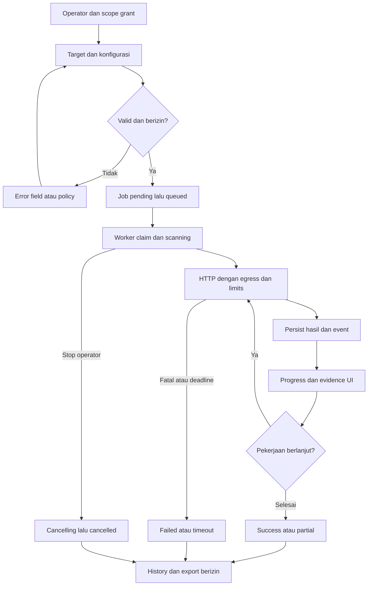
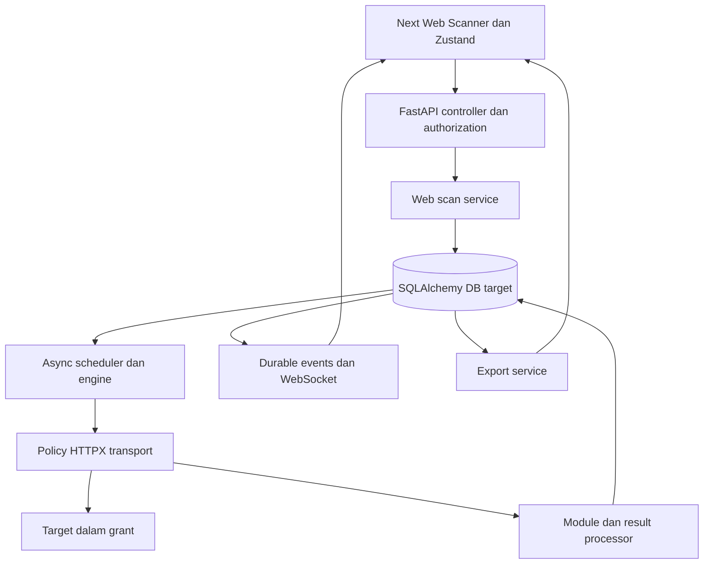
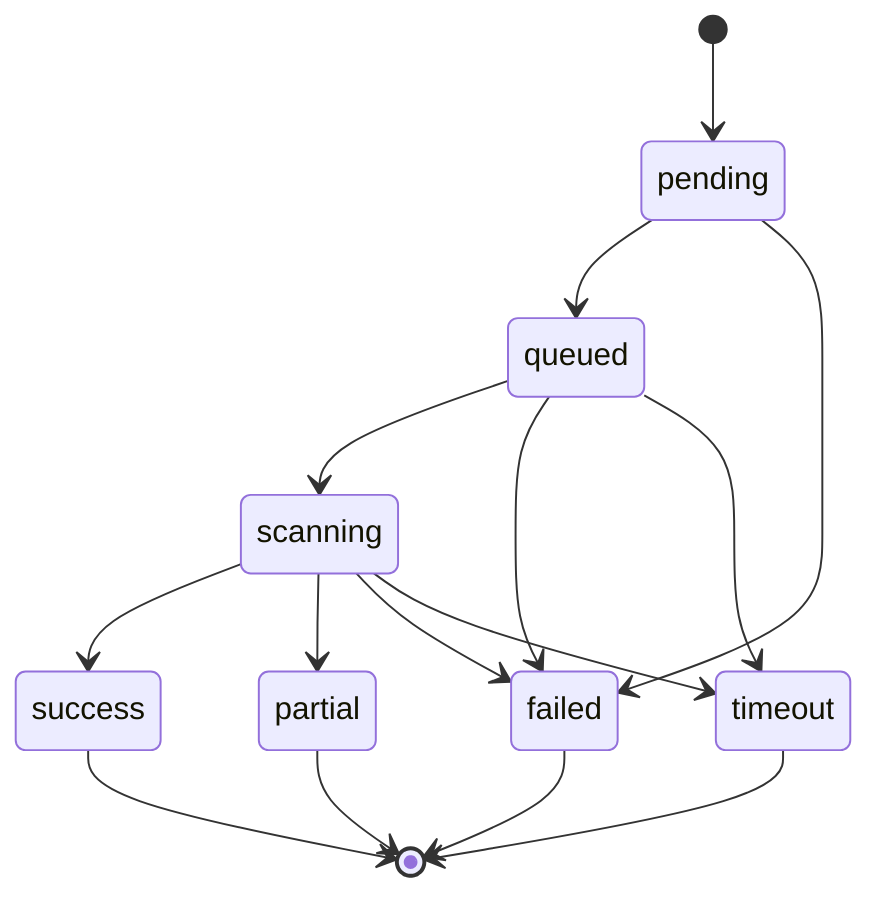
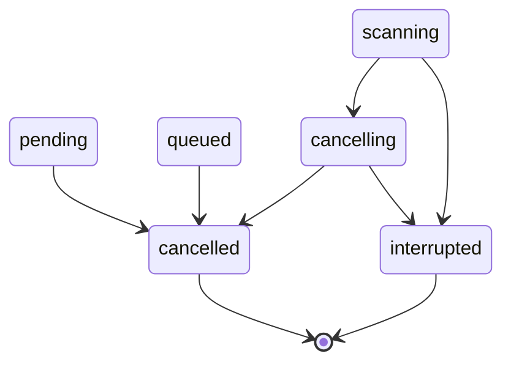

# PRD — Integrasi Ghost Web Scanner ke SignalScanner

Versi dokumen: **1.0 — spesifikasi implementasi untuk review engineering**. Tanggal: **3 Oktober 2026, Asia/Jakarta**. Bahasa kontrak: `snake_case`, mengikuti model/API target. Dokumen ini merancang integrasi; kode integrasi, endpoint, dan tabel baru **belum dibuat**.

| Repositori | Branch yang diakses | Commit tetap | Inventaris terlacak |
|---|---|---|---|
| [SignalScanner](https://github.com/Zaikhul/SignalScanner) | `main` | `823ec1a98f1fd5a5b768436fe0181f33bcf0c42a` | 122 berkas; 56 Python |
| [Ghost-Web-Scanner](https://github.com/Zaikhul/Ghost-Web-Scanner) | `main` | `0774b0c9e1f2eb2763a1afee6233b2f4ddab9f35` | 27 berkas; 16 Python; termasuk dua legacy script |

**Batas akses:** kedua clone Git dan metadata commit dapat diperiksa. Halaman kedua repository melalui alat web gagal diambil; ini tidak menghalangi akses kode melalui Git. Tidak ada scan terhadap layanan live, pengujian payload pada sistem eksternal, atau pengoperasian load generator. Seluruh pemeriksaan perilaku memakai resolver/transport/data sintetis. PR/issue/settings deployment dan data operasional tidak diperiksa. Semua nomor baris merujuk SHA di atas. Ref `main` dikonfirmasi ulang menjelang finalisasi dan tetap sama; snapshot dapat ditelusuri melalui [tree target](https://github.com/Zaikhul/SignalScanner/tree/823ec1a98f1fd5a5b768436fe0181f33bcf0c42a) dan [tree source](https://github.com/Zaikhul/Ghost-Web-Scanner/tree/0774b0c9e1f2eb2763a1afee6233b2f4ddab9f35).

**Penghambat yang terverifikasi sejak awal:** `Ghost-Web-Scanner/ghost_scanner/reports/json_report.py` tidak ada, walaupun diimpor engine dan keempat modul v2. Import engine gagal `ModuleNotFoundError: ghost_scanner.reports`. Definisi `Finding`, `Severity`, `ScanReport`, formula risk v2, dan serializer JSON v2 **tidak dapat diverifikasi sebagai implementasi yang tersedia**. Field yang dipakai pemanggil dan contoh README tetap dapat dipetakan sebagai kontrak yang dimaksud; penggantinya dalam PRD adalah **Proposed Design**, bukan klaim source sudah berfungsi.

Konvensi: **[VERIFIED]** = kode/config yang diperiksa; **[ASSUMPTION]** = keputusan lingkungan/bisnis yang belum terbukti; **[PROPOSED DESIGN]** = desain baru; **[PROPOSED PATH]** = berkas belum ada. **[PROPOSED DEFAULT — requires confirmation]** dan **[PROPOSED TARGET]** bukan angka bawaan/SLA repository. Semua endpoint, tabel, tipe dan requirement integrasi pada bagian 7–23 adalah proposal kecuali secara eksplisit disebut existing.

## 1. Executive Summary

SignalScanner mempunyai UI instrumen, FastAPI, model SQLAlchemy async, state Zustand, streaming, history dan export untuk pengukuran WiFi/BLE/radio. Ghost menyediakan recon web, pemeriksaan header/cookie, dan load-resilience melalui modul v2; dua script legacy menambahkan discovery form/parameter, probe SQL/NoSQL/reflection, perbandingan boolean/timing, audit melalui header, dan export TXT/SQL.

Integrasi menambahkan area **Web Scanner** dalam produk yang sama. Implementasi memakai struktur service/router/schema target dan design tokens target; scanner Python dipindah sebagai library internal dengan request/result contract bertipe. Scanner web mempunyai job/store/model sendiri karena URL, status HTTP dan temuan aplikasi tidak sesuai `MeasurementEvent` RSSI, `ScanMode`, atau perintah collector hardware.

Manfaat produk: operator dapat mengatur scope dan metode assessment, memantau scan, memeriksa bukti serta keterbatasan, dan mengekspor hasil dari satu UI. Manfaat teknis: HTTPX/asyncio dan penyimpanan target dipakai ulang; tidak menambah service JavaScript scanner, framework UI, broker, atau executor legacy. Seluruh keluarga pemeriksaan source dipetakan, termasuk fitur legacy dan kontrak v2 yang hilang.

Kemampuan scanner dipertahankan melalui otorisasi server dan workload berbatas. Stimulus DDL destruktif pada header legacy diganti stimulus diagnostik non-destructive; POST workload legacy tetap ada dengan template aman, deadline dan caps. Instruksi terminal untuk eksploitasi/pencurian cookie bukan mekanisme scanner yang dieksekusi; keluaran produk menjadi panduan verifikasi/remediasi.

### Success Definition

- Semua **48 C-ID** mempunyai requirement, candidate component, acceptance criterion, planned test atau disposition eksplisit. Tidak ada fitur source yang hilang diam-diam.
- Default profile v2 menjalankan recon, headers dan cookies; fungsi legacy relevan tersedia melalui pilihan advanced yang sesuai grant. Gap C-25/C-44 terlihat dalam registry dan dokumen.
- Hasil membedakan observation, konfigurasi yang benar-benar diamati, suspected vulnerability, inconclusive, skipped dan execution error. Scan selesai tidak berarti target aman.
- Timeout, cancellation, batas per-origin/global/request/body, redirect/DNS policy, idempotensi dan isolasi tenant lolos test offline sebelum feature flag diaktifkan.
- History/export dapat ditelusuri ke config efektif, source SHA, check/catalog/rule version dan event sequence. UI radio yang lama tetap berfungsi.
- Clean install/import/build/typecheck dan suite yang dibuat pada fase implementasi lulus. Angka kebijakan produksi yang masih proposed harus disetujui pemilik operasi sebelum enablement; developer dapat membangun dan menguji default sementara dengan feature flag off.

## 2. Repository Findings & Technical Assumptions

### 2.1 SignalScanner Architecture Findings

| Area [VERIFIED] | Implementasi/bukti | Implikasi integrasi |
|---|---|---|
| Monorepo/runtime | `SignalScanner/run.py`; root `package.json`; `backend/Dockerfile:1`; `collector/Dockerfile:1`; `frontend/Dockerfile:1` | Backend/collector image Python 3.12; frontend image Node 20. Runtime lokal runner terpisah dari image. |
| Frontend routing | `frontend/app/page.tsx`, `app/channel-health/page.tsx`, `app/sessions/page.tsx`, `app/collectors/page.tsx`, `app/layout.tsx` | Next App Router; tambah route web, jangan ubah routing menjadi SPA framework lain. |
| State | `frontend/lib/store.ts:18–119`, `lib/types.ts:1–11,94–175` | Zustand global radio; buat store bertipe domain web dengan pola selector/actions yang sama. |
| Async/error/loading | `frontend/lib/apiClient.ts:13–36`; `components/controls/SessionControls.tsx:22–97`; `app/sessions/page.tsx:11–43` | Fetch helper dan try/catch/finally; request non-2xx throw. History hanya console-error pada beberapa jalur; UI baru perlu error terlihat. |
| REST routing | `backend/app/main.py:45–57`; `api/v1/sessions.py`; `api/v1/exports.py:11–36` | Prefix `/api/v1`, router/service/model pattern; WebSocket `/ws/v1`. |
| Schema/conventions | `backend/app/schemas/common.py:8–40`; `schemas/session.py:24–73`; `schemas/problem_details.py:6–16` | Pydantic, string enum, `snake_case`, paginated response; ProblemDetails tersedia tetapi belum dipakai konsisten oleh semua router. |
| Service layer | `backend/app/services/session_manager.py`; `collector_service.py`; `export_service.py:14–71` | Service menjalankan async SQLAlchemy; web orchestration harus terpisah dari radio session manager. |
| Persistence | `backend/app/db/models.py:19–99,212–275`; `db/session.py:11–43`; `config.py:25` | SQLite async default; model existing mencakup collectors/adapters/scan_sessions/targets/measurements/markers/manifests/exports. Tabel tersebut bukan tabel web scanner. |
| Migration | `backend/migrations/env.py:15–30,54–75`; `versions/0004_channel_health_recommendations.py:1–16`; `main.py:22–26` | Alembic ada; startup hanya `create_all`, bukan upgrade. Registrasi metadata dan revision upgrade wajib dirancang. |
| Streaming | `backend/app/core/stream_engine.py:9–22,43–97`; `api/ws/session_stream.py:27–51`; `frontend/hooks/useSessionStream.ts:42–98` | Hub/replay in-memory; Redis tidak digunakan oleh implementasi hub yang diperiksa. Reuse pola transport, tetapi perbaiki handshake/dedup dan persistence untuk web. |
| Design system | `frontend/app/globals.css:1–49`; `components/layout/AppShell.tsx:8–47`; `Header.tsx`; `components/ui/MethodBadge.tsx` | Token dark/lime/Geist, tiga panel dan badge. Tidak ditemukan generic `Button`/`Card` yang dapat dianggap sudah tersedia. |
| Environment | `backend/app/config.py`; `backend/.env.example`; `backend/example.env`; `collector/app/config.py`; `collector/example.env`; `frontend/.env.example`; `frontend/next.config.ts:5–10`; Compose | API_BASE dari NEXT_PUBLIC_API_URL, tetapi WS/rewrites memuat port/loopback literal. Semua web calls harus memakai satu konfigurasi efektif. |
| Tests/build/lint | `pytest.ini`; `frontend/vitest.config.ts:5–8`; `frontend/package.json:5–10`; root `package.json:13–15`; `.gitignore:44,51` | Pytest/pytest-asyncio, Vitest Node, Next build/lint, TypeScript. Test directories/test cases dan lock tidak ditemukan pada tracked inventory. |
| Trust boundary | `backend/app/main.py:29–57`; `api/v1/ingest.py`; `core/security.py` | Tidak ditemukan dependency autentikasi operator global pada route yang diperiksa. Helper HMAC bukan authentication framework yang siap dipakai ulang. Otorisasi web baru adalah prerequisite, bukan fakta existing. |

TanStack Query/Table, Motion dan next-themes terdaftar di `frontend/package.json`. Pada jalur yang diperiksa tidak ditemukan import TanStack Query/Table; perilaku fetch/state terverifikasi adalah Fetch + React hooks + Zustand. Keberadaan dependency tidak dianggap bukti bahwa library itu telah dipakai.

### 2.2 Ghost-Web-Scanner Architecture Findings

| Area [VERIFIED] | Bukti | Perilaku/ketidakselarasan yang harus diperhitungkan |
|---|---|---|
| Entry points | `ghost_scanner/__main__.py:24–125`; `Ghost-Web-Scanner.py:272–278`; `Ghost-Web-Scanner-V1.0.py:356–388` | CLI argparse v2, linear pipeline V47 dan menu V75. Tidak ditemukan REST server, web UI atau API endpoints source. |
| Config | `ghost_scanner/core/config.py:37–138` | Default HTTP untuk tanpa scheme, timeout10s, TLS verify true, concurrency50, modules recon/headers/cookies. Dataclass tidak frozen; domain memakai netloc. IPv4 resolver dan daftar network pribadi tertentu; bukan validasi DNS/redirect menyeluruh. |
| Engine v2 | `ghost_scanner/core/engine.py:50–119` | Modul berjalan berurutan, masing-masing try/except; report export sesudah engine. Stress dipanggil dengan `authorized_by_admin=True` secara otomatis bila dipilih. Bukan RBAC. |
| HTTP | `ghost_scanner/utils/http_client.py:40–151` | HTTPX async, HTTP/2, pooling, UA rotation, follow_redirects true. Tidak ada retry loop walau docstring menyebut retry. Argumen `timeout=None` pada tiap request menonaktifkan timeout client pada versi audit. |
| Recon | `ghost_scanner/modules/recon.py:67–257` | Geolokasi provider luar, WAF/server/CMS, DNS/subdomain dan path enumeration. `gather` kemudian progress bar; bukan progress real-time per completion. |
| Header/cookie | `modules/security_headers.py:43–262`; `modules/cookie_audit.py:48–156` | Enam header families, tiga cookie flag families; class/symbol di source tersedia, tetapi import membutuhkan reporter yang hilang. Cookie flags memakai substring; malformed HSTS max-age tidak menghasilkan finding. |
| Load v2 | `modules/stress_test.py:50–69,92–196` | GET; 50 worker/30s/0.05s default, caps200/300/min0.01; Event stop; 5s override; successful status<500; CancelledError ditelan pada run. |
| Legacy aktif | `Ghost-Web-Scanner.py:141–226`; `Ghost-Web-Scanner-V1.0.py:181–308` | Form/input, parameter SQL/NoSQL/reflection, mutation, timing/length heuristics, anchor discovery/header probes dan POST load. Tidak semua stimulus mempunyai predicate deteksi khusus. |
| Hasil/exports | `Ghost-Web-Scanner-V1.0.py:55–97,310–354`; `ghost_scanner/core/engine.py:17,118,125–147`; `README.md:361–398` | TXT/SQL append benar-benar diimplementasikan; source tidak menjalankan SQL itu ke database. JSON v2/risk reporter hilang; README example tidak dianggap bukti serializer aktual. Tidak ditemukan persistent job history. |
| Dependency/license | `requirements.txt`; `LICENSE`; `ghost_scanner/__init__.py` | httpx[http2], beautifulsoup4, lxml dideklarasikan. Legacy mengimpor requests/urllib3 yang tidak disebut requirements source saat ini. lxml tidak ditemukan dipakai pada parser yang diperiksa. MIT notice/author/version tersedia. |

**Batas kemampuan yang benar-benar ditemukan:** discovery HTML hanya root forms dan satu lapis anchors (10 untuk header probes), bukan crawler rekursif; tidak ada browser/DOM execution, authenticated target session manager, credential cracking, SSRF scanner, subdomain takeover atau SQL data extractor. HTTP client parameter `headers` bukan bukti UI/CLI authenticated-scanning workflow. Label `LFI`, `AUTH_BYPASS` dan beberapa blind categories pada weights tidak membuktikan detector tersendiri.

**Pemeriksaan aman pada rangkaian analisis ini:** 56 Python target dan 16 Python source diparse AST tanpa syntax error; 12 observasi G-01–G-12 selesai exit0 pada HTTPX0.28.1. Resolver dan HTTPX MockTransport dipakai; modul header/cookie/load diimpor menggunakan **reporting stand-in** setelah import engine asli dibuktikan gagal. Stand-in hanya membuka akses algoritme yang tersedia; tidak memverifikasi reporter/serializer hilang. Stress `run()` dan worker tidak dijalankan. Tidak ada build ulang frontend pada penyusunan PRD ini; hasil build QA sebelumnya tidak diperlakukan sebagai hasil integrasi.

| Observasi | Hasil lokal | Dampak desain |
|---|---|---|
| G-02 | Engine import gagal pada `ghost_scanner.reports` | Tidak menjalankan source v2 sebagai subprocess/package drop-in |
| G-03–G-05 | Default config terkonfirmasi; `ftp://…` menjadi `http://ftp://…` saat private allowed; private IPv4 default ditolak | Parser baru, test explicit scheme, DNS scope penuh |
| G-06–G-07 | Enam missing-header findings; HSTS `max-age=invalid; includeSubDomains` menghasilkan nol finding | Retain families; malformed menjadi inconclusive/fail parse, bukan pass |
| G-08–G-09 | `NotHttpOnly`/`Insecure` dapat lolos substring; session tanpa flags menghasilkan HIGH/HIGH/MEDIUM | Exact parser dan fixture regresi |
| G-10 | Constructor caps200/300/0.01 dan direct gate tanpa flag ditolak | Caps dipertahankan; server permission mengganti boolean CLI |
| G-11 | Request tanpa override: timeout connect/read/write/pool semuanya None; override5s finite | Finite timeout diterapkan secara nyata |
| G-12 | Mock connection failure: satu attempt, return None | Retry default0; tidak mengklaim exponential backoff source |

Perintah pembacaan: `git ls-remote … refs/heads/main`, `git clone --single-branch --branch main --no-tags …`, `git rev-parse HEAD`, `git log`, `git ls-files`, `rg`, `nl -ba`, AST inventory dan harness `PYTHONDONTWRITEBYTECODE=1 qa-runtime/bin/python prd-checks/audit_source.py`. Harness temporary berada di luar clone. `git status --porcelain --untracked-files=all` kosong pada kedua clone. Suite baru pada bagian18 masih **planned**, bukan test yang sudah lulus.

### 2.3 Verified Technology Stack

| Kebutuhan | Target source of truth | Source usage | Keputusan |
|---|---|---|---|
| UI/framework | Next15/React19/TypeScript5, Tailwind4, Geist | Terminal ANSI | Reuse target |
| State/request | Zustand5, Fetch hooks; HTTPX backend | Python async + requests legacy | Store web mengikuti Zustand; HTTPX async internal |
| API/schema | FastAPI, Pydantic2/pydantic-settings | Dataclass/argparse; missing Finding reporter | Pydantic API dan TypeScript types baru |
| Data | SQLAlchemy async/SQLite/asyncpg/Alembic | Lists, set, file logs | DB domain web baru pada storage target |
| Chart/icons | ECharts5/echarts-for-react, Phosphor | Text/progress bars | Charts deskriptif target |
| Concurrency/logging | asyncio, Python logging, orjson | asyncio, HTTPX, executor legacy | Native async + bounded scheduler; no copied executor |
| Tests | pytest/pytest-asyncio, Vitest Node | Tidak ada test suite terlacak | Reuse; browser E2E tooling baru dijustifikasi bagian21 |

Angka di tabel adalah major/range manifest, bukan pinned runtime. Versi audit HTTPX0.28.1 dan httpcore1.0.9 digunakan untuk pemeriksaan lokal; `h2` tidak terpasang pada venv target audit. Manifest target belum meminta extra HTTP/2. Install source requirements penuh, TLS nyata/HTTP2 network, Docker, PostgreSQL/Redis dan hardware tidak diuji.

### 2.4 Explicit Technical Assumptions

| ID | [ASSUMPTION] sementara | Keputusan terpengaruh | Cara konfirmasi |
|---|---|---|---|
| A-01 | Backend worker berada pada network yang dapat menjangkau aset scope yang diizinkan | Eksekusi web di backend, bukan collector hardware/browser | Uji reachability pada environment assessment yang disetujui; jangan infer dari alamat browser |
| A-02 | Administrator dapat memprovisikan operator token acak dan scope grant | Opaque-token identity adapter untuk initial release | Konfirmasi IdP/provisioning; adapter dapat diganti tanpa mengubah scanner contract |
| A-03 | Runtime utama Python3.12 dan Node20 sesuai Dockerfile; web dispatcher satu proses | Structured concurrency dan batas in-memory global | CI di runtime image; startup menolak multi-worker topology yang belum didukung |
| A-04 | Job historical boleh disimpan sampai retensi yang disetujui | DB audit, evidence minimization | Konfirmasi retention/access/export policy pada OQ-04; sementara disable auto-delete |
| A-05 | Geolokasi pihak ketiga opsional dan dapat dinonaktifkan | Provider adapter opt-in | Keputusan security/privacy owner; internal IP tidak dikirim |
| A-06 | Kebijakan request budget yang proposed layak sebagai baseline lingkungan uji | Configuration section11/feature readiness | Review pemilik aplikasi; lebih kecil dari server/grant tidak membutuhkan tuning scanner |

### 2.5 Constraints

- Tidak menganggap target telah memiliki auth/RBAC, Redis pubsub, queue durable, generic design components, atau suite test yang tidak ditemukan.
- Prasyarat target yang relevan: deklarasi SQLAlchemy asyncio/greenlet untuk clean setup; packaging frontend menyalin `public` yang tidak ada; startup migration belum otomatis; URL REST/WS hardcoded tidak konsisten. Bukti: `backend/requirements.txt:5`, `frontend/Dockerfile:21`, `backend/app/db/session.py:27–30`, `frontend/hooks/useSessionStream.ts:42–46`, `frontend/next.config.ts:8–9`. Perbaikan ini termasuk readiness/CI, bukan klaim sudah diperbaiki.
- Web requests menjalankan operasi pada target hanya sesudah policy server; operator confirmation tidak menggantikan grant. Tidak ada payload baru untuk pencurian data, callbacks luar, persistensi, atau penghancuran database.
- Range dependency target longgar dan lock tidak tersedia. PRD meminta pin/lock hasil yang diuji; tidak mengarang versi rilis atau CVE.
- Teks/kode source yang hilang tidak direkonstruksi sebagai “implementasi original”. Serializer/model/risk rule baru ditandai proposal dan diuji dengan fixture sendiri.

## 3. Scope of Work

### Feature Traceability Matrix

Status menggambarkan tindakan integrasi: `Existing` bila kemampuan target dapat dipakai langsung; `Modify` bila pola/fungsi existing perlu adaptasi; `New` untuk kemampuan domain web yang belum ada; `Needs Verification` untuk kontrak/detector source yang belum dapat dipastikan. Pada kolom Source Evidence, path sesudah titik-koma masih berada di repository Ghost-Web-Scanner. Strategi perbaikan tidak berarti implementasi source bekerja seperti desain baru.

| ID | Ghost-Web-Scanner Capability | Source Evidence | SignalScanner Equivalent | Integration Strategy | UI Impact | Backend Impact | Status |
|---|---|---|---|---|---|---|---|
| C-01 | URL/domain/IP, scheme default, path/query/port | `Ghost-Web-Scanner/ghost_scanner/core/config.py:37–91,131–138`; `Ghost-Web-Scanner/Ghost-Web-Scanner.py:191–200` | Belum ada URL web target | Parser terpisah; hostname terpisah dari netloc; perbaiki scheme handling | Input target + preview canonical | Validator + DNS policy | `New` |
| C-02 | allow_private dan resolusi IPv4 | `Ghost-Web-Scanner/ghost_scanner/core/config.py:20–30,75–103` | Batas prefix LAN bersifat berbeda | Pertahankan internal scan dengan scope grant; evaluasi IPv4/IPv6 setiap koneksi | Pilihan scope internal | Policy resolver/transport | `New` |
| C-03 | timeout, TLS, concurrency, modules, output; CLI version | `Ghost-Web-Scanner/ghost_scanner/__main__.py:35–86`; `Ghost-Web-Scanner/ghost_scanner/core/config.py:121–138` | Pydantic config/env dan version metadata | Pindahkan ke schema web; requested/effective config eksplisit | Panel konfigurasi | Schema/capabilities API | `Modify` |
| C-04 | Pemilihan fase/menu legacy dan urutan modul v2 | `Ghost-Web-Scanner/Ghost-Web-Scanner-V1.0.py:356–382`; `Ghost-Web-Scanner/ghost_scanner/core/engine.py:65–115` | ModeRail hanya wifi/bluetooth/radio | Web scanner terpisah; profile dan checklist modul; tidak memperluas ScanMode | Navigasi Web Scanner | Registry + engine | `New` |
| C-05 | GET/POST/PUT, query, form body, JSON body | `Ghost-Web-Scanner/Ghost-Web-Scanner-V1.0.py:126–146`; `Ghost-Web-Scanner/ghost_scanner/utils/http_client.py:93–135` | HTTPX sudah tersedia, bukan web scanner | RequestSpec terkontrol; method/body mengikuti check dan grant | Ringkasan request | Shared async client | `Modify` |
| C-06 | Rotasi User-Agent, Accept/Language, header override, X-Forwarded-For legacy | `Ghost-Web-Scanner/ghost_scanner/utils/http_client.py:19–28,85–121`; `Ghost-Web-Scanner/Ghost-Web-Scanner-V1.0.py:131–136` | HTTP client tersedia tanpa profile ini | Pertahankan UA rotation; variasi header legacy hanya profil audit berizin; log seed | Advanced header profile | Header policy + redaction | `New` |
| C-07 | HTTP/2, pooling, keepalive, automatic redirects | `Ghost-Web-Scanner/ghost_scanner/utils/http_client.py:47–64` | httpx base; h2 belum dideklarasikan | Aktifkan extra HTTP/2; redirect manual melalui policy; semaphore terpisah dari pool | Protocol/redirect detail | Transport + pool | `Modify` |
| C-08 | Timeout umum 10s/legacy 7s; override 5s/12s | `Ghost-Web-Scanner/ghost_scanner/core/config.py:124`; `Ghost-Web-Scanner/ghost_scanner/utils/http_client.py:123–134`; `Ghost-Web-Scanner/Ghost-Web-Scanner-V1.0.py:22,281,304` | HTTPX dipakai uploader | Jangan teruskan None yang menonaktifkan timeout; absolute deadline | Timeout field/error | Timeout mapping | `Modify` |
| C-09 | Network error ke None, logger dan isolasi kegagalan modul | `Ghost-Web-Scanner/ghost_scanner/utils/http_client.py:137–151`; `Ghost-Web-Scanner/ghost_scanner/core/engine.py:66–114` | ProblemDetails ada; router campur HTTPException | Outcome bertipe; pertahankan modul lain; jangan samakan failure dengan hasil kosong | Error per modul | Taxonomy + partial state | `Modify` |
| C-10 | Semaphore 500/threadpool 150 legacy; pool v2; retry tidak diimplementasikan | `Ghost-Web-Scanner/Ghost-Web-Scanner-V1.0.py:32–33,126–147`; `Ghost-Web-Scanner/ghost_scanner/utils/http_client.py:40–64,93–151` | asyncio + HTTPX tersedia | Reuse async; tidak port executor; retry default 0; caps global/per origin | Requested/effective limits | Scheduler + limiter | `Modify` |
| C-11 | Geolokasi city/country/ASN via ip-api | `Ghost-Web-Scanner/ghost_scanner/modules/recon.py:83–110`; `Ghost-Web-Scanner/Ghost-Web-Scanner-V1.0.py:162–166` | Tidak ada geolokasi web | Pertahankan provider adapter sebagai opt-in egress; failure bukan target finding | Metadata lokasi/unknown | Provider dengan policy terpisah | `New` |
| C-12 | Server, X-Powered-By, PHP session hints | `Ghost-Web-Scanner/ghost_scanner/modules/recon.py:145–157`; `Ghost-Web-Scanner/Ghost-Web-Scanner.py:107–110`; `Ghost-Web-Scanner/Ghost-Web-Scanner-V1.0.py:175–178` | Tidak ada web fingerprint | Rule deterministik; observasi dengan bukti header/cookie yang disamarkan | Tech summary | Recon checks | `New` |
| C-13 | WAF signatures: Cloudflare, ModSecurity, Sucuri, Akamai, Imperva, AWS WAF | `Ghost-Web-Scanner/ghost_scanner/modules/recon.py:123–143` | Tidak ada WAF classifier | Preserve signature set; sebut fingerprint heuristic, bukan konfirmasi proteksi | WAF badge | Recon checks | `New` |
| C-14 | CMS WordPress/Joomla/Drupal/Shopify/Wix | `Ghost-Web-Scanner/ghost_scanner/modules/recon.py:159–176` | Tidak ada CMS classifier | Preserve body signatures; hasil diikat pada response aktual | CMS badges | Recon checks | `New` |
| C-15 | Subdomain wordlists, DNS + HTTP check | `Ghost-Web-Scanner/ghost_scanner/modules/recon.py:27–31,180–210`; `Ghost-Web-Scanner/Ghost-Web-Scanner.py:120–139`; `Ghost-Web-Scanner/Ghost-Web-Scanner-V1.0.py:187–192` | LAN inventory bukan subdomain scan | Profile v2/v47/v75; dedup union 22; grant wildcard eksplisit; jangan gunakan netloc berport sebagai DNS name | Discovery table | Resolver + bounded tasks | `New` |
| C-16 | Directory/path wordlists dan status 200/403/405/301/302 | `Ghost-Web-Scanner/ghost_scanner/modules/recon.py:33–39,219–252`; `Ghost-Web-Scanner/Ghost-Web-Scanner.py:207–213`; `Ghost-Web-Scanner/Ghost-Web-Scanner-V1.0.py:194–201` | Tidak ada path processing web | Profile union 25; status per hop; baseline soft-404; jangan semua 200 otomatis high | Path/status/evidence table | Path classifier | `New` |
| C-17 | Form action/method; input/textarea/select; queue parameter | `Ghost-Web-Scanner/Ghost-Web-Scanner.py:141–173,218–224`; `Ghost-Web-Scanner/Ghost-Web-Scanner-V1.0.py:210–229` | Tidak ada HTML form parser | Native HTMLParser untuk discovery terbatas; action urljoin + scope; metadata saja untuk secret fields | Forms/parameters tab | HTML parser + plan | `New` |
| C-18 | Login GET dan indikasi CSRF token tidak ada pada POST | `Ghost-Web-Scanner/Ghost-Web-Scanner.py:161–170` | Tidak ada weak-form audit | Preserve heuristic; no-CSRF bukan bukti eksploitasi; pahami mitigasi yang tidak terlihat | Weak-form findings | Forms checks | `New` |
| C-19 | Query parameter probes dan SQL error/reflection signatures V47 | `Ghost-Web-Scanner/Ghost-Web-Scanner.py:175–189` | Tidak ada parameter audit | Probe catalog versioned dan authorized; pisahkan SQL-error dari reflection | Parameter findings | Parameter audit | `New` |
| C-20 | XSS reflection V47; XSS stimulus V75 | `Ghost-Web-Scanner/Ghost-Web-Scanner.py:179–189`; `Ghost-Web-Scanner/Ghost-Web-Scanner-V1.0.py:214–219` | Tidak ada XSS audit | Refleksi sebagai suspected; tidak eksekusi JS atau pencurian cookie | Evidence detail escaped | Reflection analyzer | `New` |
| C-21 | SQL/NoSQL error predicates V75 | `Ghost-Web-Scanner/Ghost-Web-Scanner-V1.0.py:242–248` | Tidak ada injection analyzer | Preserve matcher catalog; gunakan matching rule bukan substring sql untuk kategori | Finding check ID | Response analyzer | `New` |
| C-22 | Pasangan probe form/query dan POST JSON operator NoSQL | `Ghost-Web-Scanner/Ghost-Web-Scanner-V1.0.py:223–239` | HTTPX JSON tersedia | Dua request terukur, grant method POST wajib; masing-masing punya correlation ID | Pair evidence | Parameter audit + transport | `New` |
| C-23 | Time-based SQL heuristic dan header timing | `Ghost-Web-Scanner/Ghost-Web-Scanner-V1.0.py:235–252,275–285` | Tidak ada baseline timing web | Per-request monotonic timer + matched controls; simpan indikasi legacy dan confidence; limit workload | Timing evidence/inconclusive | Timing analyzer | `New` |
| C-24 | Boolean heuristic: body length berbeda dan HTTP 200 | `Ghost-Web-Scanner/Ghost-Web-Scanner-V1.0.py:254–257` | Tidak ada response comparison | Matched baseline, canonical fingerprint; perbedaan panjang saja tidak confirmed | Baseline/delta detail | Response comparison | `New` |
| C-25 | Stimulus traversal/LFI; AUTH_BYPASS/LFI/BLIND labels pada weights | `Ghost-Web-Scanner/Ghost-Web-Scanner-V1.0.py:89–96,214–219` | Tidak ada LFI/auth bypass scanner | Stimulus tercatat; predicate LFI/auth bypass tidak ditemukan; jangan mengiklankan detektor yang tidak terbukti | Label coverage/inconclusive | Catalog; manual review | `Needs Verification` |
| C-26 | Sepuluh transformasi mutate_payload | `Ghost-Web-Scanner/Ghost-Web-Scanner-V1.0.py:70–84` | Tidak ada payload mutation | Catalog ID/seed deterministik, approved benign probes; satu transform lalu encoding transport; tidak membuat engine evasion baru | Advanced profile + seed | Payload catalog | `New` |
| C-27 | One-page anchor discovery; maksimal 10 halaman untuk header audit | `Ghost-Web-Scanner/Ghost-Web-Scanner-V1.0.py:262–272` | Tidak ada web link discovery | Origin equality + path grant; sorted/dedup; depth satu, batas 10 dipertahankan | Discovered/skipped links | Discovery plan | `New` |
| C-28 | Header audit probes User-Agent/XFF/Referer; satu stimulus DDL destruktif | `Ghost-Web-Scanner/Ghost-Web-Scanner-V1.0.py:275–285` | Tidak ada header injection audit | Pertahankan jenis audit; ganti stimulus DDL dengan diagnostic non-destructive; reject catalog destruktif | Advanced authorization + evidence | Header probe module | `New` |
| C-29 | CSP absent + unsafe-inline/unsafe-eval | `Ghost-Web-Scanner/ghost_scanner/modules/security_headers.py:74–111` | Tidak ada CSP audit | Preserve checks dan source severity; tambah applicability/context tanpa klaim XSS confirmed | Header finding | Header audit | `New` |
| C-30 | HSTS absent/max-age<31536000/includeSubDomains | `Ghost-Web-Scanner/ghost_scanner/modules/security_headers.py:113–163` | Tidak ada HSTS audit | Preserve thresholds; reject malformed; HTTP=not_applicable; includeSubDomains kontekstual | Header finding | Header audit | `New` |
| C-31 | X-Frame-Options absence/non-standard value | `Ghost-Web-Scanner/ghost_scanner/modules/security_headers.py:165–191` | Tidak ada XFO audit | Preserve DENY/SAMEORIGIN; catat CSP frame-ancestors sebagai konteks | Header finding | Header audit | `New` |
| C-32 | X-Content-Type-Options nosniff | `Ghost-Web-Scanner/ghost_scanner/modules/security_headers.py:193–220` | Tidak ada XCTO audit | Exact token parsing, bukan substring; preserve severity | Header finding | Header audit | `New` |
| C-33 | Permissions-Policy atau Feature-Policy presence | `Ghost-Web-Scanner/ghost_scanner/modules/security_headers.py:222–242` | Tidak ada policy audit | Preserve fallback; presence tidak sama dengan correctness semua directive | Header finding | Header audit | `New` |
| C-34 | Referrer-Policy presence | `Ghost-Web-Scanner/ghost_scanner/modules/security_headers.py:244–262` | Tidak ada referrer audit | Preserve presence rule; tandai validasi nilai tambahan sebagai desain baru | Header finding | Header audit | `New` |
| C-35 | Raw Set-Cookie multi-header dan session-name heuristics | `Ghost-Web-Scanner/ghost_scanner/modules/cookie_audit.py:23–33,58–66,77–90` | Tidak ada cookie analyzer | Names/domain/path + exact attributes; value selalu dibuang; tidak gabungkan Set-Cookie pakai koma | Cookie inventory | Cookie parser | `New` |
| C-36 | HttpOnly/Secure, severity session vs non-session | `Ghost-Web-Scanner/ghost_scanner/modules/cookie_audit.py:93–124` | Tidak ada cookie checks | Preserve distinction; jangan substring NotHttpOnly/Insecure; applicability per cookie purpose | Cookie findings | Cookie audit | `New` |
| C-37 | SameSite missing; None tanpa Secure | `Ghost-Web-Scanner/ghost_scanner/modules/cookie_audit.py:126–154` | Tidak ada SameSite checks | Preserve cases; exact normalized attribute value; temuan konfigurasi bukan eksploitasi CSRF | Cookie findings | Cookie audit | `New` |
| C-38 | GET load test: default 50 workers/30s/0.05s; hard caps 200/300s/min0.01s | `Ghost-Web-Scanner/ghost_scanner/modules/stress_test.py:50–69,92–165,169–196` | Tidak ada HTTP load test | Preserve bounded workload; server grant menggantikan boolean auto-true; rate/request caps lebih rendah efektif | Load config, privileged start | Load module | `New` |
| C-39 | Legacy POST load, intensity dan body sintetis sekitar 5KiB; loop tanpa deadline | `Ghost-Web-Scanner/Ghost-Web-Scanner-V1.0.py:288–308` | Tidak ada POST load test | POST workload tetap tersedia melalui template benign dan scope; semua loop berbatas; bukan 500 request tak terbatas | GET/POST profile + stop | Bounded load module | `New` |
| C-40 | KeyboardInterrupt, is_flooding, asyncio.Event dan cancellation | `Ghost-Web-Scanner/Ghost-Web-Scanner.py:272–278`; `Ghost-Web-Scanner/Ghost-Web-Scanner-V1.0.py:288–308,384–388`; `Ghost-Web-Scanner/ghost_scanner/modules/stress_test.py:119–130,191–196` | Stop sesi ada; lifecycle web berbeda | Cancel cooperative + cancel task; finalisasi tepat sekali; jangan menelan CancelledError | Stop + cancelling/cancelled | Lifecycle/scheduler | `Modify` |
| C-41 | Request count, duration/RPS, successful<500, failure rate thresholds20/50 | `Ghost-Web-Scanner/ghost_scanner/modules/stress_test.py:132–165,169–179`; `Ghost-Web-Scanner/Ghost-Web-Scanner-V1.0.py:137,326` | Telemetry pengukuran berbeda | Preserve legacy counters terpisah; 429 bukan HTTP success operasional; outcome breakdown baru | Metrics cards/chart | Metrics aggregator | `New` |
| C-42 | Progress bar fase/counter; isolasi module errors | `Ghost-Web-Scanner/ghost_scanner/utils/banner.py:52–67`; `Ghost-Web-Scanner/Ghost-Web-Scanner.py:75–86`; `Ghost-Web-Scanner/ghost_scanner/core/engine.py:65–115` | StreamEngine/WS + Zustand | Progress aktual, bukan timer persentase; durable event cursor untuk web | Progress/per-module status | DB events + WS | `Modify` |
| C-43 | Findings, category, detail/remediation; risiko V47/V75 dan kategori | `Ghost-Web-Scanner/Ghost-Web-Scanner.py:237–240`; `Ghost-Web-Scanner/Ghost-Web-Scanner-V1.0.py:55–97`; `Ghost-Web-Scanner/ghost_scanner/modules/security_headers.py:81–109` | Models/schema/evidence patterns ada | Schema domain web; dedup; legacy indices dengan formula/version; bukan probabilitas kerentanan | Severity summary/legacy index | Processor + DB | `Modify` |
| C-44 | JSON export dan risk/summary API v2 yang diimpor tetapi implementasi hilang | `Ghost-Web-Scanner/ghost_scanner/core/engine.py:17,54–58,118,125–147`; `Ghost-Web-Scanner/README.md:361–398` | JSON export sinyal tersedia | Tentukan kontrak baru; kompatibilitas dokumentasi terpisah; v2 risk formula unavailable | JSON download + gap badge | New serializer | `Needs Verification` |
| C-45 | Append SQL INSERT breaker_logs + TXT real-time | `Ghost-Web-Scanner/Ghost-Web-Scanner-V1.0.py:55–68,354` | DB + JSON/CSV export tersedia, FK khusus sesi | Persist per finding; SQL/TXT download data-only, quoting, static schema; jangan eksekusi di server | Export menu | Domain exporter + audit | `Modify` |
| C-46 | Summary, grouped top findings, duration, recommendation output | `Ghost-Web-Scanner/Ghost-Web-Scanner.py:228–268`; `Ghost-Web-Scanner/Ghost-Web-Scanner-V1.0.py:310–351`; `Ghost-Web-Scanner/ghost_scanner/core/engine.py:122–147` | Inspector/evidence/cards patterns ada | Preserve insight; rekomendasi remediation; hasil kosong bukan klaim aman; tidak otomatis mengeksekusi saran terminal | Summary/detail/remediation | Summary schema | `Modify` |
| C-47 | Runtime/model/IP/battery terminal dan ANSI banner | `Ghost-Web-Scanner/Ghost-Web-Scanner.py:30–72`; `Ghost-Web-Scanner/Ghost-Web-Scanner-V1.0.py:39–53,99–124`; `Ghost-Web-Scanner/ghost_scanner/utils/banner.py:23–49` | Collector diagnostics + AppShell/Header | Worker runtime metadata relevan; ANSI/clear/Termux battery tidak dipindahkan, alasan di scope | Runtime provenance dengan UI target | Runtime metadata | `Modify` |
| C-48 | Logging timestamp/level/file, version/author/MIT metadata | `Ghost-Web-Scanner/ghost_scanner/utils/ui.py:37–80`; `Ghost-Web-Scanner/ghost_scanner/__init__.py:12–13`; `Ghost-Web-Scanner/LICENSE:1–21` | Python logging + version, tidak ada attribution Ghost | Structured logs + notice MIT; jangan replikasi formatter yang memutasi record.msg | About/source revision | Logging + attribution | `Modify` |


### 3.1 In Scope

| Kelompok | Cakupan terikat C-ID |
|---|---|
| Scan configuration | URL, profile/modul, timeout/TLS/private/concurrency, legacy advanced choices, output format; C-01–C-10 |
| Target processing | IPv4/IPv6 parser/scope, DNS/subdomains, paths dan one-level HTML/form/link discovery; C-02/C-15–C-18/C-27 |
| Scanning engine | Recon, headers/cookies, parameter/reflection/NoSQL/timing/boolean/header probes, GET/POST load; C-11–C-41 |
| HTTP/network | Method/query/form/JSON/header handling, HTTP2/pooling/redirects, finite timeout, limiter/cancellation; C-05–C-10/C-38–C-41 |
| Analysis/aggregation | Semua signature/check yang tersedia; classification/evidence/confidence, legacy indices dan v2 gap; C-12–C-37/C-43/C-44 |
| Progress/state/errors | Module/request outcome, typed failure, persisted lifecycle, cancellation dan streaming actual; C-09/C-40–C-42 |
| UI/visualization | Config/start/stop/summary/results/detail/history/provenance dengan design language target; C-03/C-04/C-41–C-48 |
| Persistence/export | DB target-domain, JSON contract baru/compat documented v2, TXT/SQL legacy compatibility; C-43–C-45 |
| Operational safeguards | New scoped auth/egress/limits/redaction/audit dibutuhkan karena scanner menjadi layanan server; bukan kemampuan existing source yang diklaim |

### 3.2 Out of Scope

| Item/disposition | Alasan berbasis bukti |
|---|---|
| Recursive crawler, headless execution, authenticated target credential/session orchestration, external/custom wordlist upload | Tidak ditemukan workflow tersebut pada source. Fixed wordlists dan source form/link discovery tetap dipindah. |
| SSRF detector untuk aplikasi target, takeover, credential brute-force, SQL extraction, exploit automation, exfiltration/persistence | Tidak ditemukan implementasi scanner ini. Perlindungan egress scanner sendiri berada in scope. Narasi rekomendasi terminal tidak diperlakukan sebagai fungsi yang dieksekusi. |
| DDL destruktif dan unbounded flood apa adanya | Bukan menghilangkan keluarga header/load audit: C-28/C-39 dipertahankan melalui non-destructive probes dan bounded GET/POST workload. Tidak ada statement destructive atau loop tanpa cap di engine baru. |
| Skulls/ANSI, terminal clear, Termux battery command dan koneksi ke resolver publik hanya untuk mencari IP operator | Interface/environment terminal tidak relevan pada UI web. C-47 dipetakan ke worker/runtime provenance; tidak membuka telemetry perangkat browser yang tidak tersedia. |
| Penggunaan `.sql` sebagai perintah yang dijalankan backend | Source hanya menulis file INSERT. Download SQL data-compatible tetap in scope; eksekusi database target bukan fitur yang ditemukan. |
| PCA/clustering/risk prediction ML | Data/cohort/prasyarat tidak tersedia; keputusan bagian4. Charts deskriptif tetap in scope. |
| Distributed workers/broker baru, collector web agent baru, deploy infrastructure tambahan | Tidak diperlukan untuk integrasi awal dengan bounded backend worker. Interface engine tetap platform-independent; A-01 wajib diverifikasi. |
| Mengubah semua fitur radio/menuntaskan seluruh audit QA lama | Scope ini memperbaiki prasyarat yang memengaruhi scanner baru dan regression boundary; bukan rewrite SignalScanner secara penuh. |

## 4. PCA / Data Analytics Assessment

### PCA Not Justified

**Fakta data source:** satu target per CLI config, findings kategori/severity/text, fingerprint string, path/status, cookie/header flags dan load counters/duration/RPS. Tidak ditemukan numeric observation matrix, training dataset, cohort definition atau PCA implementation. Bukti: `ghost_scanner/core/config.py:121–129`, modul recon/header/cookie/load dan legacy lists; dependency source tidak mencantumkan PCA library.

**Penilaian:** baris finding bukan unit observasi homogen. Jumlah finding dipengaruhi wordlist/module/budget dan missing responses; ordinal severity bukan jarak numerik yang sah tanpa desain tambahan. Header/cookie flags sangat terkait, sedangkan latency/RPS mengikuti workload dan kondisi jaringan. PCA pada satu scan atau gabungan rows heterogen dapat memvisualkan pilihan konfigurasi dan jumlah request, bukan karakteristik keamanan target. PCA tidak mengukur exploitability maupun meningkatkan keyakinan detector.

**Keputusan desain:** tidak menambah scikit-learn/PCA endpoint/komponen, tidak memaksakan explained-variance threshold. Gunakan counts dengan coverage denominator, severity breakdown, status distribution, measured latency/RPS dan tabel bukti. Missing numeric value tetap null, bukan zero.

**Syarat evaluasi terpisah bila kelak dibutuhkan:** unit satu normalized origin pada workload/check set yang sama dan time window terdefinisi; cohort banyak origin/ulang dengan izin; feature vector fixed numeric dari rates/latency/flags; normalization untuk skala, categorical encoding eksplisit, missingness dan constant-feature filtering; standardization fit hanya pada dataset pelatihan; correlation/covariance dan loadings dievaluasi; jumlah komponen dipilih dari explained variance dan stabilitas out-of-sample, bukan angka pada PRD ini. PC dipakai untuk eksplorasi/similarity dengan provenance, bukan severity/risk automation. Dataset, interpretasi dan validasi tersebut belum ada, sehingga syarat ini bukan requirement integrasi saat ini.

## 5. User Personas & Primary Use Cases

| Persona | Tujuan/kebutuhan | Akses yang dirancang | Aktivitas utama |
|---|---|---|---|
| Security engineer | Assessment berulang yang terotorisasi dengan konfigurasi/probe dapat diaudit | run/read/export; active/load/internal/insecure-TLS hanya melalui permission+grant tambahan | Pilih scope, preview plan/budget, jalankan scan, hentikan, review suspected findings |
| Application security analyst | Verifikasi signal dan mengarahkan remediation; membedakan false positive/data missing | read/export pada tenant/scope yang diberikan; tanpa mengubah grant | Filter findings, bandingkan control/evidence, inspect header/cookie/form, ekspor dan tulis tindak lanjut |
| Internal administrator | Menjamin scope, kapasitas, audit dan identitas operator | scope_admin dan provisioning; tidak otomatis mendapat semua target privileges | Provision/revoke token/grant, menetapkan request caps, memonitor job/restart, review log/export access |

Use cases utama: baseline header/cookie/recon pada aplikasi sendiri; internal scope khusus untuk private services; controlled parameter/header assessment sesudah izin active-test; load resilience GET/POST pada workload disetujui; review partial/error tanpa klaim aman; histori/export untuk remediation; cancel/reconnect tanpa duplicate workload.

## 6. User Flow

1. Operator membuka Web Scanner dan memasukkan credential ephemeral; UI mengambil capabilities serta grant miliknya.
2. Input target → parser preview → static scope/config validation. Invalid/forbidden tidak membuat request ke target; DNS/connect policy diperiksa worker sebelum outbound.
3. Operator memilih module/profile, meninjau effective limits dan mengonfirmasi penggunaan yang sah; server tetap memeriksa permission/grant.
4. Create idempotent menghasilkan pending/queued. Worker mengklaim job, memvalidasi grant ulang dan menjalankan task melalui bounded HTTP client.
5. Modul menghasilkan observations/check outcomes/findings/errors; persist sebelum event publish. UI mendapat watermark snapshot/progress dan results page.
6. Complete/partial/failed/timeout/cancelled/interrupted tampil sesuai coverage. Detail/evidence dan export dapat diakses hanya dengan principal yang berhak; rerun membuat job baru.



## 7. Proposed System Architecture

**[PROPOSED DESIGN]** Library scanner berjalan di backend worker async; browser tidak melakukan request langsung ke target dan collector radio tidak menerima command web. REST controller melakukan admission/authorization/DB transaction, tidak menjalankan scan inline. Scheduler dimulai/dihentikan dalam FastAPI lifespan. DB adalah source of truth; in-memory tasks/buffers hanya cache/dispatch.



### Data Flow

Grant + requested config → normalized target + effective config/hash → committed job → atomic worker claim → bounded RequestSpec → policy DNS/transport/redirect validation → RequestObservation → module CheckResult → dedup/redaction → transactional finding/summary/event → WS snapshot/REST pagination → authorized history/export. Semua timestamps API aware UTC dengan suffix `Z`/offset, termasuk SQLite round-trip. Operator Bearer token tidak pernah masuk RequestSpec/client target.

### Component Responsibilities

| Komponen | Tanggung jawab | Boundary |
|---|---|---|
| Controller/auth | Principal, grant access, input validation, idempotency, ticket/export authorization | Tidak memegang loop scanner atau credential target |
| Web scan service | Job/result queries, legal transition/CAS, snapshot, tenant filtering | Tidak menyamakan web job dengan radio session |
| Scheduler/engine | Claim, deadlines, structured task ownership, module ordering, cleanup | Satu process awal; independent DB session per worker |
| Policy/client | DNS/IP/Host/SNI, method/header limits, redirects, rate/caps/timeout | Semua outbound, termasuk geolokasi, masuk boundary ini |
| Modules | Check-specific request plan dan pure response predicates | Tidak memiliki bypass limiter atau akses DB langsung |
| Processor/storage | Typed results, confidence, dedup, redaction, counters/events | Persistence sebelum fanout; findings tidak executable |
| UI/visualization | Config, status server, bounded results, evidence dan feedback | UI permission affordance bukan security enforcement |

### Integration Boundaries

- `ScanMode`, `MeasurementEvent`, EMA, radio target store dan collector command contract tetap domain sinyal. Tidak mengisi URL sebagai RSSI target dan tidak memakai fictitious hardware collector.
- Reuse SQLAlchemy Base/session, router prefix, ProblemDetails class, Fetch helper pattern, layout tokens/slots dan icon/chart packages. Model existing ExportJob mempunyai FK signal session sehingga tidak langsung dipakai untuk web scan.
- Reuse struktur StreamEngine, bukan menjadikan ring buffer in-memory satu-satunya replay history. Web event namespace dan subscriber queues dibatasi; fallback/recovery dari DB.
- DNS protection harus berada pada koneksi yang benar-benar dibuka, bukan hanya preflight hostname. Gunakan HTTPX custom AsyncBaseTransport dan public httpcore AsyncNetworkBackend; delegate socket ke AnyIOBackend sesudah memilih IP yang diizinkan. URL/Host/SNI tetap hostname asli, bukan mengganti seluruh URL ke IP. Interface resmi: [HTTPX transports](https://www.python-httpx.org/advanced/transports/) dan [httpcore network backends](https://www.encode.io/httpcore/network-backends/). Detail scanner-specific policy di bagian14 adalah desain PRD.

### Existing Components Reused

`SignalScanner/backend/app/db/session.py`, `db/models.py::Base`, `schemas/problem_details.py::ProblemDetails`; pola `api/v1/*`, `services/*`, `core/stream_engine.py`; `frontend/components/layout/AppShell.tsx` dan `Header.tsx`; `frontend/lib/apiClient.ts::request`; `frontend/app/globals.css`; `hooks/usePrefersReducedMotion.ts`; Phosphor/ECharts/Zustand. MethodBadge hanya referensi styling/evidence semantics; tooltip “hardware measurement” tidak dipakai untuk web response.

### New Components Required

Seluruh berikut **[PROPOSED PATH]** dalam SignalScanner:

- `backend/app/schemas/web_scan.py`, `backend/app/db/web_scan_models.py`.
- `backend/app/core/web_scan/`: `registry.py`, `engine.py`, `authorization.py`, `network_policy.py`, `transport.py`, `http_client.py`, `html_parser.py`, `payload_catalog.py`, `result_processor.py`, `events.py`, dan subfolder `modules/` untuk recon/forms/parameters/header_probes/security_headers/cookie_audit/load_resilience.
- `backend/app/services/web_scan_service.py`, `web_scan_scheduler.py`, `web_scan_export_service.py`.
- `backend/app/api/v1/web_scans.py`, `web_scan_scopes.py`; `backend/app/api/ws/web_scan_stream.py`.
- `frontend/app/web-scanner/page.tsx`, `web-scanner/history/page.tsx`, `web-scanner/[scanId]/page.tsx`; `frontend/lib/webScanTypes.ts`, `webScanStore.ts`, `webScanApiClient.ts`; `hooks/useWebScanStream.ts` dan scoped components di `components/web-scanner/`.
- Migration/test/notice files pada bagian20. Directory names tersebut belum ada pada commit target.

### Components Modified

Existing: `backend/app/main.py` lifespan/router wiring; `app/config.py` web settings; `db/session.py`/`migrations/env.py` metadata registration/readiness; `requirements.txt` dependency declarations; frontend `AppShell.tsx`/`Header.tsx` optional area/status props + accessible nav; `lib/apiClient.ts` export helper/typed API error; `.gitignore`, manifests/lock/lint/README serta Dockerfile untuk clean build. Default props dan old request behavior harus backward-compatible. Ring buffer/helper changes hanya dilakukan bila web adapter membutuhkan reuse aman dan disertai radio regression test.

## 8. Scan Lifecycle & State Machine

**Fakta source:** tidak ada persistent lifecycle enum pending/scanning/success/failed. Yang ada adalah urutan module, booleans `is_flooding`, Event stop dan KeyboardInterrupt. State berikut **[PROPOSED DESIGN]** menjaga makna prosedural itu dalam layanan web.

| State | Makna | Transisi legal |
|---|---|---|
| pending | Job committed; admission/config berhasil | queued, failed, cancelled |
| queued | Menunggu capacity; belum ada outbound | scanning, cancelled, failed, timeout |
| scanning | Worker memegang lease dan menjalankan modul | success, partial, failed, timeout, cancelling, interrupted |
| cancelling | Stop diminta; dispatch baru ditutup, cleanup berlangsung | cancelled, interrupted; terminal CAS existing dapat menang bila committed sebelum intent cancel |
| success | Semua check yang dipilih selesai sesuai applicability; no unhandled failures | Terminal; findings severity apa pun tidak mengubah state ini |
| partial | Sebagian hasil usable tersimpan, coverage belum lengkap karena failure/cap/scope skip yang tidak direncanakan | Terminal |
| failed | Pre-execution fatal/target tidak menghasilkan hasil usable/storage fatal | Terminal |
| timeout | Absolute job deadline atau queue-wait deadline terlampaui; reason membedakan | Terminal; hasil yang sudah commit tetap ada |
| cancelled | Cancel operator atau explicit abort policy; reason membedakan keduanya | Terminal |
| interrupted | Worker restart/lost lease saat scanning tanpa terminal commit | Terminal; tidak auto-replay POST/probe |



Jalur cancel/recovery berikut melengkapi diagram utama; node bernama sama adalah state yang sama pada job.



Aturan finalisasi: status + ended_at + summary + terminal event committed dalam transaksi version-CAS sekali. Cancel terminal job mengembalikan state lama (200) dan tidak membuka kembali job. Rerun membuat job/idempotency key baru. Tidak ada pause/resume web pada versi ini: source tidak mempunyai resumable execution checkpoint. `not_applicable` yang diharapkan tidak menurunkan success; failure tak terencana/skipped oleh cap dilaporkan pada coverage.

## 9. Detailed Functional Requirements

Seluruh FR berikut adalah **[PROPOSED DESIGN]**. Dependencies platform/safeguards yang baru tidak dianggap fitur source sudah tersedia.

### 9.1 Target Input & Validation

FR-003–FR-005 dan FR-014–FR-016: URL canonical, grant, DNS/redirect/discovery. Root target satu per job; tidak menerima daftar URL tak terbatas.

### 9.2 Scan Configuration

FR-001/FR-006/FR-020/FR-025: profile, module list, source defaults, approved advanced/load controls dan config hash.

### 9.3 Scan Initialization

FR-002/FR-007–FR-009: identity, idempotent create, queue claim dan legal transition.

### 9.4 Scanner Execution

FR-012–FR-025: recon, forms/parameters/header probes, security header/cookie dan load; registry names canonical `recon`, `headers`, `cookies`, `forms`, `parameters`, `header_probes`, `stress`. Tiga nama tambahan merupakan adaptasi fase legacy, bukan module v2 yang diklaim sudah ada.

### 9.5 HTTP Request Processing

FR-005/FR-010/FR-011/FR-022/FR-025: explicit RequestSpec, finite timeout, caps dan scoped methods/headers.

### 9.6 Response Processing

FR-013/FR-015/FR-017–FR-024/FR-027: status/body/header/cookie evidence, source predicate dan contextual classification.

| Check family | Source rule/severity yang dipertahankan | Penyesuaian wajib |
|---|---|---|
| CSP | Missing HIGH; unsafe-inline dan unsafe-eval MEDIUM | Exact directives; nonce/hash/context disimpan; bukan bukti XSS execution |
| HSTS | Missing HIGH; max-age<31536000 LOW; absent includeSubDomains LOW | HTTPS applicability; malformed/empty max-age bukan pass; keputusan includeSubDomains/preload sesuai ownership, bukan enable otomatis |
| XFO | Missing MEDIUM; non-DENY/SAMEORIGIN LOW | Konteks CSP frame-ancestors; no automatic exploit claim |
| XCTO | Missing MEDIUM; tidak nosniff LOW | Exact value; substring seperti `not-nosniff` tidak pass |
| PP/Feature-Policy | Keduanya absent LOW | Fallback source; tidak mengklaim seluruh policy valid hanya dari presence |
| Referrer-Policy | Missing LOW | Presence rule source; extra value parsing adalah proposed enhancement, rule-versioned |
| Cookie HttpOnly/Secure | Session heuristic missing HIGH, other cookie MEDIUM | Exact attribute names; cookie purpose/context; values discarded |
| Cookie SameSite | Missing MEDIUM; None tanpa Secure HIGH | Exact case-insensitive key/value; malformed value inconclusive/config error |
| Parameter/header signals | SQL/NoSQL errors, reflection, length/timing heuristic source | Baseline/control correlation; suspected/inconclusive, bukan confirmed exploit; dangerous stimulus tidak disalin |
| Paths | Source 200→sensitive/HIGH v2; 403/405/301/302→directory/LOW | Record source assessment separately; soft-404/redirect/general endpoint context sebelum assessed severity |

Severity source tersedia untuk traceability; **assessed severity** dapat berbeda jika applicability/context menyangkal klaim. Simpan `severity_reason`, `source_severity` dan `assessment_version`; perubahan bukan penghapusan check. Konfigurasi header/cookie yang jelas missing dapat confirmed_configuration, bukan confirmed_exploit.

### 9.7 Result Aggregation

FR-026–FR-028: dedup, observations vs findings vs errors, coverage dan indeks legacy dengan formula/version eksplisit.

### 9.8 Progress Reporting

FR-029/FR-036: counts aktual dan durable cursor. Jika jumlah target/requests bertambah saat discovery, `planned_requests` adalah estimate dan dapat berubah; progress bar diberi label estimate atau indeterminate. Tidak menetapkan 100% sebelum finalization.

### 9.9 Result Visualization

FR-032/FR-033/FR-040/FR-041: section13, tabel/evidence/chart, no PCA dan no unsafe assertions.

### 9.10 Error Management

FR-009/FR-031/FR-036: taxonomy section12, fatal/per-module policy dan visible loading/error semantics.

### 9.11 Cancellation

FR-030: prosedur stop source dipertahankan sebagai API+UI cancel; bukan sekadar menutup browser stream.

### 9.12 Persistence/History

FR-034/FR-039: file logs source diperluas memakai storage target; persistent job history adalah desain baru, bukan kemampuan source yang diklaim existing.

### 9.13 Export

FR-035: TXT/SQL implemented-source parity; JSON schema baru dan optional documented-v2 projection dengan gap dinyatakan.

Spesifikasi requirement lengkap berikut mengikat input, pemrosesan, output, error, dependency dan capability pada tindakan yang dapat diuji.

### FR-001 — Registry kapabilitas dan profile

- **Description:** Sediakan registry ber-versi untuk semua capability C-01–C-48 dan check ID yang executable.
- **Rationale:** Mencegah fitur legacy hilang dan klaim kemampuan yang belum implementable.
- **Inputs:** Profile v2, legacy_v47, legacy_v75, comprehensive; modules.
- **Processing:** Default v2 recon→headers→cookies; advanced opt-in; unsupported predicate diberi coverage gap; expose defaults/effective limits.
- **Outputs:** Capabilities response dan planned checks.
- **Error conditions:** UNKNOWN_MODULE, UNSUPPORTED_CHECK.
- **Dependencies:** Registry/schema.
- **Source capability reference:** C-03 C-04 C-25 C-43 C-44 C-48; lihat bukti lengkap pada matriks bagian 3.
- **Candidate component:** [PROPOSED PATH] `SignalScanner/backend/app/core/web_scan/registry.py`; existing path hanya bila ditandai di bagian 20.
- **Verifikasi:** AC-FR-001; T-01 T-02.

### FR-002 — Identitas operator dan isolasi tenant

- **Description:** Wajibkan opaque Bearer token terverifikasi server pada seluruh route web.
- **Rationale:** Target saat ini belum mempunyai identity boundary yang dapat dipakai scanner server.
- **Inputs:** Token ephemeral; konfigurasi operator id/tenant/token_hash/permissions.
- **Processing:** Hash SHA-256 token acak kuat; compare_digest; reject missing/revoked; resolve principal; jangan simpan token browser di storage.
- **Outputs:** Principal untuk setiap service/WS/export.
- **Error conditions:** UNAUTHENTICATED, FORBIDDEN.
- **Dependencies:** Settings; authorization adapter.
- **Source capability reference:** C-38 C-40 C-45; lihat bukti lengkap pada matriks bagian 3.
- **Candidate component:** [PROPOSED PATH] `SignalScanner/backend/app/core/web_scan/authorization.py`; existing path hanya bila ditandai di bagian 20.
- **Verifikasi:** AC-FR-002; T-03 T-04.

### FR-003 — Scope grant dan Rules of Engagement

- **Description:** Grant server menentukan host/port/path/CIDR/method/check/expiry/budget yang diizinkan.
- **Rationale:** Checkbox atau authorized_by_admin=True bukan pembuktian wewenang.
- **Inputs:** Admin principal; authorization reference; scope specification.
- **Processing:** Create immutable grant revision; operator dapat membaca grant yang diberikan; deny privilege escalation; revocation diperiksa sebelum setiap dispatch.
- **Outputs:** ScopeGrant, scope revision/hash, audit.
- **Error conditions:** SCOPE_DENIED, SCOPE_EXPIRED, POLICY_NOT_CONFIGURED.
- **Dependencies:** FR-002; policy.
- **Source capability reference:** C-02 C-15 C-22 C-28 C-38 C-39; lihat bukti lengkap pada matriks bagian 3.
- **Candidate component:** [PROPOSED PATH] `SignalScanner/backend/app/api/v1/web_scan_scopes.py`; existing path hanya bila ditandai di bagian 20.
- **Verifikasi:** AC-FR-003; T-03 T-05.

### FR-004 — Normalisasi dan validasi URL

- **Description:** Pisahkan canonical URL, hostname IDNA, effective port, path dan query.
- **Rationale:** netloc berport dan auto-prefix scheme pada sumber menyebabkan target salah.
- **Inputs:** Raw target string; grant id.
- **Processing:** Trim; default http hanya jika scheme benar-benar tidak ada; HTTP(S) saja; validate port/userinfo/control char; drop fragment; jangan ubah query semantics; literal IPv4/IPv6 tidak menjalankan subdomain enum.
- **Outputs:** NormalizedTarget dan preview; config hash.
- **Error conditions:** INVALID_TARGET, MALFORMED_URL, INVALID_PORT.
- **Dependencies:** Pydantic + urllib.parse/ipaddress.
- **Source capability reference:** C-01 C-02 C-15 C-27; lihat bukti lengkap pada matriks bagian 3.
- **Candidate component:** [PROPOSED PATH] `SignalScanner/backend/app/core/web_scan/network_policy.py`; existing path hanya bila ditandai di bagian 20.
- **Verifikasi:** AC-FR-004; T-02 T-05.

### FR-005 — Egress dan redirect scope enforcement

- **Description:** Setiap koneksi DNS, discovery, redirect dan provider wajib melewati policy.
- **Rationale:** Source hanya memvalidasi target awal dan mengikuti redirect otomatis.
- **Inputs:** Normalized target, grant, DNS answer set, redirect Location.
- **Processing:** Resolve A/AAAA off loop; validate semua alamat; pin koneksi ke alamat disetujui sambil mempertahankan Host/SNI; setiap hop dicek; trust_env false; block metadata/self services; strip cross-origin sensitive headers.
- **Outputs:** Approved request atau structured policy denial; redirect chain.
- **Error conditions:** DNS_FAILURE, SCOPE_DENIED, REDIRECT_BLOCKED, TOO_MANY_REDIRECTS.
- **Dependencies:** FR-003/004; HTTPX transport + httpcore backend.
- **Source capability reference:** C-02 C-07 C-11 C-15 C-16 C-27; lihat bukti lengkap pada matriks bagian 3.
- **Candidate component:** [PROPOSED PATH] `SignalScanner/backend/app/core/web_scan/transport.py`; existing path hanya bila ditandai di bagian 20.
- **Verifikasi:** AC-FR-005; T-05 T-06.

### FR-006 — Configuration snapshot requested/effective

- **Description:** Validasi seluruh option, profile dan budget; configuration tidak berubah setelah queued.
- **Rationale:** Perlu reproduksibilitas dan penerapan nyata, bukan sekadar field yang tersimpan.
- **Inputs:** ScanConfiguration; capabilities/default policy.
- **Processing:** Apply profile defaults; range/finite validation; effective=min(requested, grant, server limits); advanced settings berizin; hash canonical config; output_path diganti download filename aman.
- **Outputs:** Immutable config + algorithm/source revision.
- **Error conditions:** CONFIG_INVALID, BUDGET_INVALID, FORBIDDEN_OPTION.
- **Dependencies:** FR-001/003; schema.
- **Source capability reference:** C-03 C-06 C-08 C-10 C-26 C-38; lihat bukti lengkap pada matriks bagian 3.
- **Candidate component:** [PROPOSED PATH] `SignalScanner/backend/app/schemas/web_scan.py`; existing path hanya bila ditandai di bagian 20.
- **Verifikasi:** AC-FR-006; T-02 T-07.

### FR-007 — Create job idempotent

- **Description:** Buat job pending secara atomik tanpa network scan pada request handler.
- **Rationale:** Double submit/retry tidak boleh menggandakan scan atau load.
- **Inputs:** CreateWebScanRequest; Idempotency-Key; principal.
- **Processing:** Unique tenant/operator/key; hash request; same key+same body return job lama; different body conflict; transaksi commit sebelum enqueue.
- **Outputs:** 201 baru atau 200 replay, Location; job id.
- **Error conditions:** IDEMPOTENCY_CONFLICT, QUEUE_FULL.
- **Dependencies:** FR-002/006; database.
- **Source capability reference:** C-04 C-40 C-42; lihat bukti lengkap pada matriks bagian 3.
- **Candidate component:** [PROPOSED PATH] `SignalScanner/backend/app/services/web_scan_service.py`; existing path hanya bila ditandai di bagian 20.
- **Verifikasi:** AC-FR-007; T-07 T-08.

### FR-008 — Durable queue dan bounded worker

- **Description:** Worker async mengambil job melalui claim atomik dan session DB miliknya.
- **Rationale:** Tidak ada worker/queue durable di sumber; target stream hanya in-memory.
- **Inputs:** Pending/queued jobs, server capacity.
- **Processing:** Dispatcher lifespan; CAS version/lease; queue FIFO tenant fairness; batas job global; tidak memegang request DB session; SQLite satu worker process; stale running job interrupted saat restart.
- **Outputs:** Queued/scanning jobs dan recovery audit.
- **Error conditions:** QUEUE_FULL, WORKER_INTERRUPTED, DB_FAILURE.
- **Dependencies:** FR-007/009/034; asyncio/SQLAlchemy.
- **Source capability reference:** C-10 C-40 C-42; lihat bukti lengkap pada matriks bagian 3.
- **Candidate component:** [PROPOSED PATH] `SignalScanner/backend/app/services/web_scan_scheduler.py`; existing path hanya bila ditandai di bagian 20.
- **Verifikasi:** AC-FR-008; T-08 T-09.

### FR-009 — State machine dan finalisasi sekali

- **Description:** Tegakkan lifecycle dan terminal state pada bagian 8 dengan version compare-and-swap.
- **Rationale:** Success berarti pekerjaan selesai, bukan target aman; sumber tidak mempunyai status job persisten.
- **Inputs:** Job version, module outcomes, cancel/deadline event.
- **Processing:** Atomic legal transitions; freeze ended_at once; derive success/partial/failed dari coverage; cancellation race dimenangkan terminal CAS.
- **Outputs:** Job status, reason, coverage, sequence event.
- **Error conditions:** ILLEGAL_TRANSITION, VERSION_CONFLICT.
- **Dependencies:** FR-008/027/030/031.
- **Source capability reference:** C-09 C-40 C-41 C-42; lihat bukti lengkap pada matriks bagian 3.
- **Candidate component:** [PROPOSED PATH] `SignalScanner/backend/app/services/web_scan_service.py`; existing path hanya bila ditandai di bagian 20.
- **Verifikasi:** AC-FR-009; T-09 T-10.

### FR-010 — Shared HTTP client dengan RequestSpec

- **Description:** Gunakan satu client per job melalui AsyncBaseTransport policy-aware dan HTTP/2.
- **Rationale:** HTTPX sudah ada; executor legacy tidak diperlukan.
- **Inputs:** Approved RequestSpec: method/url/query/form/json/header/check_id.
- **Processing:** GET/POST/PUT sesuai check+grant; no delete/extensions; pooled connections; keep cookie isolation per job; header merge aman, seed UA; never sensitive-header forward lintas origin.
- **Outputs:** HTTP observation, status per hop, HTTP version, timings.
- **Error conditions:** CONNECTION_REFUSED, TLS_FAILURE, PROTOCOL_ERROR.
- **Dependencies:** FR-005/006/011; httpx[http2]/httpcore.
- **Source capability reference:** C-05 C-06 C-07 C-08; lihat bukti lengkap pada matriks bagian 3.
- **Candidate component:** [PROPOSED PATH] `SignalScanner/backend/app/core/web_scan/http_client.py`; existing path hanya bila ditandai di bagian 20.
- **Verifikasi:** AC-FR-010; T-06 T-11.

### FR-011 — Limiter, timeout dan retry

- **Description:** Terapkan aturan bagian 11 pada semua dispatch termasuk retry/redirect/probe.
- **Rationale:** Pool limit saja tidak membatasi stream HTTP/2; None timeout sumber terbukti bermasalah.
- **Inputs:** Effective limits, per-check override, deadlines.
- **Processing:** Semaphore global+origin, token bucket dan request budget; omit timeout override yang kosong; absolute monotonic deadlines; retry default 0; 429 cool-down mengikuti Retry-After tanpa retry otomatis.
- **Outputs:** Rate/cap telemetry, typed timeout/budget errors.
- **Error conditions:** REQUEST_TIMEOUT, JOB_TIMEOUT, RATE_LIMITED, REQUEST_BUDGET_EXHAUSTED.
- **Dependencies:** FR-005/008/010.
- **Source capability reference:** C-08 C-10 C-23 C-38 C-39 C-41; lihat bukti lengkap pada matriks bagian 3.
- **Candidate component:** [PROPOSED PATH] `SignalScanner/backend/app/core/web_scan/http_client.py`; existing path hanya bila ditandai di bagian 20.
- **Verifikasi:** AC-FR-011; T-11 T-12 T-13.

### FR-012 — Geolokasi opsional

- **Description:** Pertahankan metadata lokasi/IP/ASN melalui provider terkontrol.
- **Rationale:** Source mengirim IP target ke pihak ketiga; bukan kebutuhan semua assessment.
- **Inputs:** geo_lookup_enabled; provider config; public target IP.
- **Processing:** Default opt-in false [PROPOSED DEFAULT — requires confirmation]; grant/provider allowlist; parsing JSON terpisah; internal IP tidak dibagikan; failure not_available.
- **Outputs:** City/country/ASN/provider atau reason.
- **Error conditions:** PROVIDER_UNAVAILABLE, PARSING_FAILURE, EGRESS_DISABLED.
- **Dependencies:** FR-005/031; recon.
- **Source capability reference:** C-11; lihat bukti lengkap pada matriks bagian 3.
- **Candidate component:** [PROPOSED PATH] `SignalScanner/backend/app/core/web_scan/modules/recon.py`; existing path hanya bila ditandai di bagian 20.
- **Verifikasi:** AC-FR-012; T-14.

### FR-013 — Teknologi, WAF dan CMS

- **Description:** Jalankan seluruh signature terverifikasi C-12–C-14.
- **Rationale:** Mempertahankan intel sumber tanpa memberi jaminan bahwa WAF efektif atau CMS pasti benar.
- **Inputs:** Bounded root response headers/body/cookie names.
- **Processing:** Match catalog case rules; collect all CMS matches dan first WAF sesuai source order; evidence redacted; severity INFO/observation.
- **Outputs:** TechnologyObservations dan fingerprint confidence heuristic.
- **Error conditions:** ROOT_UNREACHABLE, BODY_TRUNCATED.
- **Dependencies:** FR-010/027.
- **Source capability reference:** C-12 C-13 C-14; lihat bukti lengkap pada matriks bagian 3.
- **Candidate component:** [PROPOSED PATH] `SignalScanner/backend/app/core/web_scan/modules/recon.py`; existing path hanya bila ditandai di bagian 20.
- **Verifikasi:** AC-FR-013; T-14 T-15.

### FR-014 — Subdomain discovery

- **Description:** Pertahankan ketiga wordlist dengan 22 nama unik pada comprehensive profile.
- **Rationale:** Legacy dan v2 berbeda; tidak mengarang recursive/subdomain takeover checks.
- **Inputs:** Canonical hostname; profile words; scope.
- **Processing:** Strip satu www prefix saja; skip literal IP; exact DNS labels; async A/AAAA + scoped HTTP checks; NXDOMAIN observation bukan vulnerability; dedup.
- **Outputs:** Subdomain observations, IP/status/no HTTP.
- **Error conditions:** DNS_FAILURE, SCOPE_DENIED; per item saja.
- **Dependencies:** FR-004/005/011.
- **Source capability reference:** C-15; lihat bukti lengkap pada matriks bagian 3.
- **Candidate component:** [PROPOSED PATH] `SignalScanner/backend/app/core/web_scan/modules/recon.py`; existing path hanya bila ditandai di bagian 20.
- **Verifikasi:** AC-FR-014; T-05 T-15.

### FR-015 — Path enumeration dan classification

- **Description:** Pertahankan tiga wordlist dan seluruh status C-16; gunakan provenance path lengkap.
- **Rationale:** 200 termasuk login/robots/soft-404 tidak selalu paparan sensitif.
- **Inputs:** Target path base, profile (union 25), bounded responses.
- **Processing:** urljoin terkontrol tanpa drop base path/query ambigu; record redirects/intermediate status; random missing-path baseline; content-type/hash matching; exposure suspected bila bukti tidak cukup.
- **Outputs:** Path observations, source category/severity dan assessed finding.
- **Error conditions:** SOFT_404, BODY_TRUNCATED, SCOPED_PATH_DENIED.
- **Dependencies:** FR-005/010/027.
- **Source capability reference:** C-16; lihat bukti lengkap pada matriks bagian 3.
- **Candidate component:** [PROPOSED PATH] `SignalScanner/backend/app/core/web_scan/modules/recon.py`; existing path hanya bila ditandai di bagian 20.
- **Verifikasi:** AC-FR-015; T-06 T-15 T-16.

### FR-016 — Discovery form dan parameter

- **Description:** Parse root HTML untuk form/action/method/field dan satu halaman anchor; tidak full crawler.
- **Rationale:** Input harus diturunkan dari kode sumber dan diikat scope.
- **Inputs:** Content-Type HTML; bounded body; form DOM tokens.
- **Processing:** HTMLParser dengan size/token caps; input/textarea/select; name/type saja; resolve action relatif; de-dupe request key; jangan persist password/token field value.
- **Outputs:** FormObservation dan candidate parameter plan.
- **Error conditions:** PARSING_FAILURE, BODY_TRUNCATED, ACTION_OUT_OF_SCOPE.
- **Dependencies:** FR-005/010; stdlib parser.
- **Source capability reference:** C-17 C-19 C-22 C-27; lihat bukti lengkap pada matriks bagian 3.
- **Candidate component:** [PROPOSED PATH] `SignalScanner/backend/app/core/web_scan/html_parser.py`; existing path hanya bila ditandai di bagian 20.
- **Verifikasi:** AC-FR-016; T-17.

### FR-017 — Audit konfigurasi form

- **Description:** Laporkan password field pada GET dan indikasi POST tanpa CSRF token.
- **Rationale:** Heuristik source harus dipertahankan tanpa menyebut hasilnya exploit terbukti.
- **Inputs:** FormObservation field name/type/method.
- **Processing:** Check names csrf/token; distinguish unknown/out-of-scope; retain source weak form rule; note SameSite/origin checks tidak dapat dibuktikan dari HTML.
- **Outputs:** Finding suspected beserta remediation.
- **Error conditions:** NO_FORMS = observed empty, bukan failure/aman.
- **Dependencies:** FR-016/027.
- **Source capability reference:** C-18; lihat bukti lengkap pada matriks bagian 3.
- **Candidate component:** [PROPOSED PATH] `SignalScanner/backend/app/core/web_scan/modules/forms.py`; existing path hanya bila ditandai di bagian 20.
- **Verifikasi:** AC-FR-017; T-17 T-18.

### FR-018 — Parameter SQL/NoSQL/reflection audit

- **Description:** Preserve probes dan error/reflection families sumber termasuk stimulus LFI yang belum mempunyai predicate.
- **Rationale:** Tidak boleh mengklaim SQLi/XSS/LFI/auth bypass confirmed hanya dari substring/error/echo.
- **Inputs:** Approved non-destructive payload IDs; fields; method grant.
- **Processing:** Catalog variants; paired JSON NoSQL request; own correlation/timing; case-safe signatures; reflection context; traversal hanya grant eksplisit dan evidence redacted; source LFI/auth bypass coverage gap.
- **Outputs:** Suspected findings, observation/inconclusive, source category.
- **Error conditions:** ACTION_DENIED, INVALID_PROBE, PARSING_FAILURE, BUDGET_EXHAUSTED.
- **Dependencies:** FR-016/020/027.
- **Source capability reference:** C-19 C-20 C-21 C-22 C-25; lihat bukti lengkap pada matriks bagian 3.
- **Candidate component:** [PROPOSED PATH] `SignalScanner/backend/app/core/web_scan/modules/parameters.py`; existing path hanya bila ditandai di bagian 20.
- **Verifikasi:** AC-FR-018; T-18 T-19.

### FR-019 — Perbandingan boolean dan timing

- **Description:** Bandingkan matched control/probe per request, bukan elapsed dua task gabungan.
- **Rationale:** Delay/proxy/jitter dan konten dinamis adalah alternatif penjelasan hasil legacy.
- **Inputs:** Baseline/control/probe observations; expected delay metadata.
- **Processing:** Monotonic timer di dispatch; store original heuristic >=source threshold sebagai legacy indicator; multiple matched control pairs sesuai budget; insufficient/jitter=inconclusive; no automatic escalation payload.
- **Outputs:** Timing/body delta evidence dan confidence reasons.
- **Error conditions:** INSUFFICIENT_SAMPLES, TARGET_UNSTABLE, REQUEST_TIMEOUT.
- **Dependencies:** FR-011/018/022/027.
- **Source capability reference:** C-23 C-24; lihat bukti lengkap pada matriks bagian 3.
- **Candidate component:** [PROPOSED PATH] `SignalScanner/backend/app/core/web_scan/result_processor.py`; existing path hanya bila ditandai di bagian 20.
- **Verifikasi:** AC-FR-019; T-19 T-20.

### FR-020 — Mutation catalog ber-versi

- **Description:** Pertahankan sepuluh keluarga transformasi source sebagai profil kompatibilitas yang terukur.
- **Rationale:** Random mutation tanpa seed tidak reproducible; bukan engine evasion otonom.
- **Inputs:** Payload ID, transform ID, seed, approved advanced profile.
- **Processing:** Allowlisted diagnostic payload; seeded single transform; transport encodes satu kali; record logical/wire hash; reject DDL/data-changing probe; jangan generate varian tak terbatas.
- **Outputs:** ProbePlan terukur, seed/catalog version.
- **Error conditions:** PROBE_NOT_ALLOWED, REQUEST_BUDGET_EXHAUSTED.
- **Dependencies:** FR-003/006/018.
- **Source capability reference:** C-26 C-28; lihat bukti lengkap pada matriks bagian 3.
- **Candidate component:** [PROPOSED PATH] `SignalScanner/backend/app/core/web_scan/payload_catalog.py`; existing path hanya bila ditandai di bagian 20.
- **Verifikasi:** AC-FR-020; T-19 T-21.

### FR-021 — Link discovery terbatas

- **Description:** Preserve anchor discovery V75 untuk header audit dengan maksimal 10 URL.
- **Rationale:** Substring domain tidak cukup untuk memutuskan ownership.
- **Inputs:** Root anchors, canonical origin, scope.
- **Processing:** urljoin; HTTP(S) filter; exact origin/allowlisted origin equality; strip fragment; sorted dedup; depth satu; skipped reasons.
- **Outputs:** Discovered links + audit queue.
- **Error conditions:** MALFORMED_LINK, OUT_OF_SCOPE; item skipped.
- **Dependencies:** FR-004/005/016.
- **Source capability reference:** C-27; lihat bukti lengkap pada matriks bagian 3.
- **Candidate component:** [PROPOSED PATH] `SignalScanner/backend/app/core/web_scan/modules/header_probes.py`; existing path hanya bila ditandai di bagian 20.
- **Verifikasi:** AC-FR-021; T-17 T-21.

### FR-022 — Audit injection melalui header

- **Description:** Pertahankan checks User-Agent/XFF/Referer dengan stimulus non-destructive dan kontrol terpisah.
- **Rationale:** Source memuat Referer DDL destruktif dan shared timing yang tidak layak dipindah apa adanya.
- **Inputs:** Approved discovered links, header profile, active-test grant.
- **Processing:** Satu perubahan header per matched test; anti CRLF; target Host diturunkan URL; baseline/timing rules FR-019; replace destructive stimulus; no sensitive outbound callback.
- **Outputs:** Suspected header finding atau inconclusive.
- **Error conditions:** HEADER_INVALID, ACTIVE_TEST_FORBIDDEN.
- **Dependencies:** FR-019/020/021.
- **Source capability reference:** C-06 C-23 C-28; lihat bukti lengkap pada matriks bagian 3.
- **Candidate component:** [PROPOSED PATH] `SignalScanner/backend/app/core/web_scan/modules/header_probes.py`; existing path hanya bila ditandai di bagian 20.
- **Verifikasi:** AC-FR-022; T-20 T-21.

### FR-023 — Audit enam keluarga security header

- **Description:** Implementasikan check matrix bagian 9 untuk C-29–C-34 dengan rule version.
- **Rationale:** Fitur v2 terbukti pada source tetapi membutuhkan parser exact dan konteks HTTP/browser.
- **Inputs:** Final/intermediate headers, original/final scheme, context.
- **Processing:** CSP unsafe flags; HSTS numeric max-age + HTTPS applicability; XFO enum; XCTO exact nosniff; PP/Feature presence; RP presence; store source severity + applicability.
- **Outputs:** CheckResults pass/fail/not_applicable/inconclusive + findings.
- **Error conditions:** HEADER_PARSE_ERROR; per check.
- **Dependencies:** FR-010/027.
- **Source capability reference:** C-29 C-30 C-31 C-32 C-33 C-34; lihat bukti lengkap pada matriks bagian 3.
- **Candidate component:** [PROPOSED PATH] `SignalScanner/backend/app/core/web_scan/modules/security_headers.py`; existing path hanya bila ditandai di bagian 20.
- **Verifikasi:** AC-FR-023; T-22 T-23.

### FR-024 — Audit cookie exact dan redaction

- **Description:** Preserve session heuristic, HttpOnly/Secure/SameSite termasuk None tanpa Secure.
- **Rationale:** Substring parsing sumber dapat menerima flag palsu dan cookie value sensitif.
- **Inputs:** Multiple raw Set-Cookie header instances per hop.
- **Processing:** Parse exact normalized keys; cookie scope name/domain/path; name heuristic source; never retain value; classify expected JS-readable non-session cookies contextually.
- **Outputs:** Cookie observations + findings/coverage.
- **Error conditions:** COOKIE_PARSE_ERROR; error scope per cookie.
- **Dependencies:** FR-010/027.
- **Source capability reference:** C-35 C-36 C-37; lihat bukti lengkap pada matriks bagian 3.
- **Candidate component:** [PROPOSED PATH] `SignalScanner/backend/app/core/web_scan/modules/cookie_audit.py`; existing path hanya bila ditandai di bagian 20.
- **Verifikasi:** AC-FR-024; T-22 T-24.

### FR-025 — Load resilience GET dan POST berbatas

- **Description:** Preserve GET v2 dan POST workload legacy hanya pada grant load yang spesifik.
- **Rationale:** Batas, durasi dan cancellation diperlukan untuk penggunaan enterprise terukur.
- **Inputs:** Approved method/path/body template; workers/duration/delay; grant load budget.
- **Processing:** Defaults source v2; enforce hard ceilings 200/300s/min0.01s dan effective server caps; bounded synthetic body; no unbounded loop/intensity bypass; 429/abort thresholds pause/stop according policy.
- **Outputs:** Load result metrics dan lifecycle.
- **Error conditions:** LOAD_NOT_AUTHORIZED, RATE_LIMITED, ABORT_POLICY, JOB_TIMEOUT.
- **Dependencies:** FR-003/011/030; load module.
- **Source capability reference:** C-38 C-39 C-40 C-41; lihat bukti lengkap pada matriks bagian 3.
- **Candidate component:** [PROPOSED PATH] `SignalScanner/backend/app/core/web_scan/modules/load_resilience.py`; existing path hanya bila ditandai di bagian 20.
- **Verifikasi:** AC-FR-025; T-03 T-12 T-25.

### FR-026 — Metrics dan klasifikasi load yang transparan

- **Description:** Hitung attempt/status/network outcome secara terpisah dan retain compatibility counters.
- **Rationale:** Source successful<500 menghitung 429 sebagai sukses; tidak boleh menutupi rate limiting.
- **Inputs:** Monotonic durations; response status; request outcomes.
- **Processing:** Operational success 2xx/3xx; separate 4xx/429/5xx/timeout/policy/cancel; legacy_success<500 dan error-rate >20/>50 diberi label; exclude canceled-before-dispatch dari request attempts.
- **Outputs:** Counters, elapsed, measured RPS/latency; source-derived load severity.
- **Error conditions:** NO_REQUESTS = no observation, bukan pass.
- **Dependencies:** FR-010/025/027.
- **Source capability reference:** C-41 C-43 C-46; lihat bukti lengkap pada matriks bagian 3.
- **Candidate component:** [PROPOSED PATH] `SignalScanner/backend/app/core/web_scan/result_processor.py`; existing path hanya bila ditandai di bagian 20.
- **Verifikasi:** AC-FR-026; T-25 T-26.

### FR-027 — Canonical findings dan evidence

- **Description:** Pisahkan observation, check outcome, suspected finding, confirmed configuration dan execution error.
- **Rationale:** Output sumber heterogen dan heuristic bukan eksploitasi terbukti.
- **Inputs:** Per-request/module results dan source_rule_id.
- **Processing:** Dedup stable fingerprint check/origin/path/parameter/cookie scope/evidence hash; preserve occurrence count; redaction sebelum DB/event; UI tidak menambah counters dari replay; rule version provenance.
- **Outputs:** ScanFinding, ScanResult, CheckResult, RequestObservation.
- **Error conditions:** RESULT_SCHEMA_ERROR, RESULT_STORAGE_FAILED.
- **Dependencies:** FR-010/031; Pydantic/DB.
- **Source capability reference:** C-12 C-16 C-18 C-19 C-20 C-21 C-25 C-29 C-35 C-43 C-44; lihat bukti lengkap pada matriks bagian 3.
- **Candidate component:** [PROPOSED PATH] `SignalScanner/backend/app/core/web_scan/result_processor.py`; existing path hanya bila ditandai di bagian 20.
- **Verifikasi:** AC-FR-027; T-24 T-26 T-27.

### FR-028 — Summary dan legacy risk indices

- **Description:** Preserve formula V47/V75 sebagai compatibility indices, tidak mengarang formula v2.
- **Rationale:** Angka capped bukan probabilitas, dan INFO/directory dapat menggelembungkan risk legacy.
- **Inputs:** Dedup source-compatible finding stream; explicit requested profile.
- **Processing:** V47 min(count*20,100); V75 weights exact + default15; profile/version/taxonomy mapping tersimpan; v2_score null/implementation_missing; primary summary severity+coverage.
- **Outputs:** Summary, legacy_indices, no-finding contextual message.
- **Error conditions:** MISSING_SOURCE_FORMULA = unavailable, bukan nol.
- **Dependencies:** FR-001/027.
- **Source capability reference:** C-25 C-43 C-44 C-46; lihat bukti lengkap pada matriks bagian 3.
- **Candidate component:** [PROPOSED PATH] `SignalScanner/backend/app/core/web_scan/result_processor.py`; existing path hanya bila ditandai di bagian 20.
- **Verifikasi:** AC-FR-028; T-26 T-28.

### FR-029 — Progress dan replay WebSocket

- **Description:** Persist event sequence per job dan sediakan bootstrap watermark konsisten.
- **Rationale:** Progress sumber banyak timer/gather selesai; target snapshot+replay tidak aman disalin tanpa dedup.
- **Inputs:** WS ticket, after_sequence, job/module/request updates.
- **Processing:** Atomic DB event commit; snapshot seq S plus bounded results page; replay hanya seq>S; buffer/subscriber handshake with catch-up; client apply absolute counts + sequence/id dedup; fallback REST; slow client tidak memblokir engine.
- **Outputs:** web_scan.snapshot/state/progress/finding/error events.
- **Error conditions:** TICKET_EXPIRED, CURSOR_INVALID, EVENT_GAP.
- **Dependencies:** FR-002/009/027; stream patterns.
- **Source capability reference:** C-40 C-42 C-43; lihat bukti lengkap pada matriks bagian 3.
- **Candidate component:** [PROPOSED PATH] `SignalScanner/backend/app/api/ws/web_scan_stream.py`; existing path hanya bila ditandai di bagian 20.
- **Verifikasi:** AC-FR-029; T-27 T-29.

### FR-030 — Cancellation dan job deadline

- **Description:** Stop harus menghentikan dispatch baru, membatalkan wait/in-flight, menutup resources dan finalisasi sekali.
- **Rationale:** Proses request yang dibatalkan tidak dapat mengundo side effect remote; source menelan CancelledError.
- **Inputs:** Cancel API, stop event, absolute job deadline.
- **Processing:** Pending/queued cancel langsung; scanning→cancelling→cancelled; structured task ownership; CancelledError cleanup lalu propagate; response races CAS; timeout distinct terminal.
- **Outputs:** Cancelled/timeout result dengan partial retained.
- **Error conditions:** CANCEL_RACE, CANCELLED, JOB_TIMEOUT.
- **Dependencies:** FR-009/011/025/029.
- **Source capability reference:** C-40; lihat bukti lengkap pada matriks bagian 3.
- **Candidate component:** [PROPOSED PATH] `SignalScanner/backend/app/core/web_scan/engine.py`; existing path hanya bila ditandai di bagian 20.
- **Verifikasi:** AC-FR-030; T-10 T-12 T-29.

### FR-031 — Typed error handling dan partial coverage

- **Description:** Implementasikan taxonomy bagian 12 dan machine-readable ProblemDetails.
- **Rationale:** Source None/empty findings dapat menyembunyikan unreachable/internal module failure.
- **Inputs:** HTTP/DNS/parser/task/storage errors.
- **Processing:** Attach check/request/module; classify retryability and state; traceback hanya server redacted; continue independent modules; zero usable output failed; incomplete meaningful output partial.
- **Outputs:** ScanError dan API problem response.
- **Error conditions:** Fatal scope/security/storage error stops job; per-check failure retained.
- **Dependencies:** FR-009/027; existing ProblemDetails.
- **Source capability reference:** C-09 C-42 C-44; lihat bukti lengkap pada matriks bagian 3.
- **Candidate component:** [PROPOSED PATH] `SignalScanner/backend/app/schemas/web_scan.py`; existing path hanya bila ditandai di bagian 20.
- **Verifikasi:** AC-FR-031; T-13 T-23 T-30.

### FR-032 — UI konfigurasi dan kontrol

- **Description:** Gunakan AppShell/token target, profile/module checklist, scope selector, preview dan requested/effective budgets.
- **Rationale:** CLI controls dipindah ke pola UI target tanpa scanner radio semu.
- **Inputs:** Capabilities, grants, config, principal, job.
- **Processing:** Validate server+client; advanced/load per permissions; start disabled while request pending; Idempotency-Key stable per submit; cancel states; no pause/resume unsupported.
- **Outputs:** WebScanControls/config/progress/status.
- **Error conditions:** Field errors inline, retained draft; unauthed credential UI memory-only.
- **Dependencies:** FR-001/006/007/030/037.
- **Source capability reference:** C-03 C-04 C-38 C-39 C-40 C-42 C-47; lihat bukti lengkap pada matriks bagian 3.
- **Candidate component:** [PROPOSED PATH] `SignalScanner/frontend/components/web-scanner/WebScanControls.tsx`; existing path hanya bila ditandai di bagian 20.
- **Verifikasi:** AC-FR-032; T-31 T-32.

### FR-033 — Visualisasi hasil dan evidence detail

- **Description:** Render severity/coverage, technology/path/forms/cookie results, metrics charts dan detail bersanitasi.
- **Rationale:** ECharts dan inspector patterns sudah tersedia; raw HTML tidak boleh dirender aktif.
- **Inputs:** Paginated findings/observations/result summary.
- **Processing:** Server filtering/sorting; URL/search severity/module; table page; drawer/text code only; badges confidence/applicability; mobile layout; meaningful empty/loading/error.
- **Outputs:** Summary cards, table, detail, charts.
- **Error conditions:** FETCH_FAILED ≠ empty result; reconnect distinct job state.
- **Dependencies:** FR-027/028/029/032.
- **Source capability reference:** C-11 C-12 C-13 C-14 C-16 C-17 C-23 C-29 C-35 C-41 C-46; lihat bukti lengkap pada matriks bagian 3.
- **Candidate component:** [PROPOSED PATH] `SignalScanner/frontend/components/web-scanner/WebFindingTable.tsx`; existing path hanya bila ditandai di bagian 20.
- **Verifikasi:** AC-FR-033; T-31 T-32 T-33.

### FR-034 — Persistence/history/restart

- **Description:** Persist config, lifecycle, observations, findings, errors, events dan audit pada DB target secara domain terpisah.
- **Rationale:** Source hanya in-memory/file logs; target FK sesi sinyal tidak cocok untuk web jobs.
- **Inputs:** Tenant jobs/results/grants, migration revision.
- **Processing:** New typed tables dengan FK web scan; cursor composite; key indexes; restart marks orphan running interrupted; no auto-repeat active probes; list tenant scoped.
- **Outputs:** History/detail result durable.
- **Error conditions:** DB_FAILURE, SCHEMA_REVISION_MISMATCH, WORKER_INTERRUPTED.
- **Dependencies:** FR-002/008/009/039.
- **Source capability reference:** C-40 C-43 C-44 C-45; lihat bukti lengkap pada matriks bagian 3.
- **Candidate component:** [PROPOSED PATH] `SignalScanner/backend/app/db/web_scan_models.py`; existing path hanya bila ditandai di bagian 20.
- **Verifikasi:** AC-FR-034; T-09 T-27 T-34.

### FR-035 — JSON/TXT/SQL export kompatibel

- **Description:** Sediakan JSON native ber-versi, optional documented-v2-shaped JSON, TXT dan SQL-compatible data export.
- **Rationale:** Implementasi JSON v2 tidak tersedia, sementara SQL/TXT legacy benar-benar ditulis.
- **Inputs:** Authorized job, format json/txt/sql, compat_profile optional.
- **Processing:** Stream/bounded chunks; redacted data only; static breaker_logs schema bila sql; escape every field; never execute exported SQL on application DB; timestamp UTC/checksum audit; partial exports labeled.
- **Outputs:** Attachment UTF-8 + export audit; v2 formula gap explicit.
- **Error conditions:** EXPORT_FORBIDDEN, FORMAT_INVALID, EXPORT_FAILED.
- **Dependencies:** FR-002/027/028/034.
- **Source capability reference:** C-03 C-43 C-44 C-45 C-46; lihat bukti lengkap pada matriks bagian 3.
- **Candidate component:** [PROPOSED PATH] `SignalScanner/backend/app/services/web_scan_export_service.py`; existing path hanya bila ditandai di bagian 20.
- **Verifikasi:** AC-FR-035; T-24 T-34 T-35.

### FR-036 — Observability dan resource caps

- **Description:** Log terstruktur dan metrics tersedia per bagian 15 tanpa secret/high-cardinality target labels.
- **Rationale:** Logger source dan realtime counts perlu konteks job/operator dan batas memory.
- **Inputs:** Job/request/module transitions, resource counters.
- **Processing:** Correlation IDs; cap decompressed bytes/tokens/finding/event buffers; skipped/truncated explicit; stdout JSON + DB audit; no raw cookie/header/query logs; cap retries/redirects count.
- **Outputs:** Metrics, audit/context dan cap reasons.
- **Error conditions:** BODY_TOO_LARGE, RESOURCE_CAP, AUDIT_WRITE_FAILED.
- **Dependencies:** FR-011/027/031.
- **Source capability reference:** C-09 C-41 C-42 C-45 C-48; lihat bukti lengkap pada matriks bagian 3.
- **Candidate component:** [PROPOSED PATH] `SignalScanner/backend/app/core/web_scan/events.py`; existing path hanya bila ditandai di bagian 20.
- **Verifikasi:** AC-FR-036; T-24 T-30 T-33.

### FR-037 — Reuse shell/API patterns dengan domain isolation

- **Description:** Tambahkan nav/route web tanpa menyisipkan web pada enum mode sinyal.
- **Rationale:** Radio fields, collector commands dan EMA tidak relevan pada web job.
- **Inputs:** Header/AppShell optional area/status slots, new store/types/client.
- **Processing:** Default props backward-compatible; web route hide radio connection badge/marker; reusable request helper/status-aware API error; derive WS URL dari API_BASE; maintain abort/loading patterns.
- **Outputs:** Web area dan existing routes tetap fungsional.
- **Error conditions:** CONFIG_URL_MISMATCH, UI_STATE_LEAK.
- **Dependencies:** FR-032/033; existing files.
- **Source capability reference:** C-04 C-42 C-46 C-47; lihat bukti lengkap pada matriks bagian 3.
- **Candidate component:** [EXISTING — MODIFIED] `SignalScanner/frontend/components/layout/AppShell.tsx`; existing path hanya bila ditandai di bagian 20.
- **Verifikasi:** AC-FR-037; T-29 T-32 T-36.

### FR-038 — Dependency, license dan executable import discipline

- **Description:** Gunakan existing packages/native parser; tambahkan hanya HTTP/2 extra, explicit transitive API declaration dan browser test tooling yang diperlukan.
- **Rationale:** Source reports hilang, legacy dependencies tak dideklarasikan dan lock target belum ada.
- **Inputs:** Target manifests, source MIT notice, build/test tools.
- **Processing:** No copying CLI as subprocess; httpx[http2], tested httpcore direct if policy backend used; no requests/bs4/lxml/sklearn/Celery dependency; lock tested; notice retained; import smoke.
- **Outputs:** Resolved dependency plan + attribution + clean build.
- **Error conditions:** DEPENDENCY_MISSING, IMPORT_FAILED.
- **Dependencies:** FR-005/010/039/042.
- **Source capability reference:** C-07 C-10 C-44 C-48; lihat bukti lengkap pada matriks bagian 3.
- **Candidate component:** [EXISTING — MODIFIED] `SignalScanner/backend/requirements.txt`; existing path hanya bila ditandai di bagian 20.
- **Verifikasi:** AC-FR-038; T-01 T-34 T-36.

### FR-039 — Migration dan readiness gate

- **Description:** Tambahkan additive Alembic revision setelah 0004 dengan pemeriksaan schema di startup.
- **Rationale:** create_all tidak melakukan upgrade existing tables; jangan memperkenalkan silent schema mismatch.
- **Inputs:** Existing SQLite/PostgreSQL revision atau unversioned schema matching.
- **Processing:** Register new model metadata; upgrade controlled; verify no destructive changes; base schema reconciliation explicit; disable feature bila auth/policy/HTTP2/migration belum ready; rollout flag default off.
- **Outputs:** Schema-ready scanner, rollback feature flag.
- **Error conditions:** SCHEMA_REVISION_MISMATCH, POLICY_NOT_CONFIGURED.
- **Dependencies:** FR-002/034/038; Alembic.
- **Source capability reference:** C-43 C-44 C-45 C-48; lihat bukti lengkap pada matriks bagian 3.
- **Candidate component:** [PROPOSED PATH] `SignalScanner/backend/migrations/versions/0005_web_scanner.py`; existing path hanya bila ditandai di bagian 20.
- **Verifikasi:** AC-FR-039; T-34 T-36.

### FR-040 — Analytics berbasis bukti, PCA ditunda

- **Description:** Gunakan counts, status distribution dan measured timing; tidak mengimplementasikan PCA pada integrasi ini.
- **Rationale:** Tidak tersedia cohort numeric homogen/matrix training untuk PCA.
- **Inputs:** Observed numeric values, coverage, null values.
- **Processing:** Charts langsung; null bukan nol; jangan encode risk ordinal sebagai metrik jarak; document data prerequisites untuk proposal analytics berikutnya.
- **Outputs:** Descriptive charts; PCA Not Justified decision.
- **Error conditions:** INSUFFICIENT_DATA = unavailable.
- **Dependencies:** FR-026/027/033; ECharts.
- **Source capability reference:** C-41 C-43 C-46; lihat bukti lengkap pada matriks bagian 3.
- **Candidate component:** [PROPOSED PATH] `SignalScanner/frontend/components/web-scanner/WebScanCharts.tsx`; existing path hanya bila ditandai di bagian 20.
- **Verifikasi:** AC-FR-040; T-26 T-33.

### FR-041 — Runtime provenance dan rekomendasi defensif

- **Description:** Pertahankan target/runtime/version/context dan rekomendasi hasil yang relevan.
- **Rationale:** Banner/battery desktop bukan web design language; instruksi exploit terminal bukan tindakan engine.
- **Inputs:** Worker id/runtime versions/source commit/coverage/findings.
- **Processing:** Metadata worker backend, bukan IP browser/device user; strip internal host details from ordinary viewers; remediation per check; terminal-safe assertions diganti coverage statement.
- **Outputs:** Provenance/detail dan remediation; explicit CLI-only omissions.
- **Error conditions:** UNKNOWN_CONTEXT tidak dibuat menjadi data terukur.
- **Dependencies:** FR-027/028/033.
- **Source capability reference:** C-46 C-47 C-48; lihat bukti lengkap pada matriks bagian 3.
- **Candidate component:** [PROPOSED PATH] `SignalScanner/frontend/components/web-scanner/WebFindingDetail.tsx`; existing path hanya bila ditandai di bagian 20.
- **Verifikasi:** AC-FR-041; T-28 T-31.

### FR-042 — Parity dan regression gate

- **Description:** Semua C-ID harus terhubung ke FR/component/AC/test/disposition sebelum fitur diaktifkan.
- **Rationale:** Zero-omission dapat diuji; suite existing belum tersedia.
- **Inputs:** Catalog capabilities, fixtures versioned, matrices section3/23.
- **Processing:** Validate coverage semua rows, all required status labels; run offline golden tests dan existing-mode regressions; no live targets in CI; intentional corrections diuji bukan meniru bug source.
- **Outputs:** Traceability manifest + test evidence.
- **Error conditions:** CAPABILITY_UNMAPPED, REGRESSION_FAILED.
- **Dependencies:** FR-001–FR-041; pytest/Vitest/E2E.
- **Source capability reference:** C-01 C-02 C-03 C-04 C-05 C-06 C-07 C-08 C-09 C-10 C-11 C-12 C-13 C-14 C-15 C-16 C-17 C-18 C-19 C-20 C-21 C-22 C-23 C-24 C-25 C-26 C-27 C-28 C-29 C-30 C-31 C-32 C-33 C-34 C-35 C-36 C-37 C-38 C-39 C-40 C-41 C-42 C-43 C-44 C-45 C-46 C-47 C-48; lihat bukti lengkap pada matriks bagian 3.
- **Candidate component:** [PROPOSED PATH] `SignalScanner/backend/tests/web_scan/`; `SignalScanner/frontend/tests/web-scanner/`; existing path hanya bila ditandai di bagian 20.
- **Verifikasi:** AC-FR-042; T-01 T-36.


## 10. API / Data Contract

**[PROPOSED DESIGN]** Semua route berikut baru; Ghost tidak memiliki HTTP API. Prefix dan penamaan mengikuti `SignalScanner/backend/app/api/v1/`. API memakai JSON UTF-8, waktu UTC RFC3339, UUID string, `schema_version="web_scan.v1"`. Pydantic menjadi source of truth; TypeScript mirror diuji terhadap fixture schema, bukan model kedua yang bebas menyimpang. Tolak field tak dikenal (`extra="forbid"`), non-finite float, enum tidak sah dan batas negatif. `target` hanya HTTP(S); tidak menerima arbitrary executable/script, callback, file upload atau arbitrary server output path.

### 10.1 Endpoint inventory

Semua route REST membutuhkan `Authorization: Bearer <operator-token>`; scope/scan milik tenant lain diperlakukan `404`. Permission tambahan dinyatakan di tabel. `401` memakai `WWW-Authenticate: Bearer`. Semua error non-2xx memakai `ScanProblem` pada 10.5; error detail tidak memuat token/target query value. Static routes didaftarkan sebelum `/{scan_id}`.

| Method / route | Purpose / permission | Request dan validasi | Response / status |
|---|---|---|---|
| GET `/api/v1/web-scans/capabilities` | Registry, supported checks, defaults, server caps; `web_scan:read` | Tidak ada body | `200 Capabilities`; `503 POLICY_NOT_CONFIGURED` jika tidak ready |
| GET `/api/v1/web-scans/metrics` | Operational counters; `web_scan:admin` | Tidak ada body; fixed-label JSON, bukan target list | `200 MetricsSnapshot`; `403` tanpa admin |
| POST `/api/v1/web-scan-scopes` | Buat immutable grant; `web_scan:admin` | `CreateScopeGrant`; tenant/principal recipients valid; expiry future; rule host/port/path/CIDR/method/check/budget eksplisit | `201 ScopeGrant`; `Location`; `422` invalid rule; `403` privilege |
| GET `/api/v1/web-scan-scopes` | Grant yang dapat dipakai operator | `cursor?`, `limit?`, `active_only?`; pagination di 10.4 | `200 Page<ScopeGrant>`; hanya assigned grants atau admin tenant |
| GET `/api/v1/web-scan-scopes/{scope_id}` | Grant detail | UUID valid dan tenant/assignment | `200 ScopeGrant`; `404` inaccessible/missing |
| POST `/api/v1/web-scan-scopes/{scope_id}/revoke` | Cabut grant; admin tenant | `{ "reason": "..." }`, teks bounded/non-secret | `200 ScopeGrant` idempotent; running jobs masuk cancellation path; `404` |
| POST `/api/v1/web-scans` | Create scan; `web_scan:execute`; advanced/load permission sesuai modules | `CreateScanRequest`; wajib `Idempotency-Key`; validate schema/scope/config sebelum enqueue; DNS dilakukan worker sebelum dispatch | `201 ScanJob` baru; `200` replay identik; `Location`; `409 IDEMPOTENCY_CONFLICT`; `422`; `403`; `429 QUEUE_FULL`; `503` not ready |
| GET `/api/v1/web-scans` | History tenant; `web_scan:read` | `cursor?`, `limit?`, `status?`, `profile?`; filter enum | `200 Page<ScanJob>`; `422` malformed filter/cursor |
| GET `/api/v1/web-scans/{scan_id}` | Snapshot atomik job, summary, coverage, recent errors | UUID; authorized owner/tenant viewer | `200 ScanSnapshot` dengan `snapshot_sequence`; `404`; `503 DB_FAILURE` |
| GET `/api/v1/web-scans/{scan_id}/findings` | Filter/sort finding | `cursor?`, `limit?`, `severity?`, `module?`, `confidence?`, `check_id?`; sort allowlist | `200 Page<ScanFinding>`; `422`; `404` |
| GET `/api/v1/web-scans/{scan_id}/observations` | HTTP/discovery/tech/cookie/timing/load metadata | `cursor?`, `limit?`, `kind?`, `module?` | `200 Page<ScanObservation>`; `422`; `404` |
| GET `/api/v1/web-scans/{scan_id}/errors` | Request/module errors, berbeda dari vulnerabilities | `cursor?`, `limit?`, `module?`, `code?` | `200 Page<ScanError>`; `422`; `404` |
| GET `/api/v1/web-scans/{scan_id}/events` | REST replay/reconnect fallback | `after_sequence` integer ≥0; `limit?`; per-job cursor | `200 Page<WebScanEvent>`; `409 RESYNC_REQUIRED` bila cursor di luar retained range; snapshot ulang |
| POST `/api/v1/web-scans/{scan_id}/cancel` | Stop; `web_scan:cancel` dan ownership/admin | `{ "reason": "user_requested" }`; bukan command collector | `202 ScanJob` saat cancellation mulai; `200` jika sudah cancelling/terminal, tanpa mengganti hasil; `404` |
| POST `/api/v1/web-scans/{scan_id}/stream-ticket` | Browser WS handshake; read permission | Body kosong; Origin allowlist; ticket terikat principal+tenant+scan | `201 {ticket,expires_at,stream_url}`; secret sekali pakai; `403/404`; `503` |
| WS `/ws/v1/web-scans/{scan_id}?ticket=…&after_sequence=…` | Snapshot + event stream | Single-use ticket hash/expiry, Origin dan scan match; consume atomik | Upgrade `101`; JSON `WebScanEvent`; close1008 auth/policy, 1011 server, 1013 slow consumer/resync; tidak membawa Bearer token di URL |
| GET `/api/v1/web-scans/{scan_id}/export` | Download; `web_scan:export` | `format=json\|txt\|sql`; `compat_profile=native\|documented_v2` hanya untuk JSON; terminal/partial snapshot | `200` attachment, checksum header dan schema metadata; `409 SCAN_NOT_FINAL`; `422 FORMAT_INVALID`; `403/404`; `503 EXPORT_FAILED` sebelum headers terkirim |

`GET /findings` mengembalikan summary terpisah melalui snapshot, sehingga totals tidak berubah karena halaman/filter. `503` pada layanan baru tidak mengubah response API radio. Error download sesudah streaming mulai dicatat sebagai failed export audit; client menganggap download gagal jika stream terputus/checksum salah. Nama attachment disusun server dari scan ID, format dan waktu; tidak menerima `output_path`.

### 10.2 Domain schema

Interface berikut merupakan kontrak usulan yang mengikuti stack TypeScript target. `ModuleId` adalah module API baru; bukan enum yang ditemukan di source. Observation memakai discriminated union pada Pydantic/TypeScript, bukan JSON bebas dari target.

```typescript
type ScanState = "pending" | "queued" | "scanning" | "cancelling" |
  "success" | "partial" | "failed" | "timeout" | "cancelled" | "interrupted";
type ProfileId = "v2" | "legacy_v47" | "legacy_v75" | "comprehensive";
type ModuleId = "recon" | "headers" | "cookies" | "forms" |
  "parameters" | "header_probes" | "stress";
type Severity = "critical" | "high" | "medium" | "low" | "info";
type Confidence = "confirmed_configuration" | "suspected" | "inconclusive";
type CheckStatus = "pending" | "running" | "completed" | "failed" |
  "skipped" | "not_applicable" | "inconclusive";
type ErrorStage = "validation" | "authorization" | "queue" | "dns" |
  "connect" | "tls" | "request" | "response" | "parse" | "module" |
  "storage" | "stream" | "export";

interface RequestBudget {
  max_concurrency: number;
  per_origin_concurrency: number;
  requests_per_second: number;
  max_requests: number;
  job_timeout_seconds: number;
}
interface ScopeRule {
  host: string;                  // exact IDNA hostname atau explicit wildcard
  ports: number[];
  path_prefixes: string[];        // canonical segment boundaries
  allowed_cidrs: string[];        // IP destinations, A/AAAA intersection
  allow_private: boolean;
  allow_loopback: boolean;        // explicit authorized non-control origin only
  methods: ("GET" | "POST" | "PUT")[];
  checks: string[];               // registered check IDs; no implicit "all"
}
interface CreateScopeGrant {
  authorization_reference: string;
  assigned_principal_ids: string[];
  rules: ScopeRule[];
  expires_at: string;
  budget: RequestBudget;
  allow_tls_unverified: boolean;
  allow_geolocation: boolean;
  allow_load: boolean;
  allow_header_variants: boolean;
}
interface ScopeGrant extends CreateScopeGrant {
  id: string; tenant_id: string; revision: number; created_at: string;
  created_by: string; revoked_at: string | null; scope_hash: string;
}
interface ScanConfiguration {
  profile: ProfileId;
  modules: ModuleId[];
  timeout_seconds: number;
  tls_verify: boolean;
  allow_private: boolean;         // request, never authority to bypass grant
  max_concurrency: number;
  per_origin_concurrency: number;
  requests_per_second: number;
  max_requests: number;
  job_timeout_seconds: number;
  retry_attempts: 0;              // no retry implementation in first release
  geolocation_enabled: boolean;
  user_agent_profile: "source_rotation" | "fixed";
  fixed_user_agent: string | null;
  mutation_profile: "none" | "source_v75_approved";
  random_seed: number;
  load: {
    method: "GET" | "POST";
    concurrency: number;
    duration_seconds: number;
    delay_seconds: number;
    body_template: "none" | "benign_5k";
  } | null;
}
interface CreateScanRequest {
  target: string;
  scope_id: string;
  configuration?: Partial<ScanConfiguration>; // server resolves full snapshot
  authorization_acknowledged: boolean;
}
interface CoverageEntry {
  check_id: string; module: ModuleId; status: CheckStatus;
  reason_code: string | null; planned_requests: number | null;
  completed_requests: number; truncated: boolean;
}
interface ScanError {
  id: string; scan_id: string | null; request_id: string | null;
  module: ModuleId | null; check_id: string | null;
  code: string; stage: ErrorStage; message: string; retryable: boolean;
  occurred_at: string; http_status: number | null;
}
interface Evidence {
  request_id: string | null; observation_ids: string[];
  url_display: string; method: "GET" | "POST" | "PUT" | null;
  status_code: number | null; header_names: string[];
  excerpts: {kind: "header" | "cookie_attribute" | "text" | "timing";
             value_redacted: string}[];
  baseline_request_id: string | null;
  control_request_ids: string[];
  elapsed_ms: number | null; baseline_elapsed_ms: number | null;
  body_length: number | null; baseline_body_length: number | null;
  body_truncated: boolean; catalog_entry_id: string | null;
}
interface ScanFinding {
  id: string; scan_id: string; module: ModuleId; check_id: string;
  category: string; source_category: string | null;
  severity: Severity; source_severity: Severity | null;
  severity_reason: string; confidence: Confidence;
  title: string; description: string; remediation: string;
  evidence: Evidence; fingerprint: string; occurrence_count: number;
  first_seen_at: string; last_seen_at: string;
  assessment_version: string;
}
interface ObservationBase {
  id: string; scan_id: string; module: ModuleId;
  observed_at: string; request_id: string | null;
}
type ScanObservation = ObservationBase & (
  {kind: "http_response"; data: {
    url_display: string; method: string; status_code: number;
    http_version: string; elapsed_ms: number; ttfb_ms: number | null;
    decompressed_bytes: number; body_truncated: boolean;
    body_fingerprint: string | null; header_names: string[];
  }} |
  {kind: "redirect"; data: {
    from_url_display: string; to_url_display: string; status_code: number;
    hop: number; allowed: boolean; reason_code: string | null;
  }} |
  {kind: "dns"; data: {
    hostname: string; approved_addresses: string[];
    denied_address_classes: string[]; resolution_ms: number | null;
  }} |
  {kind: "subdomain"; data: {
    hostname: string; addresses: string[]; http_status: number | null;
    http_error_code: string | null; wordlist_profile: string;
  }} |
  {kind: "path"; data: {
    url_display: string; status_code: number; baseline_request_id: string | null;
    soft_404: boolean | null; classification: string; wordlist_profile: string;
  }} |
  {kind: "technology"; data: {
    family: "server" | "powered_by" | "waf" | "cms" | "php_hint";
    name: string; rule_id: string; basis_redacted: string; heuristic: boolean;
  }} |
  {kind: "form"; data: {
    form_id: string; action_display: string; method: string; allowed: boolean;
    fields: {name: string; type: string; secret_value_discarded: boolean}[];
    token_name_detected: boolean; fields_truncated: boolean;
  }} |
  {kind: "cookie"; data: {
    name: string; domain: string | null; path: string | null;
    session_name_hint: boolean; secure: boolean; http_only: boolean;
    same_site: "lax" | "strict" | "none" | "invalid" | null;
    duplicate_attributes: string[]; parse_error: string | null;
  }} |
  {kind: "comparison"; data: {
    parameter_name: string | null; catalog_entry_id: string;
    baseline_request_ids: string[]; probe_request_ids: string[];
    deltas_ms: number[]; body_length_deltas: number[];
    rule_id: string; conclusion: "suspected" | "inconclusive" | "no_indicator";
    reason_code: string;
  }} |
  {kind: "load"; data: {
    method: "GET" | "POST"; attempted: number; elapsed_ms: number;
    http_2xx_3xx: number; http_4xx: number; http_5xx: number; http_other: number;
    network_failed: number; aborted: number; rate_limited: number;
    legacy_success_lt_500: number; legacy_failure: number;
  }} |
  {kind: "geolocation"; data: {
    provider: string; city: string | null; country: string | null;
    autonomous_system: string | null; provider_request_id: string;
  }}
);
interface ScanResult {
  counts_by_severity: Record<Severity, number>;
  findings_total: number; observations_total: number; errors_total: number;
  requests: {
    attempted: number; completed: number; http_2xx_3xx: number;
    http_4xx: number; http_5xx: number; http_other: number; network_failed: number;
    aborted: number; in_flight: number; rate_limited: number;
  };
  load_metrics: {
    attempted: number; duration_ms: number; average_rps: number | null;
    legacy_success_lt_500: number; legacy_failure: number;
    legacy_evaluated: number; legacy_average_rps: number | null;
    legacy_failure_rate_percent: number | null;
    legacy_stress_severity: Severity | null;
  } | null;
  legacy_indices: {
    v47: {value: number; formula_version: "v47_count20"; source_band: "high" | "medium"} | null;
    v75: {value: number; formula_version: "v75_weights"; source_band: "critical" | "medium" | "low"} | null;
    v2: {value: null; reason: "source_reporter_missing"};
  };
  coverage: CoverageEntry[];
}
interface ScanJob {
  id: string; schema_version: "web_scan.v1"; tenant_id: string;
  created_by: string; scope_id: string; scope_revision: number;
  scope_hash: string; target_display: string;
  requested_configuration: ScanConfiguration;
  effective_configuration: ScanConfiguration;
  status: ScanState; status_reason: string | null; version: number;
  created_at: string; queued_at: string | null; started_at: string | null;
  ended_at: string | null; cancel_requested_at: string | null;
  source_commits: {signal_scanner: string; ghost_web_scanner: string};
  engine_version: string; catalog_version: string; rules_version: string;
  snapshot_sequence: number;
}
interface ScanSnapshot { job: ScanJob; result: ScanResult; errors: ScanError[] }
interface WebScanEvent {
  scan_id: string; sequence: number; occurred_at: string;
  type: "snapshot" | "state_changed" | "progress" | "finding_upserted" |
        "observation_added" | "error_added" | "completed";
  payload: ScanSnapshot | ScanJob | ScanFinding | ScanObservation |
           ScanError | ScanResult;
}
interface Page<T> { items: T[]; total: number; next_cursor: string | null }
```

`Capabilities` memuat `schema_version`, `source_commits`, `engine_version`, profile→module/check mapping, capability dispositions, defaults, hard caps, allowed options dan readiness. Setiap check memuat C-ID, ID/version, applicability, required permissions/methods, default enabled dan coverage gap. `MetricsSnapshot` berupa timestamp UTC dan counter/gauge/histogram summary bagian15. Setiap observation type di atas adalah proposal; field IP/host tetap tenant-scoped dan tidak menjadi metric label. List/string/schema caps berlaku sebelum persistence.

Internal engine contract **[PROPOSED DESIGN]**: `RequestSpec` membawa `request_id`, `check_id`, `module`, `purpose=baseline|probe|discovery|load|provider`, method, canonical URL, query pairs/form pairs atau JSON body (mutually exclusive), controlled headers, catalog ID, per-check deadline dan expected response needs. Secret/body hanya ephemeral memory; serialized record menggunakan hashes/metadata redacted. `RequestOutcome` adalah tagged `response|network_error|policy_denied|aborted`; response membawa raw header multi-values dan bounded body hanya ke analyzer, lalu menjadi observation/evidence sanitized. `CheckResult` membawa check status, findings, observations, errors dan coverage reason. Module signature `async run(context) -> AsyncIterator[CheckResult]`; context hanya memberi approved client/cancel/deadline/catalog, bukan raw socket/DB connection.

### 10.3 Contoh create request dan response

Contoh berikut **proposal**, bukan request source. Target `.test` adalah placeholder untuk fixture; tidak dihubungi pada analisis. Configuration adalah resolved defaults yang diperoleh dari capabilities; client boleh menghilangkan field optional yang default-nya ditampilkan, tetapi server menyimpan snapshot lengkap. `random_seed` dibuat server bila tidak dikirim. `Idempotency-Key` terpisah dari body.

```json
{
  "target": "https://app.example.test",
  "scope_id": "d803246a-1e1d-4b2f-849d-866972ef43a1",
  "authorization_acknowledged": true,
  "configuration": {
    "profile": "v2", "modules": ["recon", "headers", "cookies"],
    "timeout_seconds": 10, "tls_verify": true, "allow_private": false,
    "max_concurrency": 50, "per_origin_concurrency": 5,
    "requests_per_second": 5, "max_requests": 1000,
    "job_timeout_seconds": 600, "retry_attempts": 0,
    "geolocation_enabled": false, "user_agent_profile": "source_rotation",
    "fixed_user_agent": null, "mutation_profile": "none",
    "random_seed": 310, "load": null
  }
}
```

Response `201` adalah `ScanJob` sesuai schema di atas. Nilai `requested_configuration.max_concurrency=50` berasal dari default v2; `effective_configuration.max_concurrency=10` pada server policy sementara, dan per-origin≤5. Jangan mengubah nilai request diam-diam; UI menampilkan requested/effective dan alasan cap. Job dapat terlihat `pending` atau `queued` tergantung dispatcher setelah commit. Tidak mengklaim scanning sudah berjalan hanya karena create berhasil.

Contoh finding response (satu item dari `Page<ScanFinding>`; seluruh field finding wajib sesuai tipe):

```json
{
  "id": "b5bbaaf6-6089-4489-87ad-464c6e2eb89b",
  "scan_id": "e63a251b-ab53-4a19-b57d-a908a3739019",
  "module": "cookies", "check_id": "cookie.secure.missing",
  "category": "cookie_configuration", "source_category": "INSECURE_COOKIE",
  "severity": "high", "source_severity": "high",
  "severity_reason": "Session-named cookie without Secure on HTTPS",
  "confidence": "confirmed_configuration", "title": "Cookie sesi tanpa Secure",
  "description": "Flag tidak ada pada Set-Cookie yang diperiksa; nilai dibuang.",
  "remediation": "Aktifkan Secure pada cookie sesi melalui HTTPS.",
  "evidence": {
    "request_id": "req-7", "observation_ids": ["obs-7"],
    "url_display": "https://app.example.test/", "method": "GET",
    "status_code": 200, "header_names": ["set-cookie"],
    "excerpts": [{"kind": "cookie_attribute", "value_redacted": "session_id=<redacted>; HttpOnly; SameSite=Lax"}],
    "baseline_request_id": null, "control_request_ids": [],
    "elapsed_ms": 83.4, "baseline_elapsed_ms": null,
    "body_length": null, "baseline_body_length": null,
    "body_truncated": false, "catalog_entry_id": null
  },
  "fingerprint": "sha256:fixture-fingerprint",
  "occurrence_count": 1, "first_seen_at": "2026-10-03T05:00:00Z",
  "last_seen_at": "2026-10-03T05:00:00Z", "assessment_version": "cookie.v1"
}
```

`source_category="INSECURE_COOKIE"` mengikuti rule source (`Ghost-Web-Scanner/ghost_scanner/modules/cookie_audit.py:112–122`); `category="cookie_configuration"` dan check ID merupakan taxonomy usulan target. Golden fixture mengikat pemetaan tanpa mengubah identifier source.

### 10.4 Pagination, events, idempotency dan persistence

- Findings sort allowlist `first_seen_desc` (default), `last_seen_desc`, `severity_desc`; setiap sort menyertakan ID tie-breaker. `authorization_acknowledged` wajib true; bool tidak diterima sebagai numeric option. Scope `allow_loopback` defaults false; empty required scope rule lists ditolak, bukan implicit allow-all.
- Page default50 konsisten `SignalScanner/backend/app/schemas/common.py`; max200 **[PROPOSED DEFAULT — requires confirmation]**. Cursor opaque base64url dari canonical tuple `(created_at,id)` atau `(severity_rank,created_at,id)` dengan filter hash, bukan SQL expression dari client. Tenant/predicate selalu dari server. Event cursor memakai integer per-job unik, bukan timestamp saja.
- Snapshot dan `snapshot_sequence=S` dibaca pada transaction/snapshot konsisten. Sesudah snapshot, replay hanya event `sequence>S`; client mengabaikan duplicate/older sequence, upsert finding berdasarkan ID/fingerprint, dan mengisi counts dari absolute aggregate, tidak increment ulang saat replay. Event `snapshot` membawa `ScanSnapshot`; `progress/completed` membawa `ScanResult`; `state_changed` membawa `ScanJob`; tipe lain memakai entity yang sesuai.
- WS selalu bootstrap fresh snapshotS, sehingga `after_sequence` pada handshake adalah checkpoint diagnostik/deteksi gap, bukan instruksi mengulang entity≤S sesudah snapshot. Register subscriber sebelum membaca snapshot; discard buffer≤S; DB catch-up untuk gap>S dan dedup live queue. REST `/events?after_sequence=X` dipakai untuk timeline replay atau recovery client yang memiliki snapshotX. Jika retention mengecilkan range, `RESYNC_REQUIRED` memaksa snapshot baru; tidak menebak event hilang.
- Idempotency unique `(tenant_id,created_by,idempotency_key)` berlaku selama row job disimpan. Hash submitted body menggunakan normalized target, scope ID dan field configuration yang benar-benar dikirim beserta field-presence; tidak memasukkan random seed/default/cap yang baru dibuat server. Sesudah auth+schema validation, cari key existing dan bandingkan hash sebelum resolve defaults baru. Replay memakai seed/config/scope revision snapshot job existing; same key/body tetap idempotent saat server default berubah. First create memvalidasi current grant lalu resolve defaults/seed dan menyimpan input hash+full snapshots secara atomik. API create tidak melakukan active network operation. DNS failure worker menjadi typed job error, bukan `422` target yang dianggap terjangkau.
- Token operator hanya memori frontend. Ticket WS acak, hash server, sekali pakai; expire30s **[PROPOSED DEFAULT — requires confirmation]**. Frontend meminta ticket baru saat reconnect lalu mengambil snapshot/replay. Gateway/access logs meredaksi query ticket.

**Tabel baru yang diusulkan; bukan tabel repository existing:**

| Tabel / model | Kolom penting dan constraint | Index / relasi |
|---|---|---|
| `web_scan_scopes` / `WebScanScope` | UUID, tenant, assigned principals, authorization ref, rules/budget JSON, revision/hash, expiry/revoked/creator | `(tenant_id,created_at,id)`; immutable rules; revocation terpisah |
| `web_scan_jobs` / `WebScanJob` | UUID, tenant/creator, scope FK/revision/hash, normalized execution target, target display, requested/effective JSON, status/version, UTC timestamps, source/rule versions, idempotency key/hash | Unique idempotency tuple; `(status,queued_at,id)`, `(tenant_id,created_at,id)`; no collector FK |
| `web_scan_observations` / `WebScanObservation` | UUID, scan FK, kind/module, request correlation, bounded redacted data JSON | `(scan_id,created_at,id)`; typed payload version |
| `web_scan_findings` / `WebScanFinding` | UUID, scan FK, check, fingerprint, severity/confidence, bounded evidence/remediation JSON, counts/timestamps | Unique `(scan_id,fingerprint)`; `(scan_id,severity,created_at,id)` |
| `web_scan_events` / `WebScanEventRecord` | scan FK, integer sequence, timestamp/type, payload reference or bounded redacted snapshot | Unique `(scan_id,sequence)`; insert within same entity/status commit |
| `web_scan_audit` / `WebScanAuditRecord` | UUID, tenant/principal/scan nullable, action, timestamp, request ID, bounded redacted metadata, errors including export/denied access | `(tenant_id,created_at,id)`; append only through service; DB failures emit sanitized local log |
| `web_scan_ws_tickets` / `WebScanWsTicket` | ticket hash, scan FK, principal/tenant, created/expires/consumed timestamps | Unique ticket hash; atomic consume; expiry cleanup |

`ScanError` disimpan sebagai typed `error_added` event payload dan diindeks melalui `(scan_id,type,sequence)`; tidak mengarang tabel error kedelapan. Snapshot errors dibatasi recent page dan `errors_total` tidak hanya panjang page. Tidak menyimpan seluruh response body/cookie jar. Normalized execution target boleh menyimpan query non-secret untuk antrean; userinfo dan query credential yang dikenali ditolak. Seluruh API/export/log memakai `target_display` yang meredaksi **semua query values**. Produk tidak menerima target auth credentials pada rilis ini; operator wajib memakai URL tanpa secret. Kebijakan ini membatasi kebocoran input, bukan klaim dapat mengenali setiap secret yang arbitrer. Semua akses DB/backup hasil tunduk pada kontrol section14.

### 10.5 Error response

Reuse/extend `SignalScanner/backend/app/schemas/problem_details.py` untuk web routers; jangan mengganti kontrak route radio serentak. Content-Type `application/problem+json`; `invalid_params` adalah array `{name,reason}` tanpa actual secret value. Request/correlation ID dibuat server. `ScanProblem` = existing fields `type,title,status,detail,instance,code,request_id,invalid_params,timestamp`; internal exception traceback tidak keluar API.

```json
{
  "type": "urn:signalscanner:web-scan:invalid-target",
  "title": "Target tidak valid", "status": 422,
  "detail": "Hanya URL HTTP atau HTTPS tanpa kredensial yang didukung.",
  "instance": "/api/v1/web-scans", "code": "INVALID_TARGET",
  "request_id": "req-validation-1",
  "invalid_params": [{"name": "target", "reason": "unsupported_scheme"}],
  "timestamp": "2026-10-03T05:00:00Z"
}
```

### 10.6 Eksekusi, catalog, indeks dan export semantics

**Profile/check registry [PROPOSED DESIGN]:** order deterministik `recon→headers→cookies→forms→parameters→header_probes→stress`, mengabaikan modul yang tidak dipilih. V2 default tetap tiga modul pertama; stress opsional. `legacy_v47` memakai wordlists V47, form inventory/weak-form dan GET query probe families dari linear source; parameter module memerlukan advanced grant. `legacy_v75` memakai wordlists V75 dan menu-equivalent pilihan recon/parameters/header_probes/stress, tidak memaksa load saat memilih profile. Comprehensive memakai union wordlists dan menampilkan seluruh module; advanced/load harus dipilih eksplisit. Profile bukan izin. Pemilihan check yang statis memerlukan method/check privilege tidak tersedia ditolak; discovery yang baru menunjukkan scope mismatch dicatat skipped/incomplete tanpa outbound terlarang.

Wordlist defaults v2 adalah20 subdomain/20 paths, V47 adalah14/10, V75 adalah9/13; comprehensive union22/25, sesuai AST source. Preserve order source perprofile; union stable first-seen v2→V47→V75. Tidak menambahkan public-suffix extraction: base DNS source tetap hostname yang diberikan dengan satu `www.` dihapus, tanpa port. Subdomain HTTP probe source memakai `http://<candidate>` port80 (`Ghost-Web-Scanner/ghost_scanner/modules/recon.py:188–198`); grant harus mengizinkan origin ini. DNS inventory tetap dapat tersedia bila HTTP80 tidak berizin, dengan policy reason; jangan otomatis menggunakan port8443 dari netloc atau memberikan izin80. Path candidates dibangun dari target path sebagai directory base, tanpa query/fragment; query asli tetap dipakai untuk baseline target, tidak ditempelkan secara ambigu ke semua wordlist paths. Setiap URL berasal dari `urljoin`+canonical policy.

**Catalog transforms yang benar-benar ditemukan** di `Ghost-Web-Scanner/Ghost-Web-Scanner-V1.0.py:70–84`; ID berikut baru. Transform berlaku pada approved diagnostic entry sebelum transport encoding; test menyimpan logical output dan wire encoding secara terpisah. Satu seed memilih satu transform perprobe, tidak menghasilkan kombinasi tak berbatas.

| Proposed ID | Transform family source | Implementasi/parity disposition |
|---|---|---|
| M-00 | Identity | Output tidak dimutasi |
| M-01 | Space→comment delimiter | Pertahankan transform pure; active SQL diagnostic memerlukan approved check |
| M-02 | Percent-hex setiap karakter | Preserve source formatting untuk catalog ASCII; bukan encoder UTF-8 generik |
| M-03 | Dua percent prefix percharacter | Source membuat double-percent pattern, **bukan** bukti double URL encoding yang valid |
| M-04 | Base64 | Encode source UTF-8 input→base64; target analyzer tidak menganggap encoding pasti dipahami aplikasi |
| M-05 | Apostrophe percent substitution + space plus | Catalog logical substitution dan transport layer encode sekali; record kedua tahap |
| M-06 | MySQL version-comment wrapper | Preserve family pada approved non-data-changing diagnostic; no arbitrary SQL operator input |
| M-07 | Alternating letter case | Index-based upper/lower sesuai source |
| M-08 | OR/AND logical-operator substitution | Exact case replacement sesuai source, bukan parser/engine evasion tambahan |
| M-09 | Conditional admin-like replacement ketika marker boolean source ada | Family tercatat/fixture source; dispatch hanya approved diagnostic action/check grant. Tidak menjadi klaim auth-bypass detection; C-25 gap tetap |

**Detection rules [PROPOSED DESIGN]:** preserve source SQL/NoSQL error matcher catalog, reflection dan source timing indicators; first compare baseline untuk menghindari error yang sudah ada sebelum probe. V47 reflection marker adalah suspected reflection, bukan JavaScript execution. V75 form/query+JSON pasangan mendapat request IDs dan timer sendiri. Original per-request elapsed>4s untuk parameter time stimulus dan≥5s untuk header stimulus dicatat sebagai legacy indicators (`V1.0.py:250–252,282–285`), bukan proof.

Rule `timing.v1` menggunakan3 matched pairs sesuai proposed budget: setiap probe punya control identik kecuali satu parameter/header dan tetap source delay metadata. Gunakan monotonic dispatch→response/body timing dengan metric yang sama pada semua pasangan; kalau TTFB tersedia simpan terpisah, jangan membandingkan TTFB control dengan total body probe. **[PROPOSED DEFAULT — requires confirmation]** minimum median delta4s untuk parameter/5s untuk header, setiap pair delta positif dan control spread(max−min)<median delta/2; dasar threshold source di atas, tambahan pairing/spread untuk mengurangi jitter false positives. Error/429/body truncation/insufficient3 pairs→inconclusive, bukan confirmed. Bahkan memenuhi rule hanya suspected; no escalation atau retry probes otomatis. Boolean rule memerlukan matched control responses stable dan perbedaan terulang pada pasangan equivalent; panjang berbeda saja tetap inconclusive. Body fingerprint normalize hanya known volatile fixture/catalog masks, bukan menghapus sebarang teks agar hasil cocok.

**Counter invariants:** `attempted=completed+network_failed+aborted+in_flight`; `completed=http_2xx_3xx+http_4xx+http_5xx+http_other`. `rate_limited` subset4xx, bukan bucket tambahan. Policy deny/cancel sebelum dispatch tidak termasuk attempted. Request di-abort sesudah dispatch dihitung aborted, bukan completed meskipun headers sebagian tersedia. Controlled body truncation yang menghasilkan valid response outcome dihitung completed dengan coverage truncation. Counter updates diserialkan oleh aggregator, bukan `+=` dari worker tanpa ownership.

Legacy stress denominator=`legacy_evaluated=legacy_success_lt_500+legacy_failure` untuk request yang sudah mengembalikan response/network outcome; source worker tidak menghitung request yang masih awaiting saat cancelled. `legacy_failure` meliputi5xx/network failures, sedangkan429 termasuk source success<500. `legacy_average_rps=legacy_evaluated/duration_seconds`; `average_rps` baru memakai attempted/duration. Failure-rate source>50→high, >20→medium, else info (`stress_test.py:144–150`); tanpa evaluated requests nilainya null, bukan info/pass. Ini metadata compatibility, bukan penilaian kekuatan pertahanan otomatis.

**Indeks legacy:** V47 `min(20*N,100)` dengan N unique source-compatible positive record, bukan semua observations/errors; hanya empat append families actual source: GET-password weak form, matched directory status, SQL-error potential dan reflected-XSS potential (`Ghost-Web-Scanner/Ghost-Web-Scanner.py:167,186,189,213`). POST-no-token warning, geo/fingerprint/subdomain observations tidak ditambahkan ke indeks V47. Source classification>50 HIGH else MEDIUM disimpan compatibility metadata, termasuk perilaku zero yang tidak digunakan untuk menyatakan risiko target. V75 `min(sum(weight[source_category.upper()] or default15),100)`; weights source persis:

| Source category | Weight |
|---|---:|
| `CRITICAL_VULN` |45|
| `SQLI` |40|
| `CRITICAL_BLIND_SQLI` |45|
| `BLIND_SQLI` |45|
| `SQL_TIME_BASED` |48|
| `SQL_BOOLEAN` |42|
| `NOSQL_INJECT` |40|
| `AUTH_BYPASS` |50|
| `LFI` |35|
| `DIREKTORI_SENSITIF` |20|
| `DIRECTORY` |15|
| `SUBDOMAIN` |10|
| `XSS` |25|
| `INFO` |5|
| Category lain, termasuk `BLIND_SQLI_HEADER` |15|

Formula berasal `V1.0.py:86–97`. Compatibility records V75 hanya family yang benar-benar memanggil `write_logs`: subdomain, path, SQL/NoSQL error, parameter timing/boolean dan header timing; metadata tech/geolocation/header/cookie v2 tidak otomatis menjadi record V75. Band source V75 adalah critical bila score>70, medium bila>30, selain itu low (`V1.0.py:325`); ini metadata heuristic, bukan severity assessed/probabilitas. N/weights diterapkan pada deduplicated compatibility records sebelum assessed-severity adjustment, **bukan janji skor identik untuk duplicate logs/error source**; export menyebut `deduplicated_compatibility=true`. Profile v2 legacy indices null kecuali compatibility profile dipilih; v2 value selalu null/source_reporter_missing. Tidak memetakan header/cookie checks baru ke fabricated weights source. Native severity/coverage adalah summary utama.

**Native JSON export contract [PROPOSED DESIGN]:** object root `{schema_version, exported_at, snapshot_sequence, completeness, source_commits, job, result, findings, observations, errors}`; entity mengikuti10.2, arrays streamed dengan page iterator pada terminal frozen snapshot. `completeness` memuat status job dan truncated/incomplete check IDs. No full secret/body/raw query. SHA-256 checksum pada response header/audit, tidak dimasukkan self-referential ke file yang dihitung. Body/header-only export tidak menampilkan v2 score0.

**Documented-v2 projection** mengikuti hanya contoh `Ghost-Web-Scanner/README.md:363–394`: `scan_metadata{scanner,scan_start,scan_end,target_url,domain,target_ip,risk_score}`, summary uppercase severity counts, total_findings, finding entries `{timestamp,severity,category,target_url,detail,remediation}`. `scanner` menamai adapter SignalScanner/source version, `risk_score=null`; target IP unknown/multiple ditangani null+metadata tambahan, bukan membuat IP palsu. Tambahkan `_compatibility{basis:"README_only",source_reporter_missing:true,schema_version,job_status,coverage,source_commits}`. Ini documented shape dengan extension/null yang eksplisit, **bukan exact serializer original**. Category original dipertahankan bila tersedia; target assessed severity dan detail redacted dijelaskan di compatibility metadata.

**TXT/SQL:** TXT header berisi job status/config versions/coverage/export time, lalu record source-category+redacted detail perbaris dengan escape newline/control. SQL download memakai **[PROPOSED DESIGN] SQLite dialect**, sejalan default DB target; hanya INSERT literal ke static `breaker_logs(target,tipe,detail,waktu)`, diawali comments metadata, tanpa SQL target yang dimasukkan sebagai executable command. Semuanya string SQL-quoted dengan doubling apostrophe; NUL ditolak/diganti bounded placeholder, Unicode/control representation diuji. Table definition merupakan documentation/fixture preset, bukan tabel target existing atau statement CREATE otomatis. Timestamp UTC string. Jangan mengklaim aman untuk MySQL mode backslash yang belum diuji; dialect lain memerlukan serializer/version terpisah. File ini tidak dijalankan backend saat export.

## 11. Concurrency, Rate Limiting & Timeout

### 11.1 Defaults yang ditemukan dan kebijakan baru

**Requested default** menyimpan maksud source; **effective default** mematuhi batas server dan grant. Semua batas dipublikasikan capabilities. Nilai source tidak diubah menjadi SLA. Angka baru di bawah adalah **[PROPOSED DEFAULT — requires confirmation]** secara eksplisit pada kolom basis.

| Parameter | Basis terverifikasi / proposed | Keputusan eksekusi |
|---|---|---|
| API input / bounded text | **[PROPOSED DEFAULT — requires confirmation]** max JSON64KiB, target2048 UTF-8 bytes,100 scope rules/grant, header value512 bytes, evidence excerpt2048 bytes | Reject oversize422/413 before expensive parse/DB writes; no arbitrary bulk upload; truncation evidence explicit |
| Timeout biasa | V2 10s (`config.py:124`); legacy7s (`V1.0.py:22`) | Profile v2/comprehensive10s; legacy7s; apply connect/read/write/pool **dan absolute per-request deadline**, bukan None |
| Override check | Recon/load5s (`recon.py`, `stress_test.py:175`); header timing12s (`V1.0.py:281`) | Metadata registry mempertahankan override; hanya dapat dipakai jika grant/server deadline mengizinkan; config menunjukkan override, tidak diam-diam |
| Max concurrency requested | V2 50; legacy semaphore500/threadpool150 | Default request v2/comprehensive50; legacy metadata menyimpan angka historical, tidak membuat500 worker; effective cap di bawah |
| Global in-flight HTTP | **[PROPOSED DEFAULT — requires confirmation]** 10 / process | Satu shared limiter seluruh job/provider; alasan: backend target juga melayani API sinyal dan SQLite |
| Per-origin in-flight | **[PROPOSED DEFAULT — requires confirmation]** 5 | Origin = scheme/IDNA hostname/effective port; GET/POST/control/redirect share limit |
| Rate per-origin | **[PROPOSED DEFAULT — requires confirmation]** 5 request/s, burst1 | Fixed-spaced/leaky-bucket admission; interval0.2s; slot hanya mengizinkan attempt saat semua caps terpenuhi; shared antarjob |
| Concurrent scanning jobs | **[PROPOSED DEFAULT — requires confirmation]** 2 | Tidak membatasi jumlah async API handlers; FIFO dengan tenant fairness |
| Queue capacity / wait | **[PROPOSED DEFAULT — requires confirmation]** 100 pending+queued jobs, 300s max queued wait | Reject create429 bila penuh; queue wait habis→timeout dengan `QUEUE_TIMEOUT`; tidak memakan job execution deadline |
| Entire-job deadline | **[PROPOSED DEFAULT — requires confirmation]** 600s dari claim scanning | Alasan: sekumpulan checks dapat bertambah; akhir deadline mencakup parsing/finalization allowance di bawah; clock monotonic |
| DNS deadline | **[PROPOSED DEFAULT — requires confirmation]** 5s | Semua A/AAAA, bounded resolver executor; DNS operation tak dibatalkan paksa di thread tetapi hasil terlambat tidak dipakai |
| Max HTTP attempts/job | **[PROPOSED DEFAULT — requires confirmation]** 1,000 | Semua target/control/redirect/provider attempts masuk budget; DNS lookup dihitung terpisah; cap→stop phase dan partial |
| Redirect hops/request | **[PROPOSED DEFAULT — requires confirmation]** 5 | Manual hop traversal; setiap hop memakai attempt/rate/deadline budget |
| Decompressed body cap | **[PROPOSED DEFAULT — requires confirmation]** 1MiB/response | Stream bytes, enforce setelah decompress; parser tidak membaca body tak terbatas; head/header checks masih dapat selesai |
| Findings / discovery caps | **[PROPOSED DEFAULT — requires confirmation]** 10,000 unique findings/job; 200 form fields/page | Dedup dan bounded enqueue; truncate dengan coverage reason; tidak membangun seluruh task list dulu |
| Snapshot/event buffer | Existing hub deque500 (`stream_engine.py:14`); web subscriber buffer500 **[PROPOSED DEFAULT — requires confirmation]** | Durable DB adalah source of truth; queue memory bounded, tidak memakai radio event ring sebagai store web |
| WS send / shutdown grace | **[PROPOSED DEFAULT — requires confirmation]** 2s send timeout; 5s cancellation cleanup | Slow subscriber disconnect/resync; grace untuk menutup client/task dan persisting final outcome |
| Timing controls | **[PROPOSED DEFAULT — requires confirmation]** 3 matched baseline/probe pairs | Menghindari satu kejadian lambat dianggap vulnerability; tanpa approved budget→inconclusive/skipped |
| Retry | Source tidak mengimplementasikan retry | `retry_attempts=0`; tidak ada exponential backoff. Field >0 ditolak422 pada release ini |
| Loopback scope | **[PROPOSED DEFAULT — requires confirmation]** false untuk `ScopeRule.allow_loopback` | Explicit admin grant dapat mengizinkan exact owned non-control origin; self/control/metadata deny tetap lebih kuat |
| Geolokasi | Source memanggil provider saat recon | Opt-in false **[PROPOSED DEFAULT — requires confirmation]**; privacy/minimization dan kegagalan provider bukan kegagalan target |
| TLS verification | V2 true; legacy false | Default true untuk semua profile. Unverified hanya explicit admin scope, warning dan provenance; source behavior tetap dapat dipilih dengan kontrol |
| Load workers/duration/delay | V2 50/30s/0.05s; hard caps200/300s/min0.01s | Requested defaults source; effective dipotong global/origin/rate/budget, lower bound worker≥1/duration>0/delay≥0.01; cap exceeded schema422 atau effective smaller jelas |
| Legacy POST load | Source sekitar5KiB body, intensity100–500 prompt tanpa validasi; loop5s tanpa deadline | Benign5k template+method POST hanya approved action; gunakan defaults/caps load v2. Tidak menjalankan loop tak terbatas |
| Header audit links | Source maksimal10 anchor targets (`V1.0.py:269`) | Preserve10 scoped sorted/dedup links, depth1; tidak membuat recursive crawler |

Scope/grant boleh lebih ketat, tidak lebih longgar dari server. Server configuration tidak dikirim client sebagai authority. Batas concurrency source tidak dapat dipenuhi sekaligus dengan rate rendah; UI harus menunjukkan observed RPS dan cap reason, bukan menjanjikan 50 simultaneous requests. Semua angka baru dapat diganti settings/policy tanpa mengubah schema; changes hanya berlaku job baru.

### 11.2 Scheduling, deadline dan cancellation semantics

1. Simpan job+event sebelum enqueue; scheduler claim dengan CAS. Hindari menunggu semaphore sambil memegang DB transaction. Admission global/per-origin/rate memakai coordinator lock agar tidak memegang permit saat sleep panjang; release dalam `finally`. Semaphores membatasi application requests meskipun HTTP/2 multiplexing membuat connection pool berbeda dari request concurrency.
2. Entire-job dan request absolute deadline menggunakan monotonic clock; timer terpisah dari UI progress. Request deadline = check override atau profile timeout, dipotong sisa job budget. `asyncio.timeout` membatasi operasi request+stream body; HTTPX per-phase timeouts tetap finite. Request body processing membagi kerja parser agar cancellation tidak tertunda oleh loop CPU panjang.
3. Response429 dianggap rate limit, dicatat, hentikan dispatch origin selama `Retry-After` yang valid (delta/date), dipotong remaining budget. Tidak retry request aktif. Jika absent/invalid, hentikan module origin dengan `RATE_LIMITED`; jangan mengarang backoff. Load phase berhenti pada429; bukan bukti target lemah. Rate-limit delay diobservasi dan bukan probe latency.
4. Semua HTTP statuses adalah response yang sah: 403/405/path discovery tetap terlihat; 5xx menjadi observed server error dan coverage tergantung check, bukan transport exception. `Retry-After`/redirect tidak menghindari caps. Domain berbeda pada subdomains tetap berbagi global job budget; origin-specific limits tetap berlaku.
5. Cancel set persistent intent+Event; hentikan dispatch baru, cancel in-flight Tasks, tutup client, tunggu bounded cleanup, simpan hasil yang sudah commit. Re-raise `CancelledError` setelah cleanup; jangan menghapus state intent atau menelan cancellation. Cancel yang kalah terhadap terminal CAS mengembalikan hasil existing. Tidak ada pause/resume/restart otomatis POST.
6. Worker restart: job `scanning/cancelling` stale→`interrupted`; tidak mengulang request aktif. Pending/queued dapat diproses jika payload/grant masih valid dan belum queue-timeout; atomic claims membuat hanya satu worker. Seluruh initial topology satu proses; distributed claims saja belum cukup memberi shared rate limit antarproses.

Referensi teknis primer untuk desain adapter: [HTTPX custom async/MockTransport](https://www.python-httpx.org/advanced/transports/), [httpcore network backend interface](https://www.encode.io/httpcore/network-backends/), [Python3.12 Task cancellation](https://docs.python.org/3.12/library/asyncio-task.html). Policy transport memakai public extension interfaces yang diuji; tidak mengakses private `_pool` atau monkeypatch socket global.

## 12. Error Handling

Error dibedakan dari finding keamanan. `retryable=true` berarti operator boleh membuat job baru sesudah sebab teratasi, **bukan otomatis retry pada release ini**. Failure satu module tidak menghentikan semua checks yang masih independent; coverage menunjukkan kegagalan. State terminal ditentukan sekali oleh finalizer: completed checks semua→success; usable result+mandatory incomplete→partial; tidak ada hasil berguna→failed. Deadline/cancel/restart mengutamakan timeout/cancelled/interrupted walau ada hasil parsial.

| Internal code | User-facing message | Retryable | Resulting scan state / handling | Logging minimum |
|---|---|---:|---|---|
| `INVALID_TARGET` | Target harus berupa HTTP(S) tanpa kredensial. | Tidak | Tidak membuat job; API422 | validation code/field, tanpa raw URL |
| `MALFORMED_URL` / `INVALID_PORT` | Format URL atau port tidak valid. | Tidak | Tidak membuat job;422 | parser reason/field |
| `UNAUTHENTICATED` / `FORBIDDEN` | Identitas atau izin assessment tidak mencukupi. | Tidak | Tidak membuat/menampilkan job;401/403 | principal nullable, action, deny reason |
| `SCOPE_DENIED` / `REDIRECT_BLOCKED` | Tujuan atau metode di luar scope yang diberikan. | Tidak | Sebelum dispatch; module failed/skipped→partial/failed; create403 bila dapat ditentukan saat validasi | grant revision, redacted host/hop, policy rule |
| `SCOPE_EXPIRED` / `SCOPE_REVOKED` | Izin assessment berakhir atau dicabut. | Tidak | Stop dispatch; cancelled dengan policy reason; hasil committed tetap ada | revoke/expiry reference dan transition |
| `DNS_FAILURE` | Nama target tidak dapat diresolusi. | Ya | Root unreachable→failed; discovery child→error+partial/inconclusive coverage | request/check, resolver code; no raw resolver secrets |
| `CONNECTION_REFUSED` | Target menolak koneksi. | Ya | Root failed atau per-check partial | connect stage/approved address class, exception class |
| `CONNECTION_FAILURE` | Koneksi ke target gagal. | Ya | Seperti connect refused; beda dari HTTP status | bounded normalized exception type |
| `PROTOCOL_ERROR` | Response atau protokol HTTP tidak dapat diproses. | Ya | Request/module failed→partial/failed; bukan valid status4xx | stage, exception subclass, HTTP version jika tersedia |
| `TLS_FAILURE` | Verifikasi TLS atau handshake gagal. | Ya | failed/partial; tidak auto-disable TLS | stage, verify setting, sanitized reason |
| `REQUEST_TIMEOUT` | Request melewati batas waktu. | Ya | Error per request/check; partial/failed; timeout job hanya jika deadline job habis | effective timeout, elapsed, request ID |
| `JOB_TIMEOUT` / `QUEUE_TIMEOUT` | Waktu scan atau antrean melewati batas. | Ya | timeout; stop/cleanup; preserve committed evidence | deadline kind, durations, counters |
| `RATE_LIMITED` | Target membatasi request; scan dikurangi atau dihentikan. | Ya | HTTP429 observed; cooldown atau load phase stop; partial jika checks tidak selesai | status429, normalized Retry-After, limit outcome |
| `UNEXPECTED_HTTP_RESPONSE` | Response tidak memenuhi kebutuhan check ini. | Tergantung | Status tetap observation; check inconclusive/failed→partial bila mandatory | status/check/expectation; no full body |
| `PARSING_FAILURE` | Response tidak dapat dianalisis sepenuhnya. | Tergantung | Check inconclusive; modul lain lanjut; partial bila incomplete required checks | parser/schema/version/body truncated flag |
| `BODY_TOO_LARGE` / `RESOURCE_CAP` | Batas ukuran atau jumlah pekerjaan tercapai. | Tidak otomatis | Stop relevant work; partial dan coverage truncated; header yang selesai tetap valid | cap name/value, bytes/counts |
| `SCANNER_INTERNAL_ERROR` | Modul mengalami kegagalan internal. | Tergantung | module failed; partial/failed; UI tidak menampilkan traceback | sanitized traceback server-only, module/check/version |
| `USER_CANCELLED` | Scan dihentikan oleh pengguna. | Tidak | cancelling→cancelled; hasil partial preserved | actor/reason/transition/counters |
| `PARTIAL_SCAN_FAILURE` | Beberapa pemeriksaan tidak selesai. | Tergantung | partial; summary menunjuk underlying errors/coverage | failed/incomplete check IDs, counts |
| `WORKER_INTERRUPTED` | Eksekusi terputus; hasil yang tersimpan tersedia. | Ya | interrupted; no active-probe replay | prior worker/lease, restart reason |
| `DB_FAILURE` / `AUDIT_WRITE_FAILED` | Hasil/rekam audit tidak dapat disimpan. | Ya | fail closed untuk start/dispatch berikutnya; failed bila finalization dapat disimpan; jika DB down status tidak dipalsukan, recovery→interrupted | sanitized local error+scan/correlation ID |
| `QUEUE_FULL` | Antrean assessment penuh. | Ya | Create429; tidak membuat orphan job | queue count/cap, principal |
| `IDEMPOTENCY_CONFLICT` | Kunci request telah dipakai untuk konfigurasi berbeda. | Tidak | Create409; existing job tidak berubah | key hash/body hash, bukan actual key secret |
| `RESYNC_REQUIRED` / `STREAM_DISCONNECTED` | Pembaruan langsung terputus; menyinkronkan hasil. | Ya | State job tidak berubah; snapshot+REST fallback | cursor/close code/consumer ID |
| `EXPORT_FAILED` | Ekspor tidak selesai; coba ulang. | Ya | State job tidak berubah; export audit failed | format/snapshot sequence/bounded exception |
| `POLICY_NOT_CONFIGURED` / `SCHEMA_REVISION_MISMATCH` | Scanner belum siap; hubungi administrator. | Tidak | Readiness false; create503; no scan | missing prerequisite identifiers |

Kode validasi tambahan FR (`CONFIG_INVALID`, `UNKNOWN_MODULE`, `UNSUPPORTED_CHECK`, `BUDGET_INVALID`, `FORBIDDEN_OPTION`, `FORMAT_INVALID`) adalah validation errors dengan field-level422 atau permission403. `ILLEGAL_TRANSITION`/`VERSION_CONFLICT` adalah internal CAS errors; reload state dan kembalikan terminal snapshot/idempotent response atau409 bila conflict nyata. `DEPENDENCY_MISSING`/`IMPORT_FAILED` dan `CAPABILITY_UNMAPPED`/`REGRESSION_FAILED` adalah startup/CI errors, tidak dimasukkan sebagai temuan target. Exception HTTPX dipetakan melalui subclass/stage, bukan parsing seluruh error string; lihat [HTTPX exception hierarchy](https://www.python-httpx.org/exceptions/).

Reason aliases dalam FR harus dipetakan pada schema canonical: `BODY_TRUNCATED`→`BODY_TOO_LARGE` coverage, `ROOT_UNREACHABLE`→underlying DNS/connect/TLS error, `ACTION_OUT_OF_SCOPE/SCOPED_PATH_DENIED/ACTION_DENIED`→`SCOPE_DENIED`, `BUDGET_EXHAUSTED/REQUEST_BUDGET_EXHAUSTED`→`RESOURCE_CAP`, `RESULT_STORAGE_FAILED`→`DB_FAILURE`, `RESULT_SCHEMA_ERROR`→`SCANNER_INTERNAL_ERROR`. `HEADER_INVALID/INVALID_PROBE` adalah validation422; `ACTIVE_TEST_FORBIDDEN/LOAD_NOT_AUTHORIZED/PROBE_NOT_ALLOWED/EXPORT_FORBIDDEN` permission403. `TICKET_EXPIRED/TICKET_INVALID` WS1008; `CURSOR_INVALID` REST422; `EVENT_GAP`→`RESYNC_REQUIRED`. `TARGET_UNSTABLE/INSUFFICIENT_SAMPLES/SOFT_404/NO_REQUESTS/MISSING_SOURCE_FORMULA/INSUFFICIENT_DATA/UNKNOWN_CONTEXT` adalah assessment/availability reason, **bukan vulnerability atau transport error**. `CONFIG_URL_MISMATCH/UI_STATE_LEAK` adalah client/config regression errors. Semua code log/response hanya canonical untuk error, dan reason original tetap pada coverage.

## 13. UI/UX Specification

### 13.1 Audit design language existing

**[VERIFIED]** `SignalScanner/frontend/app/globals.css:1–49` mendefinisikan dark instrument palette, Tailwind theme aliases dan font variables; `app/layout.tsx` memakai Geist/Geist_Mono. `AppShell.tsx:8–47` adalah container tiga panel pada desktop, single-column mobile; `Header.tsx` h14 dengan nav hidden di bawah `md`. SessionControls menerapkan field mono, surface panels, primary lime dan destructive stop rose. Inspector/channel components memiliki detail/evidence drawer patterns. Tidak ditemukan generic Button/Card/StatusBadge; komponen baru menggunakan class/token existing, tidak mengklaim primitive tersebut sudah tersedia.

| Elemen | Bukti existing / nilai yang ditemukan | Ketentuan web area |
|---|---|---|
| Colors | `--canvas #090b0c`, `--surface #111416`, `--surface-raised #171b1d`, `--line #2a3033`, `--instrument #78837f` | Background/panel/border mengikuti token; jangan membuat palette baru |
| Primary/ink/state | `--lime #a8d94f`, `--ink #f2f4ef`, `--muted #9aa3a0`, `--warning #e7ad52`, `--error #ed7c8d` | Severity/state memakai text+icon+warna; warna bukan satu-satunya makna |
| Typography | Geist UI; GeistMono telemetry, URL dan IDs | Label/content UI mengikuti existing; monospace untuk request/evidence |
| Shape | panel1rem, control0.625rem | Cards/badges/inputs dengan existing radius aliases |
| Spacing/grid | AppShell p4/lg:p5–6; left18rem/right22rem, gap/panel classes existing | Reuse grid; configuration kiri, results tengah, detail kanan |
| Buttons | SessionControls primary lime, min-h11; surface secondary; stop error/rose | Start primary; Export secondary; Stop destructive; disabled/busy jelas |
| Input/error/loading | SessionControls try/catch/finally dan field-level panel; sessions page loading/empty | Pertahankan pola, tambahkan error yang terlihat dan retry read |
| Badges/tables | MethodBadge tooltip untuk hardware method; TargetTable native list; ChannelHealthMatrix grid | Reuse styling/pattern saja; web status bukan measured/advertised/inferred hardware method; bounded pagination |
| Responsive | AppShell single-column sebelum lg; Header desktop nav hidden sebelum md | Mobile menu baru akses semua route; jangan menyembunyikan Web Scanner tanpa alternatif |

### 13.2 Screen layout dan interaksi

Route baru **[PROPOSED PATH]** `frontend/app/web-scanner/page.tsx`, `frontend/app/web-scanner/[scanId]/page.tsx`, `frontend/app/web-scanner/history/page.tsx`. Web page mengirim optional `area="web"`/status slots ke AppShell/Header. Default props menjaga radio pages. Web page tidak merender radio ConnectionBanner/MarkerModal atau collector-specific status; menggantinya dengan scanner connection/readiness information. `frontend/lib/types.ts` radio enums tetap utuh; `webScanTypes.ts` dan `webScanStore.ts` baru.

| Bagian | Placement / hierarchy | Reuse / candidate component | Interaction dan state |
|---|---|---|---|
| Scanner Navigation | Header area selector; Web Scanner dan Web History; active dari pathname | Modify existing Header; Phosphor icons | Desktop nav + mobile menu keyboard-accessible; radio links tetap; pilih current job via history |
| Operator access | Configuration atas sebelum grant/target | New WebScanControls, input style existing | Token ephemeral masked, submit verification via capabilities; unauthenticated terlihat; clear token saat sign out; bukan target credentials |
| Target Input | Kiri, sesudah grant selector dan authorization reference | New WebScanControls, source SessionControls patterns | Single URL field, canonical preview, inline invalid field; enter tidak double submit; simpan draft lokal store tanpa token/secret |
| Scan Configuration | Kiri; standard di atas, advanced collapsible di bawah | New WebScanConfiguration | Profile/module checklist; timeout/TLS/privacy; requested/effective caps; privileged probes/load hanya bila grant; unsupported C-25/C-44 disclosure |
| Start/Stop Controls | Kiri bawah, tetap mudah dijangkau mobile | New WebScanControls; existing hierarchy | Start enabled setelah valid+authorized; create spinner+stable idempotency key; Stop saat queued/scanning, disabled saat cancelling; cancelled/terminal dapat create new scan, bukan resume |
| Scan Progress | Atas results tengah | New WebScanProgress | Phase/check breakdown, completed/planned estimate, request counts; discovery indeterminate; terminal 100% hanya complete execution, coverage tetap ditampilkan |
| Status Indicator | Header web status + results title | New WebScanStatusBadge memakai token/border existing | Job status berbeda dari WS connected/reconnecting; aria-live polite; teks pending/queued/scanning/partial/etc |
| Summary Cards | Tengah, di atas table | New WebScanSummary; MetricStrip/card patterns | Severity counts, coverage, errors, requests/duration; null→“Tidak tersedia”; legacy index collapsed dan label heuristic/version, bukan probability |
| Finding/Result Table | Tengah; tabs Findings/Requests/Discovery/Forms/Cookies/Errors | New WebFindingTable; native HTML table/list patterns | Server filter/sort/page; URL/context escaped; confidence/applicability badges; click row selects detail; page size default50 max200 |
| Finding Detail | Kanan desktop; drawer/dialog mobile | New WebFindingDetail; ChannelEvidenceDrawer/TargetInspector patterns | Title/check/severity reason, sanitized evidence, matched controls, source category, remediation, versions; copy redacted text; no raw HTML preview/JS execution |
| Metrics charts | Tengah di bawah summary atau Results Metrics tab | New WebScanCharts; existing ECharts wrapper patterns | Status distribution/timing/load RPS; use units, sample count and missing/partial labels; no PCA; bounded datasets |
| Error State | Inline fields untuk422; global/read failure panel; Errors tab untuk scan failures | New WebScanErrorPanel; surface/error styles | Retry read/export action; underlying error code/request ID copyable; module errors tidak menutupi findings lain |
| Empty State | Tengah saat belum scan / filter no rows / genuine zero findings | New table/summary state | Tiga pesan berbeda: belum menjalankan, tidak cocok filter, no finding within evaluated coverage; partial+zero tetap menunjukkan incomplete checks |
| Loading State | Skeleton card/table untuk initial fetch; button spinner untuk submit | Existing animate/loading conventions; new local state | Preserve last snapshot on reconnect, stale timestamp; tidak mengganti successful job menjadi failed karena fetch failure |
| History / Export | Route history; export menu pada job terminal | New WebScanHistory, WebScanExportMenu | Tenant-scoped jobs; status/date/profile filter; JSON/TXT/SQL; optional documented v2 projection labeled; authorized fetch→Blob download tanpa token URL |
| Mobile/Responsive Layout | Single-column config→progress→summary→results, detail modal | Reuse breakpoints/AppShell; optional drawer | Content wrap/truncate URL with accessible full redacted text; table scroll in bounded region; navigation menu, visible Stop, no horizontal page overflow |

Semua control memiliki associated label, help text, aria-describedby/error dan focus-visible ring. Status update tidak mengambil focus; modal/drawer trap focus, Escape close dan restore trigger focus. Reduced motion mengikuti `frontend/hooks/usePrefersReducedMotion.ts`; ECharts animations mengikuti preference. Data target hanya text nodes, tidak `dangerouslySetInnerHTML`; external result links memerlukan explicit click, `rel="noopener noreferrer"`, tidak auto-fetch oleh browser. Perubahan badge/loading membutuhkan UI tests, bukan mengganti seluruh visual language target.

## 14. Security & Operational Controls

### Capability scanner

Source families recon/path/subdomain/forms/header/cookie/parameter/timing/header-probe/GET-POST load tetap dipetakan. Check registry menentukan request yang diperlukan dan indicator yang benar-benar diamati. Advanced scan dapat memengaruhi state target; ROE wajib menyebut method/path/check/budget. Findings SQL/NoSQL/reflection/timing adalah suspected sampai diverifikasi terpisah; produk tidak mengeksekusi eksploit lanjutan.

### Operational safeguards — desain baru

| Boundary / control | Implementasi yang harus dibuat | Failure policy / evidence |
|---|---|---|
| Operator identity | Settings bootstrap map principal ID/tenant/token SHA-256 hash/permissions/revoked; token kuat dibuat administrator, constant-time comparison; secret env tidak NEXT_PUBLIC | Scanner not ready bila identity map/policy kosong/invalid; no default anonymous tenant; no raw token log |
| Role/permission | `web_scan:read/execute/cancel/export/admin`, plus `web_scan:advanced/load`; service memeriksa semua routes/jobs/WS | Grant mengecilkan permissions, tidak menambah privilege; deny cross-tenant404; deny audit |
| Authorization evidence | Scope grant immutable, assigned operators, approval reference/expiry/method/check budgets; server revocation | UI acknowledgement diperlukan tetapi tidak authority; recheck sebelum tiap dispatch; expiry/revoke stop |
| URL parsing | urllib.parse + IDNA/ipaddress; reject userinfo/control char/non-HTTP scheme/invalid port; canonical hostname tanpa port; path dot-segment handling tidak mengubah query semantics | Scope memakai decoded canonical path segment boundary, bukan raw substring; ambiguity/invalid percent encoding ditolak |
| DNS/SSRF boundary | Validate seluruh A/AAAA terhadap host+CIDR grant; resolve at connect, pin approved IP via public httpcore network backend; Host/SNI original tetap untuk TLS | No automatic fallback outside resolved approved set; rebinding/AAAA/private redirect denied; negative DNS=unknown bukan safe |
| Internal assessment | RFC1918/ULA hanya explicit allowed CIDR+host+private permission; loopback hanya `allow_loopback=true` pada admin grant untuk exact non-control origin | Metadata/link-local/cloud credential dan scanner/control services selalu deny; protected destination IP+port policy wajib dikonfigurasi, tidak dapat di-override grant. Default loopback false; offline tests memakai fake transport |
| Redirect/discovery | Manual redirects setiap hop, scoped methods/origin/path; no arbitrary suffix matching; strip authorization/cookie/sensitive custom headers on origin change | Tidak mengirim operator Bearer ke target; no gateway credentials forwarded; blocked hop observed tanpa fetch |
| Network environment | `trust_env=False`, no implicit HTTP_PROXY/NETRC credentials; provider egress beda allowlist; bounded DNS executor | Deploy network firewall melengkapi app policy; firewall bukan pengganti scope validation |
| Scanner catalog | Versioned finite catalog, deterministic seed, methods/checks pergrant, non-destructive stimuli; replace source DDL; no arbitrary operator payload upload | CI rejects write/destructive statement families/callback/exfil profiles; approved catalog perubahan security review |
| Form/parameter safety | Inventory field names/type/action/method; reject out-of-scope actions; active POST/PUT check explicit ROE; password/secret field values tidak disimpan/replayed | Tidak mengambil hidden token asli untuk authenticated session; check yang memerlukan state secret menjadi skipped/inconclusive; family tetap inventory/evidence |
| Request/load caps | Admission budgets berlaku bagi module/control/provider/redirect; abort on cap/429; no unbounded task allocation | Scope berlaku di actual transport; stop button dan deadlines tidak hanya UI |
| Secret handling | Cookie values/Auth/Set-Cookie values/password fields/query values redacted sebelum log/event/evidence; known credential query inputs rejected | Jangan simpan complete request/response dumps; standard profile tidak menerima target credentials; raw headers/HTML tidak ditampilkan |
| Evidence minimization | Persist selected rule-specific excerpt/attributes/fingerprints/counts, bounded length; tidak full HTML/cookie jar | Malformed/unrecognized sensitive data tidak disalin otomatis; confidence/partial flag tetap ada |
| Result protection | Tenant access check sebelum read/filter/download/ticket; DB/export/audit server access restricted; backups/encryption-at-rest kebijakan platform OQ-04 | No shared public links/cache; responses `Cache-Control: no-store`; access denied tidak membuka existence tenant lain |
| Browser/WS | Strict deployment Origin allowlist; CORS wildcard baru tidak diandalkan; tickets hash/single-use/bounded expiry; no storage token | Expired/reused/wrong scan ticket denied; reconnect mengambil ticket baru; URL ticket scrub gateway logs |
| Audit durability | Grant create/revoke, job start/cancel/end, privileged option, failed access, export dicatat sebelum dispatch yang memerlukan audit | DB/audit unavailable→stop dispatch/fail readiness; fallback sanitized local log untuk recovery |
| Export SQL | Serializer quoting semua field dan static `breaker_logs(target,tipe,detail,waktu)` data-only; full timestamp; no arbitrary table/schema SQL dari target | Jangan execute pada target/backend DB; attacker string harus tetap literal, tested separate local parser/DB fixture |
| Package / deployment | Pinned tested resolution, license notice, HTTP2 dependency smoke, additive migration; feature flag default off | Enable hanya setelah auth, egress, schema, clean import/build dan acceptance gates |

`allow_private`, `tls_verify=false`, header variants dan load adalah scanner options yang dapat dipilih jika policy mengizinkan; safeguard menentukan siapa/batas apa, bukan menghapus capability. Scope generator tidak otomatis memberikan izin kepada semua discovered subdomains. Wildcard `*.example.test` harus eksplisit, match DNS suffix boundary, tidak mencakup apex kecuali rule lain dan tidak cocok `example.test.attacker.test`.

Cookie jar target hanya ephemeral perjob dan origin. HTTPX automatic jar tidak boleh secara diam-diam meneruskan Domain cookie ke origin/subdomain lain; approved client menyaring outgoing Cookie berdasarkan exact origin dan grant sesudah build request. Redirect lintas origin membuang sensitive headers dan implicit jar attachment. Raw Set-Cookie multi-values tetap dianalisis lalu values dibuang dari semua persisted/output sinks. URL path matching menolak ambiguous encoded separator/double-encoding traversal; canonical path prefix memakai segment boundary, bukan `/admin` cocok `/administrator`. Protected self/control endpoint list mengikuti alamat/port deployment aktual dan checked pada pinned destination, sehingga hostname alias tidak menghindari deny. Jika daftar ini belum benar, scanner tidak ready; tidak menganggap port8000 satu-satunya control endpoint.

Operator-auth adapter baru tidak otomatis mengamankan seluruh API radio existing; akses deployment target keseluruhan tetap perlu perimeter/control sesuai owner. Integrasi tidak menyatakan produk aman secara absolut. Tidak ada penetration test terhadap live target pada penyusunan dokumen ini.

## 15. Observability

### Logs

Gunakan Python logging existing dengan output JSON via orjson/std library. Event fields: `timestamp`, `level`, `event`, `scan_id`, `request_id`, `principal_id`, `tenant_id`, `module`, `check_id`, `from_state`, `to_state`, `state_version`, `elapsed_ms`, `status_code`, `error_code`, `cap_reason`, `source_commits`, `catalog_version`. Field nonapplicable null. Log lifecycle transition, queue/claim, request failure, module boundary/error, cap/cancel/recovery dan export audit. Host tampil hashed/redacted di operational logs; authorized evidence boleh memuat host dalam DB tenant-scoped. Tidak log body, cookie/token, raw query, full header, full target traceback context atau WS ticket.

Level: INFO job/module transition/completion; WARNING timeout/429/cap/policy deny; ERROR internal/storage failures. Successful request per-attempt cukup DEBUG sampled atau aggregated metrics untuk menghindari log volume; request failure correlation tetap tersedia. Logging formatter tidak memutasi `record.msg` seperti formatter source yang diperiksa (`ghost_scanner/utils/ui.py:43–66`); JSON sink dan operator sink harus mendapatkan record konsisten.

### Metrics

**[PROPOSED DESIGN]** In-process counters/gauges dan histogram bucket summary disediakan endpoint metrics admin pada 10.1; export collector/Prometheus bukan dependency wajib release ini. Restart counter reset diberi `process_started_at`; jangan menjumlah counter seolah durable sepanjang masa.

| Metric | Type / unit | Label cardinality dan makna |
|---|---|---|
| `web_scans_started_total` | Counter jobs | profile; count saat claim scanning, bukan create retry |
| `web_scans_completed_total` | Counter jobs | terminal success/partial/cancelled/timeout/interrupted dipisah status |
| `web_scans_failed_total` | Counter jobs | stable error family, bukan raw exception |
| `web_scan_queue_depth`, `web_scans_active` | Gauge jobs | process only; sumber DB/claims |
| `web_scan_duration_ms` | Histogram summary | profile/terminal status; queue dan execution terpisah |
| `web_scan_requests_total` | Counter attempts | module/method/status class/outcome; provider differentiated |
| `web_scan_request_duration_ms` | Histogram summary | module, timing excludes admission wait; measured monotonic |
| `web_scan_timeouts_total` | Counter errors | request/job/queue type; timeout rate denominator attempted |
| `web_scan_rate_limited_total`, `web_scan_policy_denied_total` | Counter | stable reason family; no domain/scan-ID labels |
| `web_scan_response_bytes`, `web_scan_body_truncations_total` | Histogram/counter | decompressed bytes and truncations |
| `web_scan_stream_disconnects_total` | Counter | close reason incl slow consumer; bukan scan failed |

RPS average memakai attempts/duration source style untuk compatibility, dan completed RPS dilabel terpisah. Numeric missing/unobserved null. Metrics tidak memakai scan IDs, tenant IDs, URLs atau parameter names sebagai time-series labels; identifier detail hanya pada access-controlled log/audit.

### Debugging Context

Job menyimpan version/config efektif/scope hash/cap reasons; request correlation menghubungkan evidence/control/outcome tanpa raw payload. Debug bundle opt-in hanya redacted native JSON+version+coverage, bukan memory dump. Client error membawa request ID; operator dapat mencari log server. Audit menetapkan actor untuk cancellation/grant/export. Debug logging tidak menonaktifkan redaction dan tidak mengubah authority/network limits.

## 16. Performance & Non-Functional Requirements

Semua target baru adalah **[PROPOSED TARGET]**, perlu baseline CI/owner sebelum klaim produksi. Tidak ditemukan SLA aplikasi di repository yang dapat dijadikan angka response-time produksi.

| ID | Area | Requirement / ukuran verifikasi | Dependencies / AC |
|---|---|---|---|
| NFR-001 | Performance | HTTP/page work bounded oleh section11; fixture10k persisted findings dibaca perpage≤200, tidak fetch semua untuk summary/chart | FR-011/027/033; AC-NFR-001; T-12/33 |
| NFR-002 | Responsiveness | **[PROPOSED TARGET]** controlled browser fixture10k rows: filter/page/Stop acknowledgement UI≤200ms setelah event lokal; network response diukur terpisah; tidak membentuk10k DOM rows | FR-032/033/040; AC-NFR-002; T-31/33 |
| NFR-003 | Scalability | Initial satu worker process; max active jobs2 dan HTTP limits selalu berlaku antarjob; unsupported multi-worker startup ditolak sampai shared limiter/recovery dirancang | FR-008/011/039; AC-NFR-003; T-08/12 |
| NFR-004 | Stability | Satu module gagal tidak menghilangkan committed findings; cancellation/restart finalization sekali; status derived dari coverage | FR-009/030/031/034; AC-NFR-004; T-09/10/30 |
| NFR-005 | Resource use | Stream decompressed body≤1MiB, field/task/subscriber budgets bounded; cap visible. Track peak RSS/object/queue counts; tidak membuat memory SLA universal tanpa baseline | FR-011/036; AC-NFR-005; T-12/30/33 |
| NFR-006 | Accessibility | **[PROPOSED TARGET]** WCAG2.2 AA pada flows baru: labels, keyboard/focus, status announcements, contrast, mobile navigation, reduced motion; tidak mengklaim sertifikasi existing UI | FR-032/033/037; AC-NFR-006; T-31/32 |
| NFR-007 | Maintainability | Pydantic/schema fixtures/typecheck selaras; adapter tidak mengimpor CLI/missing reporter; registry/catalog/scope policy terpisah; no swallowed broad errors tanpa coverage | FR-001/031/038/042; AC-NFR-007; T-01/36 |
| NFR-008 | Observability | Setiap transition/error/export dapat dikorelasikan ke scan/request/version; aggregate metrics fixed-cardinality; redaction semua sinks | FR-036; AC-NFR-008; T-24/27 |
| NFR-009 | Security | Semua outbound/authorization/redirect/DNS/ticket/tenant checks fail closed; operators tidak dapat menaikkan server/grant caps; secret fixture tidak muncul pada hasil/log/export | FR-002–005/024/035; AC-NFR-009; T-03–06/24/35 |
| NFR-010 | Backward compatibility | WiFi/BLE/radio enums, collector commands, existing schema/API tetap; AppShell/Header optional props default sama; migrations tidak menghapus data target | FR-034/037/039; AC-NFR-010; T-34/36 |
| NFR-011 | Reproducibility | Source/rule/catalog versions+seed+requested/effective config+UTC timestamps ikut job/export; timing/source heuristic terpisah measured data | FR-006/020/028/041; AC-NFR-011; T-19/28/35 |
| NFR-012 | Portability / readiness | Clean setup memakai manifest target+justified extras; Python3.12/Node20 image path; fresh/existing SQLite migration dan PostgreSQL configured path diuji; no hardware dependency untuk web scan | FR-038/039; AC-NFR-012; T-34/36 |

## 17. Acceptance Criteria

Seluruh AC berikut **planned acceptance tests** yang menjadi exit gate implementasi, bukan hasil test yang telah lulus. `Given / When / Then` harus dibuat sebagai assertions terhadap fixture/captured state, bukan sekadar manual checklist. C-25/C-44 lulus melalui disposition yang jujur, bukan detector/serializer yang dibuat-buat.

### Functional

| ID | Given / When / Then | Requirements |
|---|---|---|
| AC-FR-001 | Given profile comprehensive; When plan dibuat; Then seluruh keluarga check executable punya ID dan C-25/C-44 mempunyai disposition eksplisit. | FR-001 |
| AC-FR-004 | Given ftp URL, userinfo, port invalid, Unicode host, IPv6 dan domain:8443; When divalidasi dengan resolver stub; Then kasus terlarang ditolak dan URL valid mempunyai hostname tanpa port. | FR-004 |
| AC-FR-009 | Given job success dan cancel terlambat atau dua finalizer; When request diproses; Then terminal state/ended_at tidak berubah dan tidak ada event terminal ganda. | FR-009 |
| AC-FR-026 | Given satu 200, satu429, satu500 dan cancellation sebelum send; When aggregate; Then tiga request attempts, outcome totals konsisten, legacy vs operational counts berbeda secara eksplisit. | FR-026 |
| AC-FR-028 | Given hanya tech INFO, no results karena network error dan profile v2; When summary; Then risk v2 null, execution failure terlihat, tidak ada klaim aman dan indeks legacy diberi label heuristic. | FR-028 |
| AC-FR-034 | Given persistent DB dan restart sesudah finding commit; When history dibaca; Then finding/config tetap sama, running interrupted dan sequence cursor tidak melewatkan row bernomor sama. | FR-034 |

### Scanner Behavior

| ID | Given / When / Then | Requirements |
|---|---|---|
| AC-FR-010 | Given GET/query, POST form/JSON dan PUT fixture berizin; When request dikirim MockTransport; Then method/body/headers benar, cookies antarscan terisolasi dan response 4xx tetap diproses. | FR-010 |
| AC-FR-013 | Given fixture tiap enam WAF/lima CMS/Server/X-Powered-By/PHP session; When fingerprint; Then matched rule dan evidence benar; no match=unknown. | FR-013 |
| AC-FR-014 | Given hostname berport/www, wildcard grant terbatas, NXDOMAIN; When discovery; Then hostname DNS benar, 22-name union dapat diaudit dan hanya host berizin diprobe. | FR-014 |
| AC-FR-015 | Given 200 generic login/soft-404, 403/405 dan 301→200; When enumerate; Then status terekam dan hasil umum tidak otomatis diklaim sensitive exposure confirmed. | FR-015 |
| AC-FR-016 | Given HTML malformed dengan form relatif/absolute, textarea/select, secret field value dan external action; When parse; Then metadata valid terjaga, secret dibuang dan action asing tidak dikirim. | FR-016 |
| AC-FR-017 | Given GET password form dan POST tanpa nama token; When audit; Then weak-form/configuration indications tampil dengan confidence dan tanpa auto-submission credential. | FR-017 |
| AC-FR-018 | Given fixtures SQL errors, NoSQL error, plain reflected marker dan unrelated baseline error; When analyze; Then matching evidence diikat request dan tidak ada klaim execution/exfiltration/confirmed dari echo saja. | FR-018 |
| AC-FR-019 | Given slow controls dan dua paired tasks dengan satu request lambat; When evaluasi; Then tidak menyimpulkan SQL timing vulnerability dari shared elapsed atau length diff saja. | FR-019 |
| AC-FR-023 | Given seluruh header absent, malformed HSTS dan XCTO substring palsu; When audit; Then enam families tercakup, malformed bukan pass dan HTTP HSTS not_applicable. | FR-023 |
| AC-FR-024 | Given session cookie missing flags, NotHttpOnly/Insecure attributes, SameSite=None tanpa Secure dan Expires berkoma; When audit; Then flag palsu tidak lolos, severity source tersedia dan value tidak muncul di API/log/export. | FR-024 |

### API

| ID | Given / When / Then | Requirements |
|---|---|---|
| AC-FR-006 | Given timeout NaN, concurrency nol, config melebihi grant, profile legacy; When create; Then invalid ditolak 422 dan defaults/effective config yang sah dapat ditelusuri. | FR-006 |
| AC-FR-007 | Given dua create dengan key/body sama secara bersamaan; When transaksi selesai; Then hanya satu job dan satu execution; key sama/body beda menghasilkan 409. | FR-007 |
| AC-FR-027 | Given finding sama datang dua kali dan HTML/secret pada evidence; When persist/replay/export; Then satu logical finding, occurrences tepat dan content aman/redacted. | FR-027 |
| AC-FR-029 | Given reconnect overlap, event saat handshake dan slow subscriber; When bootstrap/replay; Then counts tidak ganda, events tidak hilang, engine tetap berjalan dan expired ticket ditolak. | FR-029 |
| AC-FR-035 | Given apostrophe/newline/script/secret pada fixture dan partial job; When export ketiga format; Then data parsable/inert/redacted, tidak ada path write arbitrer dan status/coverage export akurat. | FR-035 |

### UI

| ID | Given / When / Then | Requirements |
|---|---|---|
| AC-FR-032 | Given incomplete grant, invalid target, running scan dan HTTP422; When start/cancel; Then field errors jelas, tidak double-submit dan status berasal dari server. | FR-032 |
| AC-FR-033 | Given 10k-row synthetic history, snippet script, zero findings with partial failure dan narrow viewport; When render/filter/detail; Then pagination tetap bounded, snippet inert, coverage/error terlihat dan controls dapat dijangkau. | FR-033 |
| AC-FR-041 | Given no findings karena semua request gagal, PHP fingerprint heuristic dan provenance backend; When summary; Then tidak menyebut target aman/perangkat user, dan rekomendasi berfokus verifikasi/remediasi. | FR-041 |

### Error Handling

| ID | Given / When / Then | Requirements |
|---|---|---|
| AC-FR-012 | Given geo opt-out/internal IP/provider JSON malformed; When recon berjalan; Then tidak ada leakage/provider call terlarang dan modul target lain tetap berjalan. | FR-012 |
| AC-FR-031 | Given DNS/TLS/timeout/malformed parser dan module exception; When execute; Then code/message/state sesuai taxonomy, module errors bukan vulnerability findings atau silent success. | FR-031 |

### Concurrency

| ID | Given / When / Then | Requirements |
|---|---|---|
| AC-FR-008 | Given beberapa jobs dan restart worker saat POST aktif; When scheduler pulih; Then tidak ada claim ganda atau auto-replay POST dan job aktif lama interrupted. | FR-008 |
| AC-FR-011 | Given HTTP/2 multi-stream, slow-read dan 429; When jobs berjalan dengan clock mock; Then in-flight/rate/cap tidak dilampaui, timeout finite dan tidak ada retry tak diminta. | FR-011 |
| AC-FR-025 | Given concurrency 201/duration301, anonymous flag true atau one-request budget; When start; Then invalid/unauthorized ditolak dan budget satu tidak pernah menghasilkan request kedua. | FR-025 |
| AC-FR-030 | Given queued/in-flight/limiter-wait scan dan simultaneous success/cancel; When cancel; Then no new dispatch, resources/lease dilepas, final state satu dan hasil sebelumnya tetap available. | FR-030 |

### Performance

| ID | Given / When / Then | Requirements |
|---|---|---|
| AC-FR-036 | Given compressed oversized response, huge form set dan secrets; When scan/log; Then memory/dispatch bounded, coverage reasons tepat dan secret tidak ditemukan di logs/DB/export. | FR-036 |
| AC-FR-040 | Given single heterogeneous job dan missing latency; When visualisasi; Then data observed ditampilkan tanpa PCA/scikit-learn atau imputed-zero ranking. | FR-040 |

### Security

| ID | Given / When / Then | Requirements |
|---|---|---|
| AC-FR-002 | Given token tenant A; When membaca/membatalkan scan tenant B atau anonim; Then 404/401 dan tidak ada data/request target. | FR-002 |
| AC-FR-003 | Given grant GET untuk example.test; When diminta POST load atau subdomain tidak terdaftar; Then 403 sebelum satu request pun dikirim. | FR-003 |
| AC-FR-005 | Given DNS berubah atau redirect menuju private/metadata/out-of-scope; When request dilanjutkan; Then koneksi tujuan ditolak; approved internal CIDR tetap dapat diperiksa dengan fixture. | FR-005 |
| AC-FR-020 | Given setiap transform dengan seed tetap dan payload destructive terdaftar dari source; When plan; Then benign vectors reproducible dan stimulus destructive diganti/rejected sebelum dispatch. | FR-020 |
| AC-FR-021 | Given example.test.attacker.test, mailto, fragment duplicate dan 12 links sah; When discover; Then foreign schemes/origins tidak diprobe dan hanya 10 unique links dipilih deterministik. | FR-021 |
| AC-FR-022 | Given header probes on/off dan fake slow server; When audit; Then hanya grant aktif menghasilkan request, tidak ada DDL, dan delay tanpa control evidence tidak confirmed. | FR-022 |

### Regression

| ID | Given / When / Then | Requirements |
|---|---|---|
| AC-FR-037 | Given active WiFi session lalu membuka Web Scanner dan kembali; When navigate/reconnect/export; Then web state tidak mengubah radio state dan API/WS custom host/port tetap selaras. | FR-037 |
| AC-FR-038 | Given clean environment dengan requirements saja dan licensed adapter code; When install/import/build; Then web module tidak bergantung ghost_scanner.reports dan MIT notice/source revisions tersedia. | FR-038 |
| AC-FR-039 | Given existing schema dan fresh DB; When upgrade/enable feature; Then radio rows utuh, web tables/indexes tersedia dan unsupported/unversioned mismatch menolak readiness. | FR-039 |
| AC-FR-042 | Given satu C-ID kehilangan test/disposition atau fixture legacy berubah; When release gate; Then build gagal dengan ID yang hilang, bukan silently dropping fitur. | FR-042 |

### Non-Functional gates

| ID | Given / When / Then |
|---|---|
| AC-NFR-001 | **Given**10k findings fixture dan limit200; **When** results/filter/summary diminta; **Then** setiap page≤200, aggregate correct, query tidak materialize seluruh findings untuk UI. |
| AC-NFR-002 | **Given** controlled browser10k fixture dan mocked network; **When** filter/page/Stop ditekan; **Then** local pending/focus feedback≤200ms [PROPOSED TARGET], table bounded, network latency dicatat terpisah. |
| AC-NFR-003 | **Given**3 jobs dan configured active limit2/global10/per-origin5; **When** scheduler berjalan; **Then** maxima tidak pernah terlewati; startup multi-worker unsupported menolak enablement. |
| AC-NFR-004 | **Given** satu check gagal dan satu finding committed lalu cancel/restart; **When** finalize; **Then** finding tetap ada, terminal event sekali dan incomplete coverage terlihat. |
| AC-NFR-005 | **Given** compressed huge body dan slow WS consumer; **When** streaming/parsing; **Then** body/subscriber caps enforced, no unlimited queue, job processing tidak menunggu consumer. |
| AC-NFR-006 | **Given** keyboard-only/reduced-motion/narrow viewport; **When** create, cancel, inspect dan export; **Then** semua control accessible, focus restored, state announced dan colors bukan satu-satunya label; contrast diuji. |
| AC-NFR-007 | **Given** mismatched DTO fixture atau missing check implementation; **When** typecheck/schema/gate tests; **Then** CI gagal menunjukkan requirement/check, bukan meloloskan silent drift. |
| AC-NFR-008 | **Given** transition dan network failure; **When** audit/log/metrics diperiksa; **Then** IDs/version/stage tersedia, metrics tanpa URL labels, token fixture tak muncul. |
| AC-NFR-009 | **Given** revoked scope, cross-tenant ticket, DNS/redirect rebinding dan oversized config; **When** API/worker dispatch; **Then** denied before forbidden socket dan audit ada. |
| AC-NFR-010 | **Given** existing radio DB/session dan default shell; **When** migrate/navigate web lalu kembali radio; **Then** data/enum/commands/state radio tetap, no web event leakage. |
| AC-NFR-011 | **Given** seed/config/catalog tetap dan deterministic responses; **When** repeat offline plan/analyzer/export; **Then** catalog IDs/rules/findings reproducible; elapsed timestamps boleh berbeda dan dilabel measured. |
| AC-NFR-012 | **Given** clean image/DB dan upgraded existing DB; **When** install/import/build/test/enablement; **Then** requirements cukup, migrations lengkap, no missing reports/greenlet/h2/public-copy error pada approved packaging. |

## 18. Testing Strategy

### Framework dan level test

**[VERIFIED]** pytest+pytest-asyncio dan Vitest Node dikonfigurasi, tetapi tidak ada tracked suite yang dapat dipakai sebagai coverage existing. **[PROPOSED DESIGN]** buat suite pytest untuk schema/services/engine/HTTPX MockTransport/resolver/DB; Vitest Node untuk pure store reducers, clients, cursor/schema fixtures dan React server-render snapshots sederhana; browser flows memakai `@playwright/test` dev dependency baru, bukan mengklaim existing UI test runner. Testing Library/jsdom tidak diperlukan bila component interactions diuji di browser. Tidak ada target internet/hardware pada CI web.

- **Unit:** URL/cookie/header/parser/wordlists/catalog/matcher/baseline/risk/error mapper, no network. Mock resolver dan elapsed clock deterministik.
- **Integration/scanner:** HTTPX transport fixture, slow/cancelled/large/redirect/DNS results, actual scheduler/services dengan DB transaction; controlled local HTTP/TLS/HTTP2 fixture pada fase hardening untuk protocol yang MockTransport tidak dapat negosiasikan.
- **API:** FastAPI ASGITransport/TestClient, temporary SQLite; principal/scope/ticket/tenant/idempotency/filter/problem contract. PostgreSQL disposable CI service hanya bila path asyncpg production dipilih.
- **UI/component:** Vitest pure state/schema/client; Playwright rendered Next pages untuk forms/table/modal/focus/mobile/reconnect/export. Mock backend deterministik; tidak ada payload JS target yang dijalankan.
- **E2E:** create grant→job→stream→results→cancel/export/history, in-process authorized fixture; feature readiness dan regression navigation.
- **Error path/regression:** every taxonomy code, source bugs fixed intentionally, snapshot watermark/idempotent replay, old radio DTOs/routes/shell.

### Test matrix — seluruh T-ID planned

| ID | Skenario / fixture | Assertions utama | Level / framework |
|---|---|---|---|
| T-01 | Registry semua C-ID, missing reports, module import |48 capability dispositions; no imports ke absent reporter; all executable check IDs registered | Unit/import, pytest |
| T-02 | URL/config/domain/IP/port/scheme/NaN/unknown field | Parser/ranges/defaults, profile options, legacy scheme correction, null/finite validation | Unit/schema, pytest |
| T-03 | Anonymous/permissions/grant GET vs POST/load/revoked |401/403, advanced gate, no unauthorized request, audit | API/scanner, pytest |
| T-04 | Tenant A vs B jobs/scope/export/cancel/tickets |404 isolation; no leaked row/count/existence/ticket | API, pytest |
| T-05 | IPv4/IPv6, A+AAAA mixed, DNS rebind, wildcard/port/private | All addresses/pinned connection checked, explicit private allowed, out-of-scope blocked | Unit/transport, pytest |
| T-06 | Normal redirect, relative redirect, loops, cross-origin, HTTP2/TLS | Hop budgets/Host/SNI/method/header policy; intermediate403/301 visible; approved protocol fixture | Scanner + local fixture, pytest |
| T-07 | Idempotent create same key/body vs different body |1 job/claim,201→200 replay;409 conflict; immutable configs | API/service, pytest |
| T-08 | Concurrent jobs/queue overflow/claim contention | Active cap, fairness, atomically one claim,429 queue full, queue timeout | Integration, pytest-asyncio |
| T-09 | Restart after commit/in-flight POST | Findings durable, stale interrupted, no auto replay, existing queued handled safely | DB/scheduler, pytest |
| T-10 | Cancel vs success/deadline races, queued cancel | Exactly-one terminal/ended_at/event, no new dispatch, stable idempotent response | Integration, pytest-asyncio |
| T-11 | GET/POST/PUT, params/form/JSON/headers, default vs override | Actual request shape, UA seed, finite phase+absolute timeout, HTTP2 pool distinct cap | Transport, pytest |
| T-12 | Global/origin/rate/attempt caps, body/cancel under load | Peak dispatch within limits, permit release, controls/redirect count budget | Integration, pytest-asyncio |
| T-13 | Timeout/unreachable host/DNS/connection/TLS/429 | Typed taxonomy, no silent empty success, retry0, Retry-After/stop semantics | Error/scanner/API, pytest |
| T-14 | Provider disabled/failure/malformed JSON + root normal | No provider call unless authorized, geo unknown, fingerprints still evaluated | Unit/scanner, pytest |
| T-15 | V2/V47/V75 wordlists+technology signatures | Union22 subdomains/25 paths, stable profile metadata, exact WAF/CMS sets preserved | Golden unit, pytest |
| T-16 |200 soft404,403/405,301/302,404,5xx path fixture | Observation retained; no truthiness drop4xx; assessed severity/evidence context correct | Scanner, pytest |
| T-17 | HTML normal/malformed/relative actions/select/textarea/anchors | Field/method/action inventory, one-level scoped dedup links≤10, no secret values | Parser/scanner, pytest |
| T-18 | GET-password/POST-no-token, SQL-error/reflection | Weak-form/reflection suspected, missing-CSRF heuristic not confirmed exploit | Analyzer, pytest |
| T-19 | Matched probe/control, form+JSON pair, all10 mutations | Per-request timers/IDs, seed deterministic, encoding once, signature category correct | Analyzer/golden, pytest |
| T-20 | Slow baseline/jitter/429/body-size variance/header timing | Shared elapsed bug absent; inconclusive when insufficient evidence; no sole-length confirmed flag | Analyzer fake clock, pytest |
| T-21 | Scoped10 links, header variants, unsafe source stimulus | Origin equality, XFF permission, destructive DDL catalog rejected/replaced, family retained | Unit/scanner, pytest |
| T-22 | Six header families, missing/security cookie combinations | Check/source severity parity and exact token behavior; repeated Set-Cookie not merged | Golden unit, pytest |
| T-23 | Malformed HSTS/CSP values/HTML/JSON/headers | Not pass on parse failure, HTTPS applicability, not-applicable vs failed coverage | Unit/error, pytest |
| T-24 | Cookie/auth/query/password/secret fixture at every sink | Values absent from API/event/log/DB evidence/export/DOM; only selected redacted fields persist | Security integration, pytest+Vitest |
| T-25 | Bounded GET/POST load +429/5xx/network/aborted | Counts/RPS exact, source<500 separate,20/50 thresholds exact, cap/delay/cancel enforced | Fake clock/transport, pytest |
| T-26 | Repeated finding, occurrence, metrics/null/summary | Dedup+coverage totals accurate, null≠0, attempt counters partition properly | Unit/DB, pytest |
| T-27 | Snapshot watermark, duplicate/gap events, equal timestamps | Sequence monotonic/unique, cursor composite, absolute count no replay inflation | DB+store, pytest/Vitest |
| T-28 | V47/V75 risk weights/v2 unknown/no findings+all failed | Exact versioned formulas, original categories, no safe claims, v2 unavailable | Golden analyzer/UI, pytest/Vitest |
| T-29 | WS valid/expired/reused/wrong ticket, reconnect/slow client | Origin/ticket checks; nonblocking bounded stream; REST resync; job state unaffected | API+E2E, pytest/Playwright |
| T-30 | Partial failures/internal errors/oversized compressed body/DB down | Correct error/coverage/terminal; bounded reader; fail closed; preserve committed results | Integration, pytest |
| T-31 | Empty/loading/read error/partial/unsafe snippets/detail | Distinct states, escaped content, no execute HTML, accessible focus/status | UI, Vitest/Playwright |
| T-32 | Invalid config/Double Start/custom API port/mobile/nav | Stable submit key, canonical errors, API/WS same base, stop visible, state retained | UI/E2E, Playwright |
| T-33 |10k findings/filter/chart/slow stream/resource measurements | Bounded pagination/DOM/queue, null/partial chart labels, proposed UI target measured | Performance/UI, pytest/Playwright |
| T-34 | Fresh/existing SQLite + configured PostgreSQL/migration/history | Additive revision/model import/FK/index/versions; no radio data loss; durable exports | DB/CI, pytest/Alembic |
| T-35 | JSON/TXT/SQL apostrophe/newline/backslash/script/Unicode | Parsable bounded files, all fields safe literals, checksum, partial metadata, no execution side effect | Export unit/integration, pytest |
| T-36 | Clean install/build/typecheck plus radio workflows/license | Manifest complete, locks/notice, parity graph, no radio regression/hardware dependency in web | CI/regression, pytest/Vitest/Next/Playwright |

Test artifacts harus mencatat source SHA, fixture/catalog version, runtime/dependency resolution dan report ID. Proses local TLS/HTTP2 fixture terikat loopback test-only, bukan scanner production grant loophole. Test suites menggunakan temp directories/DB, bukan database user. Time-based assertions memakai fake monotonic clock atau controlled distributions agar CI tidak bergantung internet/jitter host.

### Pemeriksaan yang benar-benar dilakukan untuk PRD

| Pemeriksaan | Hasil / batas |
|---|---|
| Git clone/main/SHA/inventory/log dan source reads | Kedua repo dapat diperiksa; snapshot tetap pada SHA awal; tidak ada code perubahan |
| Python AST inventory |56 target +16 source syntax valid; bukan import/runtime coverage |
| Engine import asli Ghost | Gagal karena reports hilang; fakta penghambat, bukan integrasi test yang lulus |
| Offline observations G-01–G-12 |12 selesai exit0; config, missing-header, malformed-HSTS, cookie substring, load constructor gate/caps, HTTP timeout/no-retry teramati; reports stand-in dipakai untuk algoritme saja |
| Wordlist extraction AST | Union22 subdomain/25 paths; per-profile inventory; tidak menjalankan DNS/HTTP |
| Upaya rerun akhir harness | Interpreter audit `qa-runtime/bin/python` tidak tersedia setelah runtime reconnect; Python default tidak memiliki HTTPX. Tidak mengklaim rerun berhasil; JSON G-01–G-12 yang telah selesai sebelumnya dipertahankan pada SHA sama. Tidak memasang dependency tambahan hanya untuk mengulang pemeriksaan |
| PRD schema/traceability review | Dilakukan setelah dokumen lengkap; memastikan C/FR/AC/T references, existing path vs proposed, JSON examples dan struktur24 bagian |
| Build/lint/suite integrasi | Tidak dijalankan pada integrasi yang belum dibuat; source full v2 blocked; frontend dependency install/new E2E/Docker/real TLS/HTTP2/PostgreSQL/hardware tidak diuji |

Perintah implementasi **yang harus dijalankan kemudian**, bukan hasil turn ini: `python -m pytest backend/tests/web_scan`, `python -m pytest collector/tests` setelah regression cases dibuat, `pnpm --dir frontend test`, `pnpm --dir frontend exec tsc --noEmit`, `pnpm --dir frontend build`, dan lint sesuai manifest. Existing frontend lint script memakai `next lint`; kompatibilitas toolchain perlu diperbaiki pada readiness bila command tidak tersedia pada versi resolved, bukan diasumsikan lulus. Playwright command/config baru didefinisikan fase5. Alembic upgrade/test pada disposable DB untuk fresh+existing revision; tidak menjalankan migration terhadap DB pengguna.

## 19. Migration & Implementation Plan

### Phase 1 — Domain Models, Authorization & Contracts

- **Affected modules:** target schema/config/DB/migration/API scaffolding. Buat web Pydantic+TS models, capability registry, native error/result schema dan scope/identity policy. Tidak memulai target request pada fase ini.
- **New files:** web_scan schema/models/authorization/registry; revision `0005_web_scanner.py`; scope/router/service skeleton; `webScanTypes.ts`; contract fixtures/test directories/notice (semua proposed pada bagian20).
- **Modified files:** config, main wiring behind disabled feature flag, DB model registration/migration env, requirements SQLAlchemy asyncio declaration; env examples berisi placeholder tanpa token.
- **Dependencies:** no source reporter import; SHA/profile inventory; target Base/session. Schema/property invariants ditetapkan sebelum transport.
- **Exit criteria:** contract validation/auth/tenant/grant/idempotency tests T-01–04/07, additive migration smoke T-34, all C-ID mapped; fresh/old DB tetap dapat dipakai radio; feature flag masih off.

### Phase 2 — Network Policy & Scanner Engine Integration

- **Affected modules:** internal `core/web_scan/`; public HTTPX/httpcore policy transport, limiter, deadline, typed RequestSpec/outcomes, async engine/module adapters. Adapt algoritme source, tidak menjalankan CLI sebagai subprocess.
- **New files:** transport/network_policy/http_client/engine/parser/catalog/processor dan tujuh module files; source wordlist/signature/catalog fixtures; tested dependency lock.
- **Modified files:** requirements HTTP2 extra+explicit httpcore declaration; registry defaults/check IDs.
- **Dependencies:** Phase1 auth/scope/schema; approved finite catalog; DNS all-address/connection pin tests.
- **Exit criteria:** T-05/06/11–26/30 lulus offline; families legacy/v2 lengkap, DDL stimulus rejected/replaced; no timeoutNone; load/cancel/rate budgets bounded; source discrepancies tercatat dalam rule version/golden tests.

### Phase 3 — Job API, Durable State & Streaming

- **Affected modules:** services/scheduler, REST routers, WS ticket/snapshot/replay, persistent findings/events/audit/history/export.
- **New files:** web_scan_service/scheduler/export_service; web_scans/scopes/stream API modules; migration indexes and service tests.
- **Modified files:** main lifespan, config/readiness, migration model registration.
- **Dependencies:** Phase1 transactions+Phase2 engine; independent AsyncSession perworker; initial single process, policy effective budgets.
- **Exit criteria:** T-07–10/27/29/34/35 lulus; job cancel/restart exactly once; slow stream tidak memblokir scanner; same-key create satu job; export quoting/redaction; queue/caps antarjob terbukti.

### Phase 4 — UI Integration & Descriptive Analytics

- **Affected modules:** Next routes/layout, Zustand domain web, API helper/client, stream hook, config/table/detail/progress/history/export/chart components.
- **New files:** routes/store/types/client/hook/components web-scanner, pure UI tests; **tidak ada PCA phase** karena keputusan bagian4.
- **Modified files:** AppShell/Header optional slots dan accessible mobile nav, apiClient exported helper/error type, frontend env/README configuration.
- **Dependencies:** Phase3 contract fixtures; tokens/patterns existing; no target requests dari browser.
- **Exit criteria:** T-27/29/31–33 lulus; loading/error/partial/empty distinct; effective limit disclosure; token/ticket aman; source evidence escaped; WiFi/BLE/radio navigation/state unchanged.

### Phase 5 — Regression, Performance & Security Hardening

- **Affected modules:** pytest/Vitest/Playwright suites, local TLS/HTTP2 fixtures, lint/build/typecheck, clean manifests/locks/Docker packaging/docs.
- **New files:** browser config+specs, test/trace fixtures, lock(s), proposed CI workflow, THIRD_PARTY_NOTICES.
- **Modified files:** package scripts, Dockerfile frontend nonexistent-public copy fix, appropriate env docs; actual changes review scope-limited.
- **Dependencies:** all preceding phases, owner confirms ROE/operating caps/retention; production secrets stored platform-side; no newly assumed broker.
- **Exit criteria:** seluruh FR/AC/T trace gate; NFR measured evidence; clean Python3.12/Node20 import/build; DB upgrades non-destructive; no secret fixture leaks; disabled feature fails closed bila policy/schema missing.

### Phase 6 — Controlled Enablement & Rollback

- **Affected modules:** runtime configuration, permissions/grants, audit/metrics/recovery, product documentation. Tidak membutuhkan infrastructure baru bila A-01 benar.
- **New/modified files:** reviewed env/example docs dan approved policy configurations; secrets bukan tracked files.
- **Dependencies:** approved authorization scope dan network vantage; observability monitoring; Phase5 exit. Pilot hanya terhadap sistem yang benar-benar authorized, di luar pemeriksaan repository saat ini.
- **Exit criteria:** satu cohort internal terkontrol mendapat coverage/evidence/export, effective limits terlihat, operator cancel/recovery terbukti, radio regression baik; owner menyetujui kebijakan final.
- **Rollback:** flag off menolak new create, berhenti dispatch/cancel active jobs dengan audit; history/read/export hanya untuk principal sah tetap tersedia jika schema/identity ready. Jangan drop web tables/radio rows atau revert migrations secara destruktif. Script sumber dan sumber repository tetap referensi, tidak menjadi runtime fallback tanpa policy.

## 20. File-Level Change Map

Semua path di tabel relatif terhadap **SignalScanner**. `Existing` diverifikasi pada commit target; setiap baru memakai **[PROPOSED PATH]**. File tests adalah pekerjaan implementasi, bukan suite yang sudah tersedia.

| File/Directory | Existing/New | Change | Requirement IDs |
|---|---|---|---|
| `backend/app/main.py` | Existing | Register web routers, scheduler lifespan/readiness/stop; feature flag default off | FR-008/029/039 |
| `backend/app/config.py` | Existing | Web enabled/identity/policy/limits/Origin settings; reject incomplete policy | FR-002/003/006/011/039 |
| `backend/app/db/session.py` | Existing | Metadata/readiness, worker session factory; no silent migration upgrade | FR-008/034/039 |
| `backend/app/db/models.py` | Existing | Reuse Base; avoid circular imports; radio models unchanged | FR-034/039 |
| `backend/migrations/env.py` | Existing | Import web model metadata for Alembic | FR-034/039 |
| `backend/app/schemas/problem_details.py` | Existing | Reuse field shape; web error binding backward-compatible | FR-031/037 |
| `backend/app/schemas/web_scan.py` | [PROPOSED PATH] New | Domain/API request/response/result/error types and validators | FR-001/004/006/027/031 |
| `backend/app/db/web_scan_models.py` | [PROPOSED PATH] New | Seven proposed tables, tenant/FK/index/UTC/CAS fields | FR-007/008/029/034 |
| `backend/migrations/versions/0005_web_scanner.py` | [PROPOSED PATH] New | Additive revision after `0004_channel_health` | FR-034/039 |
| `backend/app/core/web_scan/__init__.py`, `backend/app/core/web_scan/modules/__init__.py` | [PROPOSED PATH] New | Package exports tanpa CLI side effects | FR-038 |
| `backend/app/core/web_scan/registry.py` | [PROPOSED PATH] New | Profiles/modules/check/C-ID/dispositions/defaults/versions | FR-001/006/041/042 |
| `backend/app/core/web_scan/authorization.py` | [PROPOSED PATH] New | Identity/permissions/tenant/grant checks | FR-002/003/005 |
| `backend/app/core/web_scan/network_policy.py` | [PROPOSED PATH] New | URL/DNS/all-IP/IDNA/scope/provider policy | FR-003/004/005 |
| `backend/app/core/web_scan/transport.py` | [PROPOSED PATH] New | Public transport/network backend IP pin/Host/SNI/redirects | FR-005/010/011 |
| `backend/app/core/web_scan/http_client.py` | [PROPOSED PATH] New | RequestSpec, shared limits/timeout/UA/redaction/outcome | FR-010/011/025 |
| `backend/app/core/web_scan/engine.py` | [PROPOSED PATH] New | Module order, bounded tasks/deadline/cancel | FR-001/009/030 |
| `backend/app/core/web_scan/html_parser.py` | [PROPOSED PATH] New | HTMLParser bounded forms/fields/anchors | FR-016/017/021 |
| `backend/app/core/web_scan/payload_catalog.py` | [PROPOSED PATH] New | Approved diagnostic catalog+10 source transformations/seed | FR-018/020/022 |
| `backend/app/core/web_scan/result_processor.py` | [PROPOSED PATH] New | Baseline/evidence/dedup/coverage/metrics/legacy indices | FR-019/026/027/028 |
| `backend/app/core/web_scan/events.py` | [PROPOSED PATH] New | Durable event allocation+bounded subscriber fanout/metrics | FR-029/036 |
| `backend/app/core/web_scan/modules/recon.py` | [PROPOSED PATH] New | Source wordlists/technology/WAF/CMS/geo | FR-012/013/014/015 |
| `backend/app/core/web_scan/modules/forms.py` | [PROPOSED PATH] New | Weak form checks | FR-017 |
| `backend/app/core/web_scan/modules/parameters.py` | [PROPOSED PATH] New | SQL/NoSQL/reflection/comparisons/LFI predicate gap | FR-018/019/020 |
| `backend/app/core/web_scan/modules/header_probes.py` | [PROPOSED PATH] New | Scoped depth1 links and header diagnostics | FR-021/022 |
| `backend/app/core/web_scan/modules/security_headers.py` | [PROPOSED PATH] New | Six families, exact/applicability parsing | FR-023 |
| `backend/app/core/web_scan/modules/cookie_audit.py` | [PROPOSED PATH] New | Multi-header/exact attributes/name heuristics/redaction | FR-024 |
| `backend/app/core/web_scan/modules/load_resilience.py` | [PROPOSED PATH] New | Bounded GET/POST workload/counters/stop | FR-025/026/030 |
| `backend/app/services/web_scan_service.py` | [PROPOSED PATH] New | Scopes/jobs/query/idempotency/CAS/tenant snapshot | FR-003/007/009/027/034 |
| `backend/app/services/web_scan_scheduler.py` | [PROPOSED PATH] New | Durable queue/claim/recovery/limits | FR-008/011/030 |
| `backend/app/services/web_scan_export_service.py` | [PROPOSED PATH] New | JSON/TXT/safe SQLite-dialect SQL export/audit | FR-035/036 |
| `backend/app/api/v1/web_scans.py` | [PROPOSED PATH] New | REST section10, validation/errors/auth | FR-001/007/029/030/031/035 |
| `backend/app/api/v1/web_scan_scopes.py` | [PROPOSED PATH] New | Grant create/revoke/list/detail | FR-003 |
| `backend/app/api/ws/web_scan_stream.py` | [PROPOSED PATH] New | Ticket/Origin/watermark/replay/fallback | FR-002/029 |
| `backend/requirements.txt` | Existing | HTTP2/asyncio extras and direct tested httpcore declaration | FR-038 |
| `backend/requirements.lock` | [PROPOSED PATH] New | Reproducible fully tested resolution | FR-038/039/042 |
| `backend/.env.example`, `backend/example.env` | Existing | Policy/limits/Origin/provisioning placeholders | FR-002/006/039 |
| `frontend/components/layout/AppShell.tsx` | Existing | Optional area/status/overlay slots with radio defaults | FR-032/037 |
| `frontend/components/layout/Header.tsx` | Existing | Path-aware web nav and accessible mobile menu | FR-032/037 |
| `frontend/lib/apiClient.ts` | Existing | Export helper/optional AbortSignal/auth/typed error; old callers preserved | FR-031/037 |
| `frontend/.env.example` | Existing | Single REST/WS base; no operator token | FR-037/039 |
| `frontend/app/web-scanner/page.tsx` | [PROPOSED PATH] New | Config and initial scan route | FR-032/033/037 |
| `frontend/app/web-scanner/[scanId]/page.tsx` | [PROPOSED PATH] New | Job detail/progress/inspection/export | FR-029/033/034/035 |
| `frontend/app/web-scanner/history/page.tsx` | [PROPOSED PATH] New | Tenant history/filter/empty/error | FR-034/037 |
| `frontend/lib/webScanTypes.ts` | [PROPOSED PATH] New | DTO mirror; isolated radio types | FR-006/027/037 |
| `frontend/lib/webScanStore.ts` | [PROPOSED PATH] New | Job/entities/cursor/connection; absolute counts/dedup | FR-029/032/037 |
| `frontend/lib/webScanApiClient.ts` | [PROPOSED PATH] New | Authorized requests/ticket/cancel/history/export | FR-002/007/029/035/037 |
| `frontend/hooks/useWebScanStream.ts` | [PROPOSED PATH] New | API-derived WS/ticket/reconnect/sequence/abort | FR-029/037 |
| `frontend/components/web-scanner/WebScanControls.tsx`, `frontend/components/web-scanner/WebScanConfiguration.tsx` | [PROPOSED PATH] New | Target/grant/profile/effective limits/start/stop/access | FR-006/032 |
| `frontend/components/web-scanner/WebScanProgress.tsx`, `frontend/components/web-scanner/WebScanStatusBadge.tsx`, `frontend/components/web-scanner/WebScanSummary.tsx` | [PROPOSED PATH] New | Lifecycle/coverage/counters/confidence/indices | FR-028/029/032/033 |
| `frontend/components/web-scanner/WebFindingTable.tsx`, `frontend/components/web-scanner/WebFindingDetail.tsx` | [PROPOSED PATH] New | Result tabs/filter/page/evidence/remediation/drawer | FR-027/033/041 |
| `frontend/components/web-scanner/WebScanCharts.tsx` | [PROPOSED PATH] New | Descriptive ECharts metrics, no PCA | FR-026/033/040 |
| `frontend/components/web-scanner/WebScanErrorPanel.tsx`, `frontend/components/web-scanner/WebScanHistory.tsx`, `frontend/components/web-scanner/WebScanExportMenu.tsx` | [PROPOSED PATH] New | Errors/history/authorized redacted export | FR-031/034/035 |
| `frontend/package.json` | Existing | Browser dev tests/scripts and verified lint command | FR-038/042 |
| `frontend/pnpm-lock.yaml` | [PROPOSED PATH] New | Tested dependency resolution lock | FR-038/042 |
| `frontend/playwright.config.ts`, `frontend/tests/web-scanner/` | [PROPOSED PATH] New | Browser/E2E+pure store/API tests | FR-032/033/037/042 |
| `backend/tests/web_scan/`, `backend/tests/fixtures/web_scan/` | [PROPOSED PATH] New | Planned unit/ASGI/scanner/DB/error/golden tests | FR-001–031/034–039/042 |
| `collector/tests/` | [PROPOSED PATH] New | Radio contract/regression fixtures; no hardware action | FR-037/042 |
| `pytest.ini`, `frontend/vitest.config.ts`, `.gitignore` | Existing | Include/unignore suites; Node/browser test separation | FR-038/042 |
| `frontend/Dockerfile`, `README.md` | Existing | Public-copy packaging correction; build/test/scope/settings docs | FR-038/039/042 |
| `THIRD_PARTY_NOTICES.md` | [PROPOSED PATH] New | Ghost MIT copyright/license/SHAs/adaptation notice | FR-038/041 |
| `.github/workflows/web-scanner-ci.yml` | [PROPOSED PATH] New | Proposed clean build/test/schema/trace gate, no live scans | FR-039/042 |

Tidak membuat reporter source palsu di target. `globals.css`, radio store/types, ModeRail/collector modules dipakai sebagai referensi existing; perubahan tambahan, jika diperlukan, harus dipetakan/review ulang. Lock mengikuti pnpm frontend target, tidak membuat dependency manager kedua.

## 21. Dependency Impact

Versi baru harus dipilih/locked dari resolution yang benar-benar diuji, bukan versi rekaan PRD. Tabel membedakan existing manifest, transitive-only dan proposed. Risiko maintenance/security berupa coupling/testing; tidak mengklaim CVE tertentu.

| Dependency | Existing in SignalScanner | Source Usage | Action | Reason |
|---|---:|---|---|---|
| FastAPI/Uvicorn | Ya | Tidak ada source API | Reuse | Router/lifespan ASGI existing |
| Pydantic/pydantic-settings | Ya | Dataclass/argparse | Reuse | Validation/domain/settings target |
| SQLAlchemy | Ya, base extra | List/file source | Modify→`sqlalchemy[asyncio]` | Async DB membutuhkan greenlet yang belum dideklarasikan; no ORM baru |
| aiosqlite/asyncpg/Alembic | Ya | No source DB | Reuse | SQLite default/optional PostgreSQL/migration |
| HTTPX | Ya, tanpa HTTP2 extra | AsyncClient http2=true | Modify→`httpx[http2]` | Protocol/source pooling; justified extra h2; audit env belum memiliki h2 |
| httpcore | Transitive HTTPX, bukan direct manifest | Melalui HTTPX; no direct source import | Declare tested direct compatible range | Public network backend pin-IP; HTTPX/httpcore pairing dikunci+tested |
| h2 | Tidak dideklarasikan | Source httpx[http2] | Extra-resolved dependency | HTTP2 negotiation; security/update surface ikut lock |
| Python urllib.parse/ipaddress/socket/asyncio/HTMLParser/logging | Native | URL/DNS/async; legacy BS4 | Reuse/native | Bounded parser/resolver/limiter; no executor legacy |
| beautifulsoup4 | Tidak | Legacy forms/anchors | Tidak tambah initial release | Native HTMLParser cukup static scope ini; malformed parity fixtures wajib. Jika gagal, BS4 membutuhkan dependency review, bukan silent omission |
| lxml | Tidak | Requirements; tidak ditemukan parser call yang perlu lxml | Tidak tambah | No verified compiled-parser requirement |
| requests/urllib3 | Tidak | Legacy HTTP/TLS warning suppression | Tidak tambah | HTTPX async menangani methods/form/JSON |
| Zustand/React/Next/TypeScript | Ya | CLI UI | Reuse | Domain store/routes/components target |
| Tailwind/Geist/Phosphor/clsx/tailwind-merge | Ya | ANSI banners | Reuse | Tokens/fonts/icon/class patterns |
| ECharts/echarts-for-react | Ya | Terminal metrics | Reuse | Descriptive charts, no PCA |
| TanStack Query/Table | Ya; penggunaan belum ditemukan | Tidak | Tidak wajib aktifkan | Fetch/Zustand+native page table cukup |
| NumPy/SciPy | Ya | Tidak source PCA | Tidak dipakai untuk PCA | Dependency existing bukan bukti kebutuhan PCA; native stats cukup |
| pytest/pytest-asyncio/Vitest | Ya | No tracked suite | Reuse+new suites | Existing configs sebagai baseline tests |
| `@playwright/test` | Tidak | Tidak | **New dev dependency proposed** | Browser/focus/mobile/WS/download E2E tidak tersedia di Vitest Node; alternative manual QA kurang reproducible CI; pin browser binaries dan updates/caching |
| ESLint/eslint-config-next | Tidak pada manifest yang diperiksa | Tidak | Conditional dev tooling | Verify resolved Next lint command; bila tidak usable tambahkan compatible Next-major config dan tested resolution. Alternative typecheck/build/tests tidak mencakup seluruh lint; bukan production dependency wajib |
| scikit-learn/Celery/Redis broker | Tidak sebagai kebutuhan scanner | Tidak | Tidak tambah | PCA unjustified; native scheduler cukup; Redis config target bukan distributed implementation |

HTTPX transport+httpcore menambah coupling API library: DNS/TLS/Host/SNI/HTTP2 fixtures wajib setiap upgrade. Alternatif tanpa direct httpcore adalah assessment gateway/proxy yang melakukan pinning; infrastructure tersebut belum ditemukan dan memperbesar scope, sehingga bukan default. Menghapus pinning agar tanpa dependency tidak memenuhi FR-005. Browser tooling hanya development, bukan runtime UI.

## 22. Risks & Mitigations

Likelihood adalah penilaian desain kualitatif, bukan statistik insiden.

| Risk | Likelihood | Impact | Mitigation |
|---|---|---|---|
| Excessive requests / target instability | Tinggi tanpa controls | Gangguan target/invalid assessment | Shared effective caps/rate/ROE, stop429/deadline, load opt-in; FR-003/011/025 |
| Source reporter v2 hilang | Terbukti | Import gagal/JSON-risk parity unknown | New serializer, v2 score unavailable, documented projection separate; FR-001/028/035/038 |
| DNS rebinding/redirect SSRF | Sedang | Internal/metadata access dari worker | Actual connect all-IP pin/every hop/internal scopes; FR-005 |
| Untrusted form POST/PUT side effects | Sedang | Target state berubah | Explicit method/action/check grant, no secret field replay; FR-003/016/018 |
| False positive SQL/reflection/timing/path | Tinggi pada source heuristics | Remediation salah | Matched controls/timing, soft404/context, suspected/inconclusive; FR-015/018/019/027 |
| LFI/auth-bypass predicate unverified | Terbukti tidak ditemukan dedicated predicate | Product claims melebihi evidence | C-25 gap visible, no confirmed detector claim; FR-001/018 |
| Resource exhaustion/huge bodies/task lists | Sedang | Backend signal/API lambat/crash | Streaming/decompressed caps, lazy bounded work/queues; FR-011/036 |
| Large result sets/UI freezing | Sedang | Stop/control tak responsif | Server page/summary/downsample/bounded DOM; FR-033/040 |
| Cancellation race/leaked requests | Sedang | Scan lanjut/terminal ganda | Persistent intent/Event, task ownership/finally, CAS; FR-009/030 |
| Slow WS/duplicate replay | Tinggi jika old hub disalin | Engine blocking/count inflation | Subscriber queue+timeout, DB watermark/upsert; FR-029 |
| Inconsistent taxonomy | Tinggi legacy/v2 | Summary/index salah | Native schema/source category/rule versions/golden fixtures; FR-027/028 |
| Export injection/secret exposure | Sedang | SQL interpretation/data leakage | Fixed SQLite literal serialization, redaction, no backend SQL execution; FR-024/035 |
| Geo provider privacy/dependency | Sedang | IP dikirim luar/result unavailable | Opt-in/approved provider/no private IP/isolation; FR-012 |
| Network vantage salah | Belum diketahui | Internal target unreachable | A-01/OQ-01 verify; no silent radio collector routing |
| Distributed topology caps bypass | Tinggi jika multi-worker enabled | Global limits berlipat | Single-process readiness; future shared limiter design; FR-008 |
| Unversioned DB/create_all drift | Sedang | Upgrade error/data risk | Metadata reconcile/additive disposable upgrade; no blind stamp/drop; FR-039 |
| Dependency drift/parser/HTTP2 incompatibility | Sedang | Build/import/protocol error | Tested locks/public APIs/clean image/golden corpus; FR-038 |
| Radio backward compatibility | Sedang | Main product regressions | Domain/type/store/FK isolation, optional shell props, regression; FR-037/039/042 |
| Missing production identity/retention/ROE decisions | Belum diketahui | Exposed scanner/inappropriate retention | Flag off until policy approval; provisioned grants/minimized evidence; FR-002/003/039 |

## 23. Requirement Traceability Matrix

Setiap C-ID ada pada Feature Matrix bagian3 dan requirement berikut. Bukti multi-file memakai path; nomor baris/symbol pada bagian3. `Target Component` proposal kecuali existing di bagian20. `Test Coverage` seluruhnya **planned**, bukan coverage telah dicapai. FR-042 memeriksa graph; substantive FR-001–041 wajib menutup semua48 capability.

| Requirement | Source Capability | Source File | Target Component | Acceptance Criteria | Test Coverage |
|---|---|---|---|---|---|
| FR-001 | C-03 C-04 C-25 C-43 C-44 C-48 | `Ghost-Web-Scanner/ghost_scanner/__main__.py`; `Ghost-Web-Scanner/ghost_scanner/core/config.py`; `Ghost-Web-Scanner/Ghost-Web-Scanner-V1.0.py`; `Ghost-Web-Scanner/ghost_scanner/core/engine.py`; `Ghost-Web-Scanner/Ghost-Web-Scanner.py`; `Ghost-Web-Scanner/ghost_scanner/modules/security_headers.py`; `Ghost-Web-Scanner/README.md`; `Ghost-Web-Scanner/ghost_scanner/utils/ui.py`; `Ghost-Web-Scanner/ghost_scanner/__init__.py`; `Ghost-Web-Scanner/LICENSE` | `SignalScanner/backend/app/core/web_scan/registry.py` (lihat status bagian 20) | AC-FR-001 | T-01 T-02 (planned) |
| FR-002 | C-38 C-40 C-45 | `Ghost-Web-Scanner/ghost_scanner/modules/stress_test.py`; `Ghost-Web-Scanner/Ghost-Web-Scanner.py`; `Ghost-Web-Scanner/Ghost-Web-Scanner-V1.0.py` | `SignalScanner/backend/app/core/web_scan/authorization.py` (lihat status bagian 20) | AC-FR-002 | T-03 T-04 (planned) |
| FR-003 | C-02 C-15 C-22 C-28 C-38 C-39 | `Ghost-Web-Scanner/ghost_scanner/core/config.py`; `Ghost-Web-Scanner/ghost_scanner/modules/recon.py`; `Ghost-Web-Scanner/Ghost-Web-Scanner.py`; `Ghost-Web-Scanner/Ghost-Web-Scanner-V1.0.py`; `Ghost-Web-Scanner/ghost_scanner/modules/stress_test.py` | `SignalScanner/backend/app/api/v1/web_scan_scopes.py` (lihat status bagian 20) | AC-FR-003 | T-03 T-05 (planned) |
| FR-004 | C-01 C-02 C-15 C-27 | `Ghost-Web-Scanner/ghost_scanner/core/config.py`; `Ghost-Web-Scanner/Ghost-Web-Scanner.py`; `Ghost-Web-Scanner/ghost_scanner/modules/recon.py`; `Ghost-Web-Scanner/Ghost-Web-Scanner-V1.0.py` | `SignalScanner/backend/app/core/web_scan/network_policy.py` (lihat status bagian 20) | AC-FR-004 | T-02 T-05 (planned) |
| FR-005 | C-02 C-07 C-11 C-15 C-16 C-27 | `Ghost-Web-Scanner/ghost_scanner/core/config.py`; `Ghost-Web-Scanner/ghost_scanner/utils/http_client.py`; `Ghost-Web-Scanner/ghost_scanner/modules/recon.py`; `Ghost-Web-Scanner/Ghost-Web-Scanner-V1.0.py`; `Ghost-Web-Scanner/Ghost-Web-Scanner.py` | `SignalScanner/backend/app/core/web_scan/transport.py` (lihat status bagian 20) | AC-FR-005 | T-05 T-06 (planned) |
| FR-006 | C-03 C-06 C-08 C-10 C-26 C-38 | `Ghost-Web-Scanner/ghost_scanner/__main__.py`; `Ghost-Web-Scanner/ghost_scanner/core/config.py`; `Ghost-Web-Scanner/ghost_scanner/utils/http_client.py`; `Ghost-Web-Scanner/Ghost-Web-Scanner-V1.0.py`; `Ghost-Web-Scanner/ghost_scanner/modules/stress_test.py` | `SignalScanner/backend/app/schemas/web_scan.py` (lihat status bagian 20) | AC-FR-006 | T-02 T-07 (planned) |
| FR-007 | C-04 C-40 C-42 | `Ghost-Web-Scanner/Ghost-Web-Scanner-V1.0.py`; `Ghost-Web-Scanner/ghost_scanner/core/engine.py`; `Ghost-Web-Scanner/Ghost-Web-Scanner.py`; `Ghost-Web-Scanner/ghost_scanner/modules/stress_test.py`; `Ghost-Web-Scanner/ghost_scanner/utils/banner.py` | `SignalScanner/backend/app/services/web_scan_service.py` (lihat status bagian 20) | AC-FR-007 | T-07 T-08 (planned) |
| FR-008 | C-10 C-40 C-42 | `Ghost-Web-Scanner/Ghost-Web-Scanner-V1.0.py`; `Ghost-Web-Scanner/ghost_scanner/utils/http_client.py`; `Ghost-Web-Scanner/Ghost-Web-Scanner.py`; `Ghost-Web-Scanner/ghost_scanner/modules/stress_test.py`; `Ghost-Web-Scanner/ghost_scanner/utils/banner.py`; `Ghost-Web-Scanner/ghost_scanner/core/engine.py` | `SignalScanner/backend/app/services/web_scan_scheduler.py` (lihat status bagian 20) | AC-FR-008 | T-08 T-09 (planned) |
| FR-009 | C-09 C-40 C-41 C-42 | `Ghost-Web-Scanner/ghost_scanner/utils/http_client.py`; `Ghost-Web-Scanner/ghost_scanner/core/engine.py`; `Ghost-Web-Scanner/Ghost-Web-Scanner.py`; `Ghost-Web-Scanner/Ghost-Web-Scanner-V1.0.py`; `Ghost-Web-Scanner/ghost_scanner/modules/stress_test.py`; `Ghost-Web-Scanner/ghost_scanner/utils/banner.py` | `SignalScanner/backend/app/services/web_scan_service.py` (lihat status bagian 20) | AC-FR-009 | T-09 T-10 (planned) |
| FR-010 | C-05 C-06 C-07 C-08 | `Ghost-Web-Scanner/Ghost-Web-Scanner-V1.0.py`; `Ghost-Web-Scanner/ghost_scanner/utils/http_client.py`; `Ghost-Web-Scanner/ghost_scanner/core/config.py` | `SignalScanner/backend/app/core/web_scan/http_client.py` (lihat status bagian 20) | AC-FR-010 | T-06 T-11 (planned) |
| FR-011 | C-08 C-10 C-23 C-38 C-39 C-41 | `Ghost-Web-Scanner/ghost_scanner/core/config.py`; `Ghost-Web-Scanner/ghost_scanner/utils/http_client.py`; `Ghost-Web-Scanner/Ghost-Web-Scanner-V1.0.py`; `Ghost-Web-Scanner/ghost_scanner/modules/stress_test.py` | `SignalScanner/backend/app/core/web_scan/http_client.py` (lihat status bagian 20) | AC-FR-011 | T-11 T-12 T-13 (planned) |
| FR-012 | C-11 | `Ghost-Web-Scanner/ghost_scanner/modules/recon.py`; `Ghost-Web-Scanner/Ghost-Web-Scanner-V1.0.py` | `SignalScanner/backend/app/core/web_scan/modules/recon.py` (lihat status bagian 20) | AC-FR-012 | T-14 (planned) |
| FR-013 | C-12 C-13 C-14 | `Ghost-Web-Scanner/ghost_scanner/modules/recon.py`; `Ghost-Web-Scanner/Ghost-Web-Scanner.py`; `Ghost-Web-Scanner/Ghost-Web-Scanner-V1.0.py` | `SignalScanner/backend/app/core/web_scan/modules/recon.py` (lihat status bagian 20) | AC-FR-013 | T-14 T-15 (planned) |
| FR-014 | C-15 | `Ghost-Web-Scanner/ghost_scanner/modules/recon.py`; `Ghost-Web-Scanner/Ghost-Web-Scanner.py`; `Ghost-Web-Scanner/Ghost-Web-Scanner-V1.0.py` | `SignalScanner/backend/app/core/web_scan/modules/recon.py` (lihat status bagian 20) | AC-FR-014 | T-05 T-15 (planned) |
| FR-015 | C-16 | `Ghost-Web-Scanner/ghost_scanner/modules/recon.py`; `Ghost-Web-Scanner/Ghost-Web-Scanner.py`; `Ghost-Web-Scanner/Ghost-Web-Scanner-V1.0.py` | `SignalScanner/backend/app/core/web_scan/modules/recon.py` (lihat status bagian 20) | AC-FR-015 | T-06 T-15 T-16 (planned) |
| FR-016 | C-17 C-19 C-22 C-27 | `Ghost-Web-Scanner/Ghost-Web-Scanner.py`; `Ghost-Web-Scanner/Ghost-Web-Scanner-V1.0.py` | `SignalScanner/backend/app/core/web_scan/html_parser.py` (lihat status bagian 20) | AC-FR-016 | T-17 (planned) |
| FR-017 | C-18 | `Ghost-Web-Scanner/Ghost-Web-Scanner.py` | `SignalScanner/backend/app/core/web_scan/modules/forms.py` (lihat status bagian 20) | AC-FR-017 | T-17 T-18 (planned) |
| FR-018 | C-19 C-20 C-21 C-22 C-25 | `Ghost-Web-Scanner/Ghost-Web-Scanner.py`; `Ghost-Web-Scanner/Ghost-Web-Scanner-V1.0.py` | `SignalScanner/backend/app/core/web_scan/modules/parameters.py` (lihat status bagian 20) | AC-FR-018 | T-18 T-19 (planned) |
| FR-019 | C-23 C-24 | `Ghost-Web-Scanner/Ghost-Web-Scanner-V1.0.py` | `SignalScanner/backend/app/core/web_scan/result_processor.py` (lihat status bagian 20) | AC-FR-019 | T-19 T-20 (planned) |
| FR-020 | C-26 C-28 | `Ghost-Web-Scanner/Ghost-Web-Scanner-V1.0.py` | `SignalScanner/backend/app/core/web_scan/payload_catalog.py` (lihat status bagian 20) | AC-FR-020 | T-19 T-21 (planned) |
| FR-021 | C-27 | `Ghost-Web-Scanner/Ghost-Web-Scanner-V1.0.py` | `SignalScanner/backend/app/core/web_scan/modules/header_probes.py` (lihat status bagian 20) | AC-FR-021 | T-17 T-21 (planned) |
| FR-022 | C-06 C-23 C-28 | `Ghost-Web-Scanner/ghost_scanner/utils/http_client.py`; `Ghost-Web-Scanner/Ghost-Web-Scanner-V1.0.py` | `SignalScanner/backend/app/core/web_scan/modules/header_probes.py` (lihat status bagian 20) | AC-FR-022 | T-20 T-21 (planned) |
| FR-023 | C-29 C-30 C-31 C-32 C-33 C-34 | `Ghost-Web-Scanner/ghost_scanner/modules/security_headers.py` | `SignalScanner/backend/app/core/web_scan/modules/security_headers.py` (lihat status bagian 20) | AC-FR-023 | T-22 T-23 (planned) |
| FR-024 | C-35 C-36 C-37 | `Ghost-Web-Scanner/ghost_scanner/modules/cookie_audit.py` | `SignalScanner/backend/app/core/web_scan/modules/cookie_audit.py` (lihat status bagian 20) | AC-FR-024 | T-22 T-24 (planned) |
| FR-025 | C-38 C-39 C-40 C-41 | `Ghost-Web-Scanner/ghost_scanner/modules/stress_test.py`; `Ghost-Web-Scanner/Ghost-Web-Scanner-V1.0.py`; `Ghost-Web-Scanner/Ghost-Web-Scanner.py` | `SignalScanner/backend/app/core/web_scan/modules/load_resilience.py` (lihat status bagian 20) | AC-FR-025 | T-03 T-12 T-25 (planned) |
| FR-026 | C-41 C-43 C-46 | `Ghost-Web-Scanner/ghost_scanner/modules/stress_test.py`; `Ghost-Web-Scanner/Ghost-Web-Scanner-V1.0.py`; `Ghost-Web-Scanner/Ghost-Web-Scanner.py`; `Ghost-Web-Scanner/ghost_scanner/modules/security_headers.py`; `Ghost-Web-Scanner/ghost_scanner/core/engine.py` | `SignalScanner/backend/app/core/web_scan/result_processor.py` (lihat status bagian 20) | AC-FR-026 | T-25 T-26 (planned) |
| FR-027 | C-12 C-16 C-18 C-19 C-20 C-21 C-25 C-29 C-35 C-43 C-44 | `Ghost-Web-Scanner/ghost_scanner/modules/recon.py`; `Ghost-Web-Scanner/Ghost-Web-Scanner.py`; `Ghost-Web-Scanner/Ghost-Web-Scanner-V1.0.py`; `Ghost-Web-Scanner/ghost_scanner/modules/security_headers.py`; `Ghost-Web-Scanner/ghost_scanner/modules/cookie_audit.py`; `Ghost-Web-Scanner/ghost_scanner/core/engine.py`; `Ghost-Web-Scanner/README.md` | `SignalScanner/backend/app/core/web_scan/result_processor.py` (lihat status bagian 20) | AC-FR-027 | T-24 T-26 T-27 (planned) |
| FR-028 | C-25 C-43 C-44 C-46 | `Ghost-Web-Scanner/Ghost-Web-Scanner-V1.0.py`; `Ghost-Web-Scanner/Ghost-Web-Scanner.py`; `Ghost-Web-Scanner/ghost_scanner/modules/security_headers.py`; `Ghost-Web-Scanner/ghost_scanner/core/engine.py`; `Ghost-Web-Scanner/README.md` | `SignalScanner/backend/app/core/web_scan/result_processor.py` (lihat status bagian 20) | AC-FR-028 | T-26 T-28 (planned) |
| FR-029 | C-40 C-42 C-43 | `Ghost-Web-Scanner/Ghost-Web-Scanner.py`; `Ghost-Web-Scanner/Ghost-Web-Scanner-V1.0.py`; `Ghost-Web-Scanner/ghost_scanner/modules/stress_test.py`; `Ghost-Web-Scanner/ghost_scanner/utils/banner.py`; `Ghost-Web-Scanner/ghost_scanner/core/engine.py`; `Ghost-Web-Scanner/ghost_scanner/modules/security_headers.py` | `SignalScanner/backend/app/api/ws/web_scan_stream.py` (lihat status bagian 20) | AC-FR-029 | T-27 T-29 (planned) |
| FR-030 | C-40 | `Ghost-Web-Scanner/Ghost-Web-Scanner.py`; `Ghost-Web-Scanner/Ghost-Web-Scanner-V1.0.py`; `Ghost-Web-Scanner/ghost_scanner/modules/stress_test.py` | `SignalScanner/backend/app/core/web_scan/engine.py` (lihat status bagian 20) | AC-FR-030 | T-10 T-12 T-29 (planned) |
| FR-031 | C-09 C-42 C-44 | `Ghost-Web-Scanner/ghost_scanner/utils/http_client.py`; `Ghost-Web-Scanner/ghost_scanner/core/engine.py`; `Ghost-Web-Scanner/ghost_scanner/utils/banner.py`; `Ghost-Web-Scanner/Ghost-Web-Scanner.py`; `Ghost-Web-Scanner/README.md` | `SignalScanner/backend/app/schemas/web_scan.py` (lihat status bagian 20) | AC-FR-031 | T-13 T-23 T-30 (planned) |
| FR-032 | C-03 C-04 C-38 C-39 C-40 C-42 C-47 | `Ghost-Web-Scanner/ghost_scanner/__main__.py`; `Ghost-Web-Scanner/ghost_scanner/core/config.py`; `Ghost-Web-Scanner/Ghost-Web-Scanner-V1.0.py`; `Ghost-Web-Scanner/ghost_scanner/core/engine.py`; `Ghost-Web-Scanner/ghost_scanner/modules/stress_test.py`; `Ghost-Web-Scanner/Ghost-Web-Scanner.py`; `Ghost-Web-Scanner/ghost_scanner/utils/banner.py` | `SignalScanner/frontend/components/web-scanner/WebScanControls.tsx` (lihat status bagian 20) | AC-FR-032 | T-31 T-32 (planned) |
| FR-033 | C-11 C-12 C-13 C-14 C-16 C-17 C-23 C-29 C-35 C-41 C-46 | `Ghost-Web-Scanner/ghost_scanner/modules/recon.py`; `Ghost-Web-Scanner/Ghost-Web-Scanner-V1.0.py`; `Ghost-Web-Scanner/Ghost-Web-Scanner.py`; `Ghost-Web-Scanner/ghost_scanner/modules/security_headers.py`; `Ghost-Web-Scanner/ghost_scanner/modules/cookie_audit.py`; `Ghost-Web-Scanner/ghost_scanner/modules/stress_test.py`; `Ghost-Web-Scanner/ghost_scanner/core/engine.py` | `SignalScanner/frontend/components/web-scanner/WebFindingTable.tsx` (lihat status bagian 20) | AC-FR-033 | T-31 T-32 T-33 (planned) |
| FR-034 | C-40 C-43 C-44 C-45 | `Ghost-Web-Scanner/Ghost-Web-Scanner.py`; `Ghost-Web-Scanner/Ghost-Web-Scanner-V1.0.py`; `Ghost-Web-Scanner/ghost_scanner/modules/stress_test.py`; `Ghost-Web-Scanner/ghost_scanner/modules/security_headers.py`; `Ghost-Web-Scanner/ghost_scanner/core/engine.py`; `Ghost-Web-Scanner/README.md` | `SignalScanner/backend/app/db/web_scan_models.py` (lihat status bagian 20) | AC-FR-034 | T-09 T-27 T-34 (planned) |
| FR-035 | C-03 C-43 C-44 C-45 C-46 | `Ghost-Web-Scanner/ghost_scanner/__main__.py`; `Ghost-Web-Scanner/ghost_scanner/core/config.py`; `Ghost-Web-Scanner/Ghost-Web-Scanner.py`; `Ghost-Web-Scanner/Ghost-Web-Scanner-V1.0.py`; `Ghost-Web-Scanner/ghost_scanner/modules/security_headers.py`; `Ghost-Web-Scanner/ghost_scanner/core/engine.py`; `Ghost-Web-Scanner/README.md` | `SignalScanner/backend/app/services/web_scan_export_service.py` (lihat status bagian 20) | AC-FR-035 | T-24 T-34 T-35 (planned) |
| FR-036 | C-09 C-41 C-42 C-45 C-48 | `Ghost-Web-Scanner/ghost_scanner/utils/http_client.py`; `Ghost-Web-Scanner/ghost_scanner/core/engine.py`; `Ghost-Web-Scanner/ghost_scanner/modules/stress_test.py`; `Ghost-Web-Scanner/Ghost-Web-Scanner-V1.0.py`; `Ghost-Web-Scanner/ghost_scanner/utils/banner.py`; `Ghost-Web-Scanner/Ghost-Web-Scanner.py`; `Ghost-Web-Scanner/ghost_scanner/utils/ui.py`; `Ghost-Web-Scanner/ghost_scanner/__init__.py`; `Ghost-Web-Scanner/LICENSE` | `SignalScanner/backend/app/core/web_scan/events.py` (lihat status bagian 20) | AC-FR-036 | T-24 T-30 T-33 (planned) |
| FR-037 | C-04 C-42 C-46 C-47 | `Ghost-Web-Scanner/Ghost-Web-Scanner-V1.0.py`; `Ghost-Web-Scanner/ghost_scanner/core/engine.py`; `Ghost-Web-Scanner/ghost_scanner/utils/banner.py`; `Ghost-Web-Scanner/Ghost-Web-Scanner.py` | `SignalScanner/frontend/components/layout/AppShell.tsx` (lihat status bagian 20) | AC-FR-037 | T-29 T-32 T-36 (planned) |
| FR-038 | C-07 C-10 C-44 C-48 | `Ghost-Web-Scanner/ghost_scanner/utils/http_client.py`; `Ghost-Web-Scanner/Ghost-Web-Scanner-V1.0.py`; `Ghost-Web-Scanner/ghost_scanner/core/engine.py`; `Ghost-Web-Scanner/README.md`; `Ghost-Web-Scanner/ghost_scanner/utils/ui.py`; `Ghost-Web-Scanner/ghost_scanner/__init__.py`; `Ghost-Web-Scanner/LICENSE` | `SignalScanner/backend/requirements.txt` (lihat status bagian 20) | AC-FR-038 | T-01 T-34 T-36 (planned) |
| FR-039 | C-43 C-44 C-45 C-48 | `Ghost-Web-Scanner/Ghost-Web-Scanner.py`; `Ghost-Web-Scanner/Ghost-Web-Scanner-V1.0.py`; `Ghost-Web-Scanner/ghost_scanner/modules/security_headers.py`; `Ghost-Web-Scanner/ghost_scanner/core/engine.py`; `Ghost-Web-Scanner/README.md`; `Ghost-Web-Scanner/ghost_scanner/utils/ui.py`; `Ghost-Web-Scanner/ghost_scanner/__init__.py`; `Ghost-Web-Scanner/LICENSE` | `SignalScanner/backend/migrations/versions/0005_web_scanner.py` (lihat status bagian 20) | AC-FR-039 | T-34 T-36 (planned) |
| FR-040 | C-41 C-43 C-46 | `Ghost-Web-Scanner/ghost_scanner/modules/stress_test.py`; `Ghost-Web-Scanner/Ghost-Web-Scanner-V1.0.py`; `Ghost-Web-Scanner/Ghost-Web-Scanner.py`; `Ghost-Web-Scanner/ghost_scanner/modules/security_headers.py`; `Ghost-Web-Scanner/ghost_scanner/core/engine.py` | `SignalScanner/frontend/components/web-scanner/WebScanCharts.tsx` (lihat status bagian 20) | AC-FR-040 | T-26 T-33 (planned) |
| FR-041 | C-46 C-47 C-48 | `Ghost-Web-Scanner/Ghost-Web-Scanner.py`; `Ghost-Web-Scanner/Ghost-Web-Scanner-V1.0.py`; `Ghost-Web-Scanner/ghost_scanner/core/engine.py`; `Ghost-Web-Scanner/ghost_scanner/utils/banner.py`; `Ghost-Web-Scanner/ghost_scanner/utils/ui.py`; `Ghost-Web-Scanner/ghost_scanner/__init__.py`; `Ghost-Web-Scanner/LICENSE` | `SignalScanner/frontend/components/web-scanner/WebFindingDetail.tsx` (lihat status bagian 20) | AC-FR-041 | T-28 T-31 (planned) |
| FR-042 | C-01 C-02 C-03 C-04 C-05 C-06 C-07 C-08 C-09 C-10 C-11 C-12 C-13 C-14 C-15 C-16 C-17 C-18 C-19 C-20 C-21 C-22 C-23 C-24 C-25 C-26 C-27 C-28 C-29 C-30 C-31 C-32 C-33 C-34 C-35 C-36 C-37 C-38 C-39 C-40 C-41 C-42 C-43 C-44 C-45 C-46 C-47 C-48 | Matriks bagian 3, seluruh berkas terkait | `SignalScanner/backend/tests/web_scan/`; `SignalScanner/frontend/tests/web-scanner/` (lihat status bagian 20) | AC-FR-042 | T-01 T-36 (planned) |


| Requirement | Source Capability | Source File | Target Component | Acceptance Criteria | Test Coverage |
|---|---|---|---|---|---|
| NFR-001/002/005 | C-10/41/42/46; new resource/UX safeguards | Source HTTP/stress/banner; bagian3 | Client/limiter/table/charts | AC-NFR-001/002/005 | T-12/30/31/33 (planned) |
| NFR-003/004 | C-09/10/40/42; new scheduler/state | Source engine/stress; bagian3 | Scheduler/service/engine | AC-NFR-003/004 | T-08/09/10/12/30 (planned) |
| NFR-006/010 | C-42/46/47; target design patterns | SignalScanner AppShell/Header/controls; bagian2/13 | UI/shell/migration | AC-NFR-006/010 | T-31/32/34/36 (planned) |
| NFR-007/012 | C-03/07/44/48; new readiness | Source config/http/reporter imports/license; bagian3 | Schema/registry/requirements/migration/CI | AC-NFR-007/012 | T-01/34/36 (planned) |
| NFR-008/009 | C-02/09/40/45/48; new auth boundary | Source config/logger/exports; bagian3 | Authorization/policy/events/export | AC-NFR-008/009 | T-03/04/05/06/24/27/35 (planned) |
| NFR-011 | C-03/26/43/48 | Source config/mutation/indices/version; bagian3 | Catalog/config/result/export | AC-NFR-011 | T-19/28/35 (planned) |

Implementasikan machine-readable trace manifest dari tabel C/FR/AC/T dan validate referential integrity pada CI. Golden fixtures mendokumentasikan source behavior dan intentional corrections; zero-omission bukan menyalin bug/destructive stimulus. Gap C-25/C-44 memerlukan resolution/disposition, bukan nilai lulus palsu.

## 24. Open Questions

Pertanyaan ini memerlukan informasi owner/deployment yang tidak tersedia di kedua repo. Keputusan domain/API/component lainnya sudah ditetapkan.

| ID | Pertanyaan / mengapa dibutuhkan | Keputusan terpengaruh | Default technical assumption sementara |
|---|---|---|---|
| OQ-01 | Network backend yang diizinkan dan firewall/proxy enterprise wajib? Kode tidak membuktikan reachability/policy deployment. | Worker placement/egress | A-01: backend satu proses pada authorized network, trust_env false; gateway requirement mengganti adapter dengan scope tetap. No collector agent baru otomatis. |
| OQ-02 | IdP/SSO/tenant directory resmi atau provisioning token cukup? No ready operator auth framework ditemukan. | Identity/provisioning | A-02: admin strong opaque tokens+hash+permissions pertenant server-side; no public signup/anonymous. IdP dapat mengganti adapter. |
| OQ-03 | Approved ROE limits, advanced/load/TLS exceptions dan target action methods? Source caps bukan kapasitas produksi. | Final caps/module/pilot enablement | Section11 conservative proposed limits, requested defaults visible; advanced/load off tanpa grant; owner approval sebelum enable. |
| OQ-04 | Retention/audit/export/backup encryption/access/deletion policy? Source file logs dan target tidak menetapkan web policy. | Purge/capacity/protection | A-04: no auto-delete sampai approved; evidence minimized+tenant permissions/private backup; indefinite retention bukan final policy. |
| OQ-05 | Boleh mengirim IP ke provider geo luar; provider/protocol/license/quota yang disetujui? Source memakai HTTP ip-api. | Geo adapter/egress/privacy | A-05: opt-in false; private IP never sent; source endpoint provenance, no automatic HTTPS equivalence claim. |
| OQ-06 | Bisa menyediakan `reports/json_report.py`/JSON fixtures original dan predicate LFI/auth-bypass dari commit sah? Artefak tidak ada pada audited main. | Exact JSON/risk parity C-44/detector C-25 | Native new schema; documented-only README projection; v2 risk null; LFI/auth coverage gap. Audit SHA baru bila artefak tersedia, no silent overwrite. |

PRD siap menjadi dasar implementasi dengan feature flag off dan mock fixtures. Release enablement bergantung acceptance/security/readiness gates dan keputusan kebijakan di atas. Dokumen tidak mengklaim scanner sudah terintegrasi, source v2 dapat berjalan penuh, atau target assessment bebas kerentanan.
