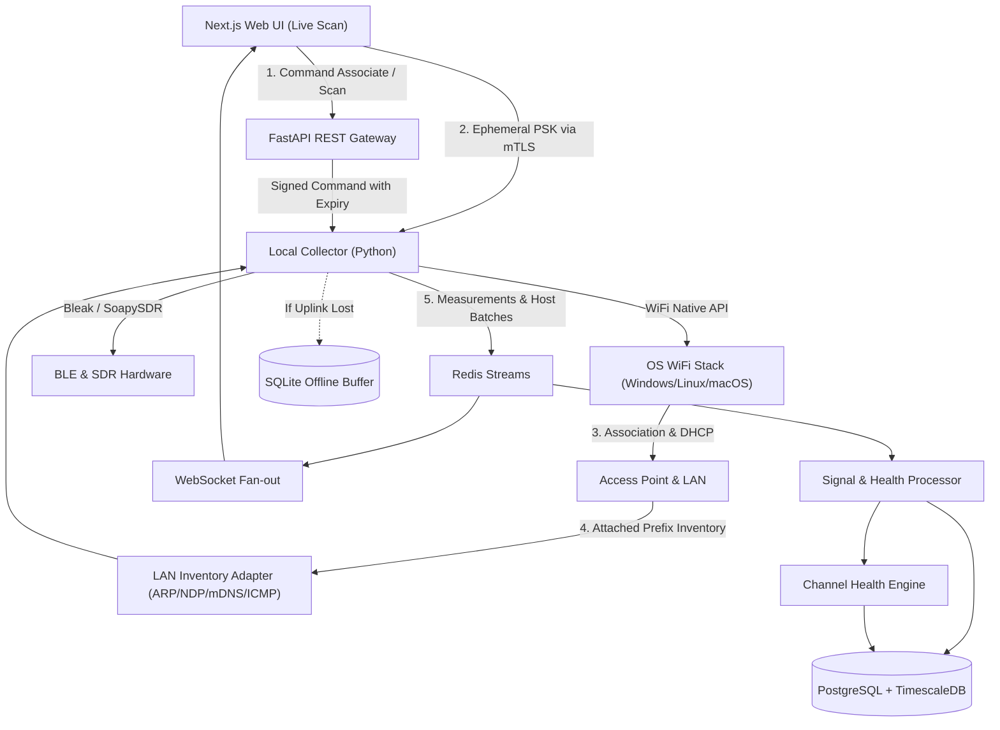

# PRD Integrated: Sistem Pengukuran Kekuatan Sinyal WiFi, Bluetooth, Radio, dan Inventaris Host LAN

**Working Product Name:** Pemindai Area  
**Document Status:** Unified PRD (v1.0 Base + v1.1A Connect & Inventory + v1.2 Channel Health)  
**Date:** 2026-09-14  
**Supersedes:** Draft v1.0 (2026-08-25) & Draft v1.1 Increment (2026-09-07)  
**Owners:** Product, Design, Frontend, Backend, Hardware Integration, dan Network Access  

---

## 1. Ringkasan Eksekutif
**Pemindai Area** adalah sistem pengukuran kekuatan sinyal multi-mode yang memungkinkan pengguna memindai **WiFi**, **Bluetooth Low Energy (BLE)**, dan **radio berbasis Software Defined Radio (SDR)** dari satu antarmuka terpadu. Sistem ini menampilkan pengukuran langsung, menyimpan sesi, membandingkan perubahan kekuatan sinyal, mengekspor hasil, menilai kesehatan kanal WiFi, serta (pada v1.1A) menghubungkan collector ke jaringan WiFi lokal dan menginventarisasi host LAN yang terjangkau.

Aplikasi dirancang sebagai web Next.js yang terhubung ke backend Python dan sebuah **collector lokal**. Collector diperlukan karena browser biasa tidak menyediakan akses lintas platform untuk memindai jaringan WiFi, spektrum radio, atau melakukan asosiasi koneksi jaringan.

Visual utama berbentuk area pemindaian instrumen: lingkaran polar, sweep arm, beacon sinyal, pembacaan numerik, grafik waktu, heatmap kanal, spectrum waterfall, serta radar jangkauan host LAN. Visual ini wajib jujur secara semantik: posisi radial mewakili kekuatan/kualitas relatif, sedangkan sudut beacon/host adalah tata letak deterministik berbasis hash dan **bukan** lokasi atau arah fisik.

---

## 2. Riwayat Versi & Changelog

| Versi | Tanggal | Perubahan Utama |
| :--- | :--- | :--- |
| **v1.0** | 2026-08-25 | Definisi awal produk: mode WiFi, BLE, SDR, collector, sesi, visualisasi polar, dan ekspor CSV/JSON. |
| **v1.1A** | 2026-09-07 | Penambahan alur **Discover → Connect → LAN Inventory**. Collector dapat terhubung ke AP (Open, WPA2, WPA3), memperoleh IP, serta memindai host LAN pada prefix attached. Menyajikan gerbang wewenang, mutex radio adapter, dan penanganan kata sandi efemeral tanpa penyimpanan backend. **Roadmap shift:** Fitur perbandingan sesi, alert threshold, dan kalibrasi RF dari v1.0 digeser ke Fase 1.2. |
| **v1.2** | 2026-09-07 | Penambahan **Channel Health & Recommendation Engine** (read-only). Memperhitungkan overlap-weighted interference (daya linear), confidence model, evidence trail, provenance data, decision record immutable, serta validasi before-after. |

---

## 3. Objective Produk

Sistem dibangun untuk mencapai tujuan-tujuan berikut:
1. Mengukur dan menampilkan kekuatan sinyal WiFi, Bluetooth, dan radio secara real-time dari satu antarmuka konsisten.
2. Memberikan alur kerja menyeluruh: pilih mode, mulai pemindaian, tinjau target, hubungkan ke AP (WiFi), inventarisasi host LAN, simpan sesi, dan ekspor data.
3. Menyediakan visual pemindaian area yang interaktif, akurat secara semantik, responsif, dan tidak menyerupai template dashboard generik.
4. Menghubungkan collector ke jaringan WiFi Open, WPA2-Personal, atau WPA3-Personal yang dipilih pengguna dengan meminta kata sandi hanya saat diperlukan (tanpa menyimpan rahasia di backend).
5. Menjalankan inventarisasi host dan alamat IP pada prefix attached secara otomatis setelah koneksi berhasil dan alamat IP didapatkan.
6. Menilai kesehatan kanal WiFi dan memberikan rekomendasi kanal yang transparan, dapat ditelusuri, serta disertai tingkat keyakinan (confidence) tanpa mengubah konfigurasi jaringan secara otomatis (read-only).
7. Menjaga privasi dan keselamatan: minimisasi metadata, pseudonimisasi BSSID/MAC host (HMAC tenant-scoped), tanpa payload komunikasi, tanpa aksi ofensif, dan tanpa klaim lokasi/jarak meter.

---

## 4. Indikator Keberhasilan (KPI Target)

| Indikator | Target Awal |
| :--- | :--- |
| Keberhasilan memulai sesi pada collector | Minimal 95% |
| Waktu menuju data pertama (First Data Time) | WiFi <= 10s p95, BLE <= 5s p95, Radio <= 3s p95 |
| Latensi data collector ke visual web | <= 1 detik p95 |
| Keberhasilan menyimpan dan mengekspor sesi | Minimal 99% |
| Keberhasilan association WiFi (Open/WPA2/WPA3) | Minimal 90% pada hardware reference matrix |
| Waktu aksi Hubungkan hingga connected / error | <= 20 detik p95 (timeout default 30 detik) |
| Waktu address_acquired hingga host pertama / empty state | <= 8 detik p95 |
| Kata sandi bocor di log, DB, analytics, atau ekspor | **0 kejadian** |
| Discovery keluar dari prefix attached | **0 kejadian** (validator menolak bound ilegal) |
| Task success uji kegunaan (Pilih AP, Connect, Inventory, Export) | Minimal 90% tanpa bantuan moderator |
| Stabilitas sesi & pemindaian | 30 menit pemindaian / 15 menit inventory tanpa kebocoran memori/duplikasi |
| Keterjelasan & determinisme rekomendasi kanal | 100% rekomendasi menampilkan alasan, confidence, freshness, dan 100% deterministik pada contract test |
| Aksesibilitas UI | WCAG 2.2 AA untuk seluruh alur utama, modal, dan tabel |

---

## 5. Problem Statement

1. **Fragmentasi Alat Ukur:** Pengukuran sinyal WiFi, BLE, dan SDR umumnya membutuhkan aplikasi terpisah dengan skala dan format berbeda. Pengguna harus berpindah alat dan menyatukan data secara manual.
2. **Visual Radar Menyesatkan:** Visualisasi radar sering membuat pengguna berasumsi bahwa posisi elemen menunjukkan arah atau jarak meter fisik, padahal RSSI hanya indikator daya relatif.
3. **Keterbatasan Kepadatan Access Point:** Kepadatan AP tidak mencerminkan kesehatan kanal sebenarnya. Satu AP kuat dan aktif berdampak lebih besar dibanding banyak AP lemah. Sistem perlu membedakan data terukur dari estimasi dan menganalisis co-channel serta adjacent-channel interference.
4. **Terputusnya Alur Scan dan Join LAN:** Setelah mengukur RSSI, teknisi jaringan sering harus berpindah ke alat OS/scanner terpisah untuk bergabung ke SSID dan melihat host yang aktif di LAN. Menghubungkan adapter yang sama juga menghentikan scan AP, sehingga konflik radio harus dikelola secara transparan.

---

## 6. Scope Bertahap (Roadmap)

| Fase | Ruang Lingkup Utama |
| :--- | :--- |
| **MVP (v1.0)** | Satu collector aktif per sesi, WiFi scan, BLE scan, SDR spectrum scan, live view, detail target, riwayat, ekspor CSV/JSON, RBAC dasar, audit log. |
| **Fase 1.1A** | **Koneksi WiFi (Open, WPA2-Personal, WPA3-SAE), gerbang wewenang, inventaris host LAN terikat attached prefix, ekspor inventory, mutex adapter (jeda scan AP saat associated), disconnect & hapus profil sementara.** |
| **Fase 1.2** | Perbandingan dua sesi, threshold alert, preset pemindaian, kalibrasi RF tersimpan, offline buffer collector, serta **Channel Health & Recommendation Engine (read-only)**. |
| **Fase 2** | Multi-collector, floor plan survey, heatmap lokasi, anotasi titik ukur, laporan PDF, mobile collector. |
| **Fase 3** | Direction-finding dengan hardware khusus, triangulasi, fleet management, multi-tenant enterprise, dan WPA/WPA2/WPA3 Enterprise (802.1X). |

---

## 7. Pengguna Sasaran

* **Teknisi Jaringan:** Mengecek cakupan WiFi, menemukan kanal padat, menghubungkan collector ke SSID, memverifikasi host/gateway di LAN, dan mengevaluasi rekomendasi kanal.
* **Teknisi IoT & Integrator:** Menemukan perangkat BLE, memantau RSSI/beacon, dan memverifikasi apakah perangkat node muncul di LAN setelah join SSID.
* **Teknisi RF & Pendidikan:** Mengamati spektrum RF via SDR, menganalisis waterfall, dan menyimpan hasil pengukuran.
* **Supervisor & Auditor:** Membuka sesi historis, membaca ringkasan host/rekomendasi, mengunduh data terpseudonimisasi tanpa mengoperasikan pemindai langsung.

---

## 8. Asumsi dan Batas Teknis

1. **Akses Hardware via Collector:** Aplikasi web Next.js tidak melakukan pemindaian atau asosiasi hardware langsung. Seluruh operasi WiFi, BLE, SDR, dan LAN discovery berjalan di collector lokal via API OS/driver.
2. **Mutex Radio Adapter:** Satu radio fisik tidak dapat melakukan pemindaian AP aktif dan terhubung (associated) secara bersamaan. Saat terhubung ke AP, pemindaian AP pada adapter tersebut dijeda. Pemindaian dapat dilanjutkan jika terdapat adapter kedua.
3. **Penerimaan Radio (Receive-Only):** Mode SDR bersifat receive-only (kompatibel SoapySDR). Sistem tidak memiliki fungsi transmit, deauth, jamming, atau spoofing.
4. **Inventaris LAN Terikat Prefix Attached:** Discovery host hanya dilakukan pada prefix IPv4/IPv6 yang secara aktual terpasang di interface associated. Tidak ada pemindaian WAN/internet.
5. **Skala RSSI & Representasi Visual:** RSSI WiFi/BLE dalam dBm, SDR dalam dBFS (dBm jika terkalibrasi). Jarak radial adalah kekuatan relatif, sudut adalah hash deterministik (bukan arah datang atau meter fisik).
6. **Keamanan Kata Sandi:** Kata sandi WiFi (PSK) dikumpulkan di UI dan dikirim langsung ke collector via channel mTLS efemeral. Kata sandi **tidak pernah** disimpan di database backend, log, analytics, atau file ekspor.

---

## 9. Goals dan Non-Goals

### 9.1 Goals
* Memilih mode WiFi, Bluetooth, atau Radio SDR dari antarmuka terpadu.
* Menemukan collector lokal dan membaca kapabilitasnya.
* Memulai, menghentikan, memberi nama, dan menyimpan sesi pemindaian live.
* Menampilkan tren kekuatan sinyal, minimum, maksimum, median, noise floor, SNR, dan channel occupancy.
* Menghubungkan collector ke jaringan WiFi Open, WPA2-Personal, atau WPA3-Personal yang dipilih.
* Menjalankan discovery host LAN otomatis pada attached prefix (own IP, gateway, DNS, hostname mDNS, OUI vendor, status jangkauan).
* Menyediakan Channel Health Engine yang menghitung health score (0-100) dan memberikan rekomendasi kanal read-only berdasarkan evidence terukur.
* Mendukung pseudonimisasi BSSID, alamat BLE, dan MAC host (HMAC tenant-scoped).
* Mengespor data historis (pemindaian & inventory LAN) ke format CSV dan JSON.

### 9.2 Non-Goals
* Menentukan lokasi fisik emitter atau host secara presisi (tanpa hardware direction-finding).
* Menangkap payload paket, mendekripsi lalu lintas, atau menyimpan isi komunikasi.
* Melakukan tindakan ofensif: jamming, deauthentication, spoofing, ARP poisoning, port scanning agresif, atau vulnerability scanning.
* Mengubah konfigurasi router/AP secara otomatis (Channel Health v1.2 bersifat read-only).
* Mendukung WPA-Enterprise (802.1X) pada Fase 1.1A.
* Mengatur atau mengisi formulir login captive portal secara otomatis.

---

## 10. User Stories Utama

1. **[Teknisi Jaringan]** Saya ingin memilih mode WiFi dan menekan *Mulai Pindai* agar access point yang terlihat langsung muncul di visual area.
2. **[Teknisi IoT]** Saya ingin memfilter perangkat BLE berdasarkan nama, manufacturer, atau service UUID agar target cepat ditemukan.
3. **[Teknisi RF]** Saya ingin mengatur center frequency, span, sample rate, gain, dan FFT size pada SDR agar spectrum waterfall sesuai kebutuhan.
4. **[Teknisi Jaringan]** Saya ingin menekan *Hubungkan* pada AP yang dipilih, memasukkan kata sandi jika diminta, dan mengonfirmasi wewenang agar collector bergabung ke jaringan.
5. **[Teknisi Jaringan]** Setelah terhubung, saya ingin melihat IP collector, gateway, DNS, dan daftar host yang merespons di subnet lokal tanpa alat terpisah.
6. **[Pengguna]** Saya ingin memutuskan jaringan atau membatalkan koneksi tanpa meninggalkan profil kata sandi di collector.
7. **[Teknisi Jaringan]** Saya ingin melihat health score setiap kanal WiFi beserta alasan, confidence, dan data yang hilang untuk membandingkan kondisi kanal.
8. **[Teknisi Jaringan]** Saya ingin membandingkan baseline sebelum dan sesudah perubahan kanal untuk memverifikasi perbaikan stabilitas jaringan.
9. **[Auditor]** Saya ingin mengekspor data sesi (termasuk inventory host dan rekomendasi kanal) dengan timestamp, unit, dan identifier terpseudonimisasi.

---

## 11. Functional Requirements

### 11.1 Collector dan Manajemen Sesi
| ID | Requirement | Prioritas | Acceptance Criteria |
| :--- | :--- | :--- | :--- |
| **FR-COL-01** | Sistem menampilkan daftar collector, status online, platform, adapter, dan mode yang tersedia. | Must | Collector tanpa SDR tidak menampilkan opsi radio. |
| **FR-COL-02** | Collector melakukan heartbeat berkala dan melaporkan permission state. | Must | UI membedakan status offline, permission denied, adapter off, busy, dan ready. |
| **FR-SES-01** | Pengguna dapat membuat sesi dengan mode, collector, durasi opsional, interval sampel, dan opsi privasi. | Must | Validasi dilakukan sebelum pemindaian dimulai. |
| **FR-SES-02** | Hanya satu proses scan/associate per adapter aktif jika tidak mendukung concurrency. | Must | Konflik menampilkan pesan kontekstual tanpa membuat sesi yatim. |
| **FR-SES-03** | Pengguna dapat pause, resume, stop, dan menambahkan marker bertimestamp. | Must | Setiap perubahan tercatat di audit log. |

### 11.2 Mode WiFi & Discovery Access Point
| ID | Requirement | Prioritas | Acceptance Criteria |
| :--- | :--- | :--- | :--- |
| **FR-WIFI-01** | Menampilkan SSID, BSSID terhash, RSSI, band, frequency, channel, channel width, dan security type. | Must | Field yang tidak disediakan OS ditandai unavailable. |
| **FR-WIFI-02** | Menampilkan channel occupancy dan tren RSSI target. Filter 2.4 GHz, 5 GHz, 6 GHz sesuai kapabilitas adapter. | Must | Filter hanya aktif jika didukung collector. |
| **FR-WIFI-03** | Mengelompokkan BSSID dalam satu SSID dengan opsi expand detail radio. | Should | Detail BSSID dapat dibuka pengguna. |
| **FR-WIFI-04** | Peringatan jika pemindaian di-throttle oleh OS. | Must | UI menjelaskan interval aktual dapat lebih lambat dari konfigurasi. |
| **FR-WIFI-05** | Menyimpan provenance setiap metrik (measured, reported, configured, derived, inferred, unavailable). | Must | UI dan ekspor membedakan data terukur dari data estimasi. |

### 11.3 Koneksi WiFi (Association)
| ID | Requirement | Prioritas | Acceptance Criteria |
| :--- | :--- | :--- | :--- |
| **FR-CON-01** | Pengguna dapat menekan *Hubungkan* pada target AP dari Live Scan atau Inspector. | Must | Aksi hanya muncul jika `can_associate=true` pada collector. |
| **FR-CON-02** | Mendukung jaringan Open, WPA2-Personal, dan WPA3-Personal (SAE). | Must | Matriks uji lulus pada Windows dan Linux referensi. |
| **FR-CON-03** | Jaringan PSK menampilkan modal kata sandi; jaringan Open langsung memproses tanpa modal kata sandi. | Must | Tombol Hubungkan di modal PSK tidak aktif jika field kosong. |
| **FR-CON-04** | Jaringan Enterprise (802.1X) ditandai tidak didukung pada v1.1A. | Must | UI menjelaskan alasan dan menolak aksi connect. |
| **FR-CON-05** | Meminta konfirmasi gerbang wewenang (*Authorized Use Gate*) sebelum perintah dikirim. | Must | Perintah connect ditolak jika wewenang tidak dicentang. |
| **FR-CON-06** | Kata sandi dikirim langsung ke collector via mTLS efemeral. Backend/DB/Logs/Ekspor tidak pernah menyimpan PSK. | Must | Uji log & static analysis: 0 match credential leakage. |
| **FR-CON-07** | Profil WiFi default bersifat sementara (*temporary profile*). Dihapus otomatis saat disconnect. | Must | Profil sementara terhapus saat disconnect default. |
| **FR-CON-08** | Transisi state machine: `idle` → `requesting_permission` → `associating` → `authenticating` → `obtaining_address` → `connected` → `disconnecting` → `idle`. | Must | Setiap transisi memiliki timestamp di `association_events`. |
| **FR-CON-09** | Timeout association default 30 detik (dapat dikonfigurasi 10-60 detik). | Must | Setelah timeout, radio kembali ke kondisi aman. |

### 11.4 Mutex Radio & Konflik Adapter
| ID | Requirement | Prioritas | Acceptance Criteria |
| :--- | :--- | :--- | :--- |
| **FR-ADP-01** | Pemindaian AP pada adapter yang digunakan untuk associate dijeda otomatis. | Must | Banner kontekstual menjelaskan bahwa scan AP sedang dijeda. |
| **FR-ADP-02** | Jika adapter kedua tersedia, scan AP dapat dilanjutkan pada adapter kedua. | Should | Pemilih adapter menampilkan status scanning vs associated per adapter. |
| **FR-ADP-03** | Setelah disconnect, pemindaian AP pada adapter dapat di-resume otomatis. | Must | Last sequence scan terjaga tanpa duplikasi. |
| **FR-ADP-04** | Hilangnya jalur backend saat join reported sebagai `COLLECTOR_UPLINK_CHANGED`. | Must | Data tertampung di offline buffer SQLite collector. |

### 11.5 Inventaris Host LAN
| ID | Requirement | Prioritas | Acceptance Criteria |
| :--- | :--- | :--- | :--- |
| **FR-INV-01** | Discovery otomatis dimulai setelah interface associated memperoleh IP valid (`address_acquired`). | Must | Discovery tidak berjalan sebelum IP valid diperoleh. |
| **FR-INV-02** | Bound discovery **hanya** prefix attached. Target di luar bound ditolak. | Must | Percobaan 0.0.0.0/0 atau IP asing ditolak validator. |
| **FR-INV-03** | Metode temuan: interface snapshot, gateway, DNS, ARP/NDP cache, mDNS/DNS-SD, ICMP echo terbatas. | Must | Sweep ICMP buta bukan jalur utama. |
| **FR-INV-04** | IPv4 /16 ke atas ditolak. Prefix /22 hingga /17 membutuhkan konfirmasi atau dipotong ke /24 di sekitar gateway. | Must | Mencegah beban discovery berlebih. |
| **FR-INV-05** | Setiap host menampilkan: IP, IP version, hostname mDNS, `mac_hash`, OUI vendor, discovery methods, reachability, RTT, `is_self`, `is_gateway`. | Must | MAC mentah di-hash secara default. |
| **FR-INV-06** | Host IPv4 dan IPv6 dari fisik yang sama digabung via `mac_hash` atau mDNS. | Must | Own interface dan gateway terdeduplikasi. |
| **FR-INV-07** | Refresh periodik default 15 detik (min 5s) plus tombol *Pindai Ulang Host*. Berhenti saat disconnect. | Must | Refresh tidak menimbulkan host duplikat. |
| **FR-INV-08** | Client isolation ditandai `LAN_DISCOVERY_BLOCKED` dengan tetap menampilkan own IP & gateway. | Must | UI menjelaskan kemungkinan isolasi jaringan stasiun. |

### 11.6 Channel Health & Recommendation Engine (v1.2 Read-Only)
| ID | Requirement | Prioritas | Acceptance Criteria |
| :--- | :--- | :--- | :--- |
| **FR-CHH-01** | Sistem menghitung health score (0-100) untuk setiap kanal kandidat yang valid. | Must | Score deterministik & dapat direproduksi dari snapshot & versi algoritma yang sama. |
| **FR-CHH-02** | Memisahkan co-channel dan adjacent-channel interference dengan pembobotan daya linear ($10^{RSSI/10}$). | Must | Evidence drawer menampilkan kontribusi BSSID terpseudonimisasi tanpa penjumlahan dBm langsung. |
| **FR-CHH-03** | Komponen unavailable tidak diberi nilai 0, melainkan bobot dinormalisasi ulang & confidence diturunkan. | Must | Missing metrics menurunkan confidence secara eksplisit. |
| **FR-CHH-04** | Menghasilkan kanal utama, maksimal 2 alternatif, alasan pendukung, counter-signal, confidence, dan missing evidence. | Must | Recommendation card memuat seluruh field wajib tersebut. |
| **FR-CHH-05** | Memfilter kandidat menurut band, channel width, regulatory domain, capability adapter, dan kebijakan DFS. | Must | Kanal terlarang regulasi tidak muncul sebagai rekomendasi. |
| **FR-CHH-06** | Engine bersifat **read-only** pada v1.2. | Must | Tidak ada endpoint atau UI yang mengubah konfigurasi AP/router. |

### 11.7 Mode Bluetooth (BLE) & Radio SDR
| ID | Requirement | Prioritas | Acceptance Criteria |
| :--- | :--- | :--- | :--- |
| **FR-BLE-01** | Menampilkan nama perangkat, `mac_hash`, RSSI, manufacturer, service UUID, dan last seen. | Must | Perangkat tanpa nama dapat dibedakan secara stabil. |
| **FR-BLE-02** | Memungkinkan pemantauan target BLE tanpa koneksi GATT (scan pasif). | Must | Mode pasif tidak melakukan proses pairing. |
| **FR-RF-01** | Deteksi perangkat SDR, pengaturan center frequency, span, sample rate, gain, FFT size, window. | Must | Prevent parameter di luar batas kapabilitas driver SDR. |
| **FR-RF-02** | Menampilkan spectrum line, peak markers, noise floor, dan waterfall (dBFS / dBm terkalibrasi). | Must | Unit ditampilkan secara eksplisit. |

---

## 12. Information Architecture & Navigation

Aplikasi memiliki dua fase utama pada Live Scan Mode WiFi:
1. **Fase Discover:** Pemindaian Access Point, Channel Occupancy, dan evaluasi Channel Health.
2. **Fase Associated:** Collector terhubung ke AP, pemindaian AP dijeda, panel LAN Host Inventory aktif.

```
[ Live Scan ]
  ├── Mode Selector (WiFi | Bluetooth | Radio SDR)
  ├── Collector Picker & Capability Diagnostic
  ├── Phase 1: Discover (AP Radar, Target Inspector, Channel Health Matrix & Recommendation)
  └── Phase 2: Associated (Network Field, Interface Summary, LAN Host Inventory, Host Inspector)
[ Channel Health ] ── Health Matrix, Recommendation Cards, Evidence Drawer, Before-After Validation
[ Sessions ] ──────── History, Filters (had_association, mode), Comparison, Export (CSV/JSON)
[ Collectors ] ────── Device status, Adapters, Permissions, Diagnostics
[ Settings ] ──────── Privacy Policy (SSID/MAC hashing), OS Keychain Profile, Retention Rules
```

---

## 13. Component Inventory & UI Standards

### 13.1 Komponen Frontend Utama

* **AppShell:** Layout global, navigasi rail/bottom bar, theme provider.
* **ModeRail:** Switcher mode WiFi, BLE, SDR.
* **ScanField:** Canvas polar ECharts dengan sweep arm (Discover) & Network Field dengan beacon host (Associated).
* **ConnectAction:** Tombol *Hubungkan* / *Putuskan* pada target AP.
* **AuthorizedUseGate:** Modal/checkbox konfirmasi wewenang penggunaan jaringan.
* **WifiCredentialModal:** Dialog kata sandi PSK dengan masked input, Caps Lock indicator, dan auto-zeroize buffer.
* **AdapterConflictBanner:** Banner persistent yang menginformasikan bahwa pemindaian AP dijeda karena adapter sedang terhubung ke SSID.
* **InterfaceSummary:** Metric strip menampilkan Own IP, Gateway, Subnet Prefix, DNS, dan DHCP server.
* **HostInventory:** Tabel ter-virtualisasi (TanStack Table) menampilkan daftar host LAN.
* **ChannelRecommendationCard:** Kartu rekomendasi kanal utama/alternatif, confidence badge, dan alasan.
* **ChannelEvidenceDrawer:** Drawer penjelasan detail provenance, missing evidence, dan kontribusi interferensi.

### 13.2 Tailwind CSS v4 Theme Tokens

```css
@import "tailwindcss";

@theme {
  --color-canvas: #090b0c;
  --color-surface: #111416;
  --color-surface-raised: #171b1d;
  --color-line: #2a3033;
  --color-signal: #a8d94f; /* Muted Signal Lime */
  --color-ink: #f2f4ef;
  --color-muted: #9aa3a0;
  --font-sans: "Geist", ui-sans-serif, system-ui, sans-serif;
  --font-mono: "Geist Mono", ui-monospace, monospace;
  --radius-panel: 1rem;     /* 16px */
  --radius-control: 0.625rem; /* 10px */
}
```

### 13.3 Anti-AI Slop Standards
* **Warna:** Base graphite/zinc neutral dengan **satu** dekoratif accent `signal-lime`. Amber/Rose hanya untuk status semantik. Tanpa AI-purple, gradient text, atau glassmorphism berlebihan.
* **Tipografi:** Geist Mono + `tabular-nums` untuk angka instrumen. Geist Sans untuk antarmuka. Heading tidak oversized.
* **Motion:** Motion hanya untuk feedback transisi state dan sweep scan. Mendukung `prefers-reduced-motion` (sweep berputar diganti dengan indicator perimeter statis).

---

## 14. Arsitektur Sistem (Backend & Collector)

### 14.1 Diagram Alur Arsitektur Terpadu



### 14.2 Stack Teknologi

* **Frontend:** Next.js App Router, TypeScript, Tailwind CSS v4, customized shadcn/ui, Phosphor Icons, Motion, Apache ECharts, TanStack Table, TanStack Query, Zustand, React Hook Form, Zod.
* **Backend:** Python 3.12, FastAPI, Pydantic v2, SQLAlchemy 2, Alembic, asyncpg, PostgreSQL + TimescaleDB, Redis Streams, NumPy, SciPy, OpenTelemetry.
* **Collector Adapters:**
  * `SignalAdapter`: Native WiFi BSS scan, Bleak (BLE), SoapySDR (Radio).
  * `AssociationAdapter`: Windows Native WiFi (`WlanConnect`), Linux NetworkManager/D-Bus, macOS CoreWLAN.
  * `LanInventoryAdapter`: Interface snapshot, OS ARP/NDP cache, mDNS/DNS-SD resolver, ICMP echo terlimit.

---

## 15. Data Model & Schema

### 15.1 Entitas Data Utama

1. **`scan_sessions`:** `id`, `mode`, `collector_id`, `config`, `status`, `started_at`, `ended_at`, `owner_id`.
2. **`measurements` (TimescaleDB hypertable):** `time`, `session_id`, `target_id`, `value` (dBm/dBFS), `unit`, `frequency`, `channel`, `noise`, `snr`, `quality_flags`.
3. **`wifi_associations`:** `id`, `session_id`, `collector_id`, `adapter_id`, `ssid_policy`, `bssid_hash`, `security_type`, `state`, `associated_at`, `disconnected_at`, `ipv4`, `ipv6`, `prefix`, `gateway`, `dns`, `dhcp_server`, `captive_state`, `save_profile_requested`.
4. **`lan_hosts`:** `time`, `association_id`, `session_id`, `ip`, `ip_version`, `hostname_redacted`, `mac_hash`, `oui_vendor`, `methods`, `reachability`, `rtt_ms`, `is_self`, `is_gateway`, `quality_flags`.
5. **`association_events`:** `time`, `association_id`, `from_state`, `to_state`, `error_code`, `actor_id`.
6. **`channel_health_snapshots`:** `id`, `session_id`, `band`, `width`, `observation_window`, `regulatory_domain`, `components`, `quality_flags`.
7. **`channel_recommendations`:** `id`, `snapshot_id`, `algorithm_version`, `ranked_candidates`, `confidence`, `reasons`, `missing_evidence`.

> **Aturan Rahasia:** Tidak ada kolom kata sandi (`password` / `psk`) di tabel manapun. Kata sandi di-zeroize dari memori UI & Collector setelah digunakan.

---

## 16. API Contract Terpadu

### 16.1 REST Endpoints Utama

* **Collectors & Sessions:**
  * `GET /api/v1/collectors` - Daftar collector & kapabilitas (`can_associate`, `can_sdr`, dll.).
  * `POST /api/v1/sessions` - Membuat sesi baru.
  * `POST /api/v1/sessions/{id}/start` | `pause` | `resume` | `stop` - Kontrol siklus sesi.
* **WiFi Association & LAN Inventory:**
  * `POST /api/v1/sessions/{id}/associations` - Membuat draft association.
  * `POST /api/v1/associations/{id}/connect` - Memicu alur koneksi (Body: `target_id`, `authorized_use_confirmed`, `save_profile`; **tanpa password**).
  * `POST /api/v1/associations/{id}/disconnect` - Memutuskan koneksi & menghapus profil efemeral.
  * `GET /api/v1/associations/{id}/hosts` - Mengambil daftar host LAN terjangkau (pagination).
* **Channel Health v1.2:**
  * `GET /api/v1/sessions/{id}/channel-health` - Mengambil health score & komponen per kanal.
  * `POST /api/v1/sessions/{id}/channel-recommendations/evaluate` - Evaluasi rekomendasi read-only.
  * `GET /api/v1/sessions/{id}/channel-recommendations/latest` - Rekomendasi kanal terbaru.
* **Exports:**
  * `POST /api/v1/sessions/{id}/exports` - Membuat job ekspor CSV/JSON.

### 16.2 WebSocket Events (`/ws/v1/sessions/{session_id}`)

* **Measurement & Status:** `session.snapshot`, `measurement.batch`, `aggregate.updated`, `collector.status_changed`.
* **Association & Inventory:** `association.state_changed`, `association.address_acquired`, `inventory.host_discovered`, `inventory.host_updated`, `inventory.completed`, `association.failed`.
* **Channel Health:** `channel.health_updated`, `channel.recommendation_updated`.

---

## 17. Security, Privacy, dan Safety

1. **Keamanan Kata Sandi:** Modal UI mengumpulkan PSK → dikirim via mTLS efemeral ke collector → dikirim ke API OS → memory zeroize. Backend, log, analytics, dan database tidak memuat kata sandi.
2. **Gerbang Wewenang (Authorized Use Gate):** Pengguna wajib secara eksplisit mengonfirmasi bahwa mereka berwenang melakukan asosiasi dan pemindaian di jaringan tersebut (`authorized_use_confirmed=true`).
3. **Pseudonimisasi Identifier:** BSSID, BLE address, dan MAC host di-hash menggunakan HMAC tenant-scoped secara default.
4. **Pembatasan Discovery:** Scope pemindaian host LAN dibatasi **hanya** pada attached prefix interface. Validator menolak permintaan yang mengarah ke luar subnet (seperti WAN atau CIDR /16 ke atas).
5. **Receive-Only & Non-Ofensif:** Tidak ada fitur injeksi paket, ARP poisoning, deauth, port scanning massal, atau banner grabbing.

---

## 18. Error Taxonomy & Recovery

| Error Code | Pesan Pengguna | Recovery Action |
| :--- | :--- | :--- |
| `COLLECTOR_OFFLINE` | Collector tidak terhubung. | Auto-retry, pemicu reconnection backoff. |
| `PERMISSION_DENIED` | Izin OS ditolak. | Tampilkan langkah perbaikan izin OS. |
| `WIFI_AUTH_FAILED` | Kata sandi ditolak atau metode keamanan tidak cocok. | Coba lagi. Kata sandi sebelumnya tidak disimpan. |
| `WIFI_ASSOC_TIMEOUT` | AP tidak menyelesaikan hubungan dalam batas waktu (30s). | Periksa jarak/sinyal AP, coba lagi. |
| `WIFI_DHCP_TIMEOUT` | Terhubung ke radio tetapi gagal mendapat IP. | Putuskan, periksa DHCP server LAN. |
| `WIFI_ADAPTER_BUSY` | Adapter sedang dipakai pemindaian lain. | Jeda scan AP atau gunakan adapter kedua. |
| `LAN_DISCOVERY_BLOCKED` | Jaringan membatasi visibilitas antar perangkat (Client Isolation). | Own IP & Gateway tetap ditampilkan. |
| `INSUFFICIENT_CHANNEL_DATA` | Data belum cukup untuk rekomendasi kanal. | Lanjutkan scan hingga minimum window terpenuhi. |
| `REGULATORY_DOMAIN_UNKNOWN` | Domain regulasi tidak diketahui. | Rekomendasi operasional ditahan hingga region diatur. |

---

## 19. Testing Strategy & Definition of Done (DoD)

### 19.1 Testing Strategy
* **Unit Test:** Normalisasi adapter, HMAC pseudonymization, daya linear interference, state machine association, zeroize credential buffer, validator attached prefix bound.
* **Contract & Integration Test:** Schema event WS, REST endpoint connect menolak payload password, TimescaleDB hypertable ingest, replay sequence.
* **Hardware Reference Matrix:** Uji pada Windows (Native WiFi), Linux (NetworkManager), dan macOS (CoreWLAN) untuk alur Open, WPA2-Personal, WPA3-SAE, serta BLE & SDR hardware.
* **Visual & Accessibility Test:** Playwright E2E, axe-core WCAG 2.2 AA compliance, screenshot regression, soak test 30 menit streaming / 15 menit inventory.

### 19.2 Definition of Done (DoD) Integrated
Sistem dinyatakan rilis jika:
1. Alur end-to-end (Pilih mode → Scan → Target → Connect AP → Inventory LAN → Channel Health → Export) berfungsi tanpa kesalahan pada hardware reference.
2. Kata sandi **0% leak** di backend, log, analytics, atau file ekspor.
3. Discovery host terbukti **hanya** berjalan pada attached prefix.
4. Scan AP pada adapter yang sama dijeda secara transparan saat connected dan dapat di-resume setelah disconnect.
5. Rekomendasi Channel Health v1.2 bersifat read-only, deterministik, dan dapat ditelusuri.
6. Seluruh kontrol dan antarmuka memenuhi standar WCAG 2.2 AA dan arah visual anti-slop.
