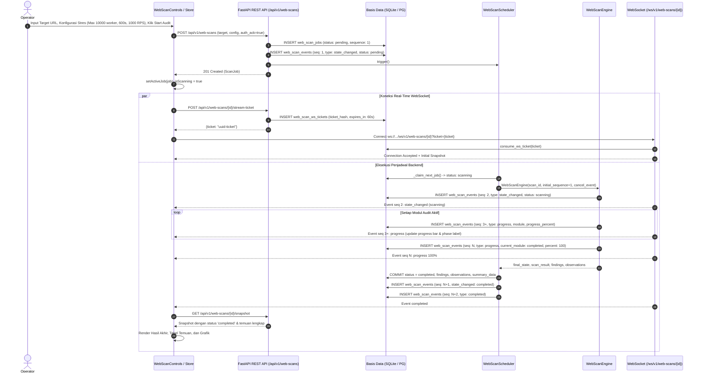

# Laporan Implementasi: Ghost Web Scanner & Skenario Pengujian Stress / Bounded DDoS

## Ringkasan
Fitur **Ghost Web Scanner & Load Resilience (Stress / Bounded DDoS Testing)** adalah subsistem pemindaian keamanan aplikasi web dan pengujian ketahanan beban terisolasi yang diintegrasikan ke dalam ekosistem Signal Scanner. Fitur ini memungkinkan tim keamanan dan operator sistem melakukan audit keamanan komprehensif terhadap aplikasi web target serta menjalankan simulasi uji beban ekstrem (*bounded stress/DDoS simulation*) hingga 10.000 pekerja konkurensi (*concurrent workers*) dan laju permintaan hingga 1.000 req/sec dengan batas waktu maksimal 10 menit (600 detik).

Hasil implementasi mencakup modul audit lengkap (rekognisi, *security headers*, audit *cookie*, audit *form/CSRF*, injeksi parameter, diagnostik *header*, dan ketahanan beban), antarmuka pengguna berbasis Next.js dengan visualisasi grafis ECharts, komunikasi real-time menggunakan WebSocket yang dilengkapi *fallback polling*, pencegahan SSRF berbasis kebijakan jaringan, pembatalan instan (*cooperative cancellation*), serta sistem ekspor laporan terverifikasi (*hash* SHA-256).

---

## Latar Belakang dan Tujuan
1. **Kebutuhan Pengujian Mandiri**: Perusahaan membutuhkan kapabilitas untuk menguji ketahanan dan kerentanan server serta aplikasi web milik sendiri secara terprogram dan aman tanpa bergantung pada alat eksternal pihak ketiga yang berpotensi membocorkan data target.
2. **Kebutuhan Simulasi Beban Tinggi (Stress / DDoS)**: Diperlukan skenario pengujian ketahanan beban nyata (*stress test / bounded DDoS*) pada infrastruktur perusahaan guna memetakan ambang batas degradasi layanan (*saturation & failure threshold*), perilaku rate limiter, dan stabilitas server web saat menerima lonjakan lalu lintas ekstrem.
3. **Pemberantasan Masalah Pemindaian Macet (*Stuck Progress*)**: Mengatasi kendala teknis saat proses audit berlangsung di mana bilah kemajuan terkunci pada status `Current Phase: Initializing Scan...` dan `0%` akibat *type coercion* pada skema Pydantic, tabrakan nomor urut (*sequence constraint*) basis data, serta *race condition* penutupan status.
4. **Isolasi Domain & Keamanan Operasi**: Memastikan modul pemindaian web beroperasi dalam ranah terisolasi dengan proteksi SSRF (*Server-Side Request Forgery*), validasi kepemilikan target (*authorization acknowledgement*), dan pembatalan instan kapan saja oleh operator.

---

## Perilaku Fitur
1. **Inisiasi Audit & Konfigurasi**:
   - Operator mengakses menu **Ghost Web Scanner Domain** melalui navigasi aplikasi.
   - Operator memasukkan URL target (contoh: `https://example.com` atau alamat internal) dan memilih profil pemindaian:
     - `v2`: Rekognisi, audit 6 *security header*, audit *cookie*, dan diagnostik injeksi *header*.
     - `legacy_v47`: Heuristik V47 dan uji stres beban.
     - `legacy_v75`: Audit kepatuhan 14 bobot keamanan.
     - `comprehensive`: Menjalankan seluruh 7 modul audit.
   - Operator wajib mencentang persetujuan legalitas otorisasi pemindaian (*authorization acknowledged*).
   - Operator dapat membuka panel **Advanced / DDoS Simulation Settings** untuk mengatur:
     - **Max Concurrency**: Pengaturan jumlah pekerja konkurensi dari 1 hingga maksimal 10.000 pekerja.
     - **Timeout (Seconds)**: Durasi maksimum audit dari 5 hingga 600 detik (10 menit).
     - **Rate Limit (req/sec)**: Batas kecepatan permintaan hingga 1.000 permintaan per detik.
     - **Allow Private Networks (SSRF Bypass)**: Akses ke IP lokal/privat khusus pengujian server internal.
2. **Eksekusi & Pemantauan Real-Time**:
   - Saat tombol **Start Audit** diklik, sistem membuat tugas audit di backend dengan status `pending` dan memulai pekerja latar belakang (*background worker*).
   - Bilah progres menampilkan fase aktif secara langsung (misal: *Recon & Fingerprinting*, *Security Headers Audit*, *Load Resilience Benchmark*) dan nilai persentase yang bertambah dari 0% hingga 100%.
   - Ringkasan metrik statistik diperbarui secara langsung: total temuan, rincian keparahan (*Critical*, *High*, *Medium*, *Low*, *Info*), jumlah permintaan HTTP, dan metrik stres (RPS rata-rata, durasi, tingkat kegagalan).
   - Operator dapat membatalkan audit kapan saja dengan menekan tombol **Cancel Audit**; proses pemindaian dan seluruh pekerja beban akan berhenti secara kooperatif dalam hitungan milidetik.
3. **Analisis Temuan & Ekspor Deliverable**:
   - Temuan kerentanan ditampilkan pada tabel interaktif yang dapat difilter berdasarkan modul, tingkat keparahan, atau pencarian teks.
   - Operator dapat membuka modal detail temuan untuk memeriksa deskripsi teknis, rekomendasi remediasi, bukti HTTP (*request/response evidence*), serta *fingerprint* temuan.
   - Menu ekspor menyediakan laporan resmi dalam format JSON, format kompatibilitas v2 JSON, teks ringkas (TXT), dan skrip SQL aman (*safe idempotent SQL*), masing-masing disertai *checksum* SHA-256 pada header unduhan.

---

## Perubahan Frontend

### Komponen & Antarmuka Pengguna
- **[`frontend/app/web-scanner/page.tsx`](file:///C:/Users/zaikh/Documents/Backup%20MacOS/Project/Signal%20Scanner/frontend/app/web-scanner/page.tsx)**: Halaman utama dasbor Web Scanner. Mengatur tata letak halaman, pengecekan *readiness feature flag*, peringatan galat, dan inisialisasi *stream hook*.
- **[`frontend/components/web-scanner/WebScanControls.tsx`](file:///C:/Users/zaikh/Documents/Backup%20MacOS/Project/Signal%20Scanner/frontend/components/web-scanner/WebScanControls.tsx)**: Panel kendali audit. Mengelola input URL, pemilihan profil, persetujuan legalitas, tombol peluncuran/pembatalan, serta pengaturan tingkat lanjut (Max Concurrency: 10.000, Timeout: 600s, RPS: 1.000).
- **[`frontend/components/web-scanner/WebScanProgress.tsx`](file:///C:/Users/zaikh/Documents/Backup%20MacOS/Project/Signal%20Scanner/frontend/components/web-scanner/WebScanProgress.tsx)**: Bilah kemajuan dinamis dengan label modul terpetakan (*Recon*, *Headers*, *Cookies*, *Forms*, *Parameters*, *Header Probes*, *Load Resilience Benchmark*, *Audit Analysis Complete*) dan indikator animasi.
- **[`frontend/components/web-scanner/WebScanStatusBadge.tsx`](file:///C:/Users/zaikh/Documents/Backup%20MacOS/Project/Signal%20Scanner/frontend/components/web-scanner/WebScanStatusBadge.tsx)**: Komponen lencana status pekerjaan audit dengan penanganan nilai defensif terhadap nilai `undefined` atau `null`.
- **[`frontend/components/web-scanner/WebScanSummary.tsx`](file:///C:/Users/zaikh/Documents/Backup%20MacOS/Project/Signal%20Scanner/frontend/components/web-scanner/WebScanSummary.tsx)**: Kartu ringkasan metrik statistik temuan risiko, metrik permintaan HTTP, dan data uji ketahanan beban.
- **[`frontend/components/web-scanner/WebScanCharts.tsx`](file:///C:/Users/zaikh/Documents/Backup%20MacOS/Project/Signal%20Scanner/frontend/components/web-scanner/WebScanCharts.tsx)**: Visualisasi distribusi keparahan temuan dan cakupan modul menggunakan Apache ECharts.
- **[`frontend/components/web-scanner/WebFindingTable.tsx`](file:///C:/Users/zaikh/Documents/Backup%20MacOS/Project/Signal%20Scanner/frontend/components/web-scanner/WebFindingTable.tsx)**: Tabel temuan audit yang mendukung paginasi, pencarian judul, dan penyaringan keparahan.
- **[`frontend/components/web-scanner/WebFindingDetail.tsx`](file:///C:/Users/zaikh/Documents/Backup%20MacOS/Project/Signal%20Scanner/frontend/components/web-scanner/WebFindingDetail.tsx)**: Modal rincian bukti teknis kerentanan dan langkah perbaikan (*remediation*).
- **[`frontend/components/web-scanner/WebScanExportMenu.tsx`](file:///C:/Users/zaikh/Documents/Backup%20MacOS/Project/Signal%20Scanner/frontend/components/web-scanner/WebScanExportMenu.tsx)**: Menu unduhan berkas laporan hasil audit dalam berbagai format.
- **[`frontend/components/web-scanner/WebScanHistory.tsx`](file:///C:/Users/zaikh/Documents/Backup%20MacOS/Project/Signal%20Scanner/frontend/components/web-scanner/WebScanHistory.tsx)**: Tabel riwayat pekerjaan audit terdahulu.
- **[`frontend/components/layout/Header.tsx`](file:///C:/Users/zaikh/Documents/Backup%20MacOS/Project/Signal%20Scanner/frontend/components/layout/Header.tsx)**: Penambahan tautan navigasi `Web Scanner` di bilah atas aplikasi.

### Manajemen State, Stream & Klien API
- **[`frontend/lib/webScanStore.ts`](file:///C:/Users/zaikh/Documents/Backup%20MacOS/Project/Signal%20Scanner/frontend/lib/webScanStore.ts)**: Store Zustand `useWebScanStore`. Mengelola status pekerjaan aktif (`activeJob`), cuplikan metrik (`snapshot`), daftar temuan (`findings`), observasi, riwayat event, sanitasi nilai progres (`progressPercent`), dan transisi otomatis `progressPercent: 100` saat status audit mencapai `completed`.
- **[`frontend/hooks/useWebScanStream.ts`](file:///C:/Users/zaikh/Documents/Backup%20MacOS/Project/Signal%20Scanner/frontend/hooks/useWebScanStream.ts)**: Hook pengelola *stream* real-time. Meminta tiket otorisasi sekali pakai (`POST /stream-ticket`), membuka koneksi WebSocket, memproses event terurut melalui fungsi `applyEvent`, serta menyertakan mekanisme cadangan *fallback HTTP polling* (interval 2 detik) ke `/events` dan `/snapshot` saat WebSocket terputus.
- **[`frontend/lib/webScanApiClient.ts`](file:///C:/Users/zaikh/Documents/Backup%20MacOS/Project/Signal%20Scanner/frontend/lib/webScanApiClient.ts)**: Klien HTTP terisolasi untuk seluruh pemanggilan endpoint REST Web Scanner dan pengunduhan berkas blob laporan.
- **[`frontend/lib/webScanTypes.ts`](file:///C:/Users/zaikh/Documents/Backup%20MacOS/Project/Signal%20Scanner/frontend/lib/webScanTypes.ts)**: Definisi tipe data antarmuka TypeScript yang selaras dengan skema Pydantic backend.

---

## Perubahan Backend

### Konfigurasi & Basis Data
- **[`backend/app/config.py`](file:///C:/Users/zaikh/Documents/Backup%20MacOS/Project/Signal%20Scanner/backend/app/config.py)**: Penambahan variabel konfigurasi lingkungan:
  - `WEB_SCANNER_ENABLED`: Feature flag global subsistem Web Scanner (default `True`).
  - `WEB_SCAN_GLOBAL_MAX_CONCURRENCY`: Batas konkurensi pekerja global (nilai 10.000).
  - `WEB_SCAN_PER_ORIGIN_CONCURRENCY`: Batas konkurensi per host/origin (nilai 5.000).
  - `WEB_SCAN_DEFAULT_TIMEOUT_SEC`: Batas waktu timeout audit default (600.0 detik / 10 menit).
  - `WEB_SCAN_MAX_BODY_BYTES`: Batas pemotongan ukuran respon (1 MiB) guna mencegah degradasi memori.
  - `WEB_SCAN_ALLOW_PRIVATE_NETWORKS`: Izin pemindaian jaringan lokal/internal (default `True`).
- **[`backend/app/db/web_scan_models.py`](file:///C:/Users/zaikh/Documents/Backup%20MacOS/Project/Signal%20Scanner/backend/app/db/web_scan_models.py)**: Model ORM SQLAlchemy untuk 7 entitas:
  - `WebScanJobModel`: Menyimpan informasi pekerjaan, konfigurasi, status eksekusi, dan ringkasan data.
  - `WebScanFindingModel`: Menyimpan rekaman temuan kerentanan terdeduplikasi (*fingerprint*).
  - `WebScanObservationModel`: Menyimpan bukti observasi permintaan dan respons HTTP.
  - `WebScanEventRecordModel`: Menyimpan rekaman event audit terurut dengan *unique constraint* `(scan_id, sequence)`.
  - `WebScanWsTicketModel`: Menyimpan tiket otorisasi WebSocket sementara (berlaku 60 detik, *single-use*).
  - `WebScanAuditRecordModel`: Catatan audit kepatuhan aktivitas operator.
  - `WebScanScopeModel`: Definisi aturan izin dan cakupan target pemindaian.
- **[`backend/migrations/versions/0005_web_scanner.py`](file:///C:/Users/zaikh/Documents/Backup%20MacOS/Project/Signal%20Scanner/backend/migrations/versions/0005_web_scanner.py)**: Berkas migrasi Alembic untuk pembuatan tabel-tabel Web Scanner secara terstruktur.

### Skema & Logika Inti Pemindaian
- **[`backend/app/schemas/web_scan.py`](file:///C:/Users/zaikh/Documents/Backup%20MacOS/Project/Signal%20Scanner/backend/app/schemas/web_scan.py)**: Model validasi Pydantic v2. Penambahan model `ScanProgress` dan penetapan tipe `WebScanEvent.payload: Any` untuk mencegah *data loss* akibat *type coercion* Pydantic Union.
- **[`backend/app/core/web_scan/engine.py`](file:///C:/Users/zaikh/Documents/Backup%20MacOS/Project/Signal%20Scanner/backend/app/core/web_scan/engine.py)**: `WebScanEngine`. Mengorkestrasi eksekusi modul-modul pemindaian, mengelola urutan penomoran event berbasis `initial_sequence` (menghindari tabrakan urutan DB), memancarkan event kemajuan 0–100%, serta mematuhi sinyal pembatalan kooperatif.
- **[`backend/app/core/web_scan/modules/load_resilience.py`](file:///C:/Users/zaikh/Documents/Backup%20MacOS/Project/Signal%20Scanner/backend/app/core/web_scan/modules/load_resilience.py)**: Modul uji ketahanan beban (*Load Resilience / Stress Testing*):
  - Mengimplementasikan *worker pool* asinkron dengan pembagian kuota kerja berbasis `asyncio.Semaphore` dan pembatasan laju (*token bucket rate limiter*).
  - Menerapkan batasan konkurensi `min(concurrency, 10000)` dan batasan durasi `min(duration_seconds, 600)`.
  - Meniadakan fitur *auto-abort* pada status HTTP 429 agar server dapat diuji ketahanannya secara utuh saat mengalami pembatasan laju (*rate limiting*).
  - Memeriksa `cancel_event.is_set()` pada setiap iterasi pekerja untuk menjamin pembatalan instan tanpa penundaan.
- **Modul Audit Tambahan**:
  - `modules/recon.py`: Deteksi banner server, firewall WAF, CMS, enumerasi subdomain, dan *path*.
  - `modules/security_headers.py`: Evaluasi keberadaan dan kekuatan CSP, HSTS, X-Frame-Options, X-Content-Type-Options, Permissions-Policy, dan Referrer-Policy.
  - `modules/cookie_audit.py`: Pemeriksaan atribut keamanan cookie (`HttpOnly`, `Secure`, `SameSite`).
  - `modules/forms.py`: Deteksi form login tanpa enkripsi, kerentanan input, dan absennya token anti-CSRF.
  - `modules/parameters.py`: Pengujian parameter URL terhadap injeksi SQL (*error-based*), XSS reflektif, dan anomali boolean delta.
  - `modules/header_probes.py`: Uji diagnostik injeksi pada header `X-Forwarded-For`, `User-Agent`, dan `Referer`.
- **[`backend/app/core/web_scan/transport.py`](file:///C:/Users/zaikh/Documents/Backup%20MacOS/Project/Signal%20Scanner/backend/app/core/web_scan/transport.py)** & **`http_client.py`**: Klien HTTP kustom dengan pembatasan SSRF (*Server-Side Request Forgery*), penegakan batas ukuran respons (*body capping* 1 MiB), dan isolasi koneksi.

### Penjadwal, Layanan & Endpoint API
- **[`backend/app/services/web_scan_scheduler.py`](file:///C:/Users/zaikh/Documents/Backup%20MacOS/Project/Signal%20Scanner/backend/app/services/web_scan_scheduler.py)**: Penjadwal latar belakang `WebScanScheduler`. Mengambil pekerjaan dari status `pending` secara atomik, memicu eksekusi engine dengan sinkronisasi nomor urut `initial_sequence`, memulihkan pekerjaan yang terinterupsi saat server mati mendadak, serta memancarkan event `state_changed: completed` dan `completed` secara aman **setelah** seluruh data commit ke basis data selesai (*race condition elimination*).
- **[`backend/app/services/web_scan_service.py`](file:///C:/Users/zaikh/Documents/Backup%20MacOS/Project/Signal%20Scanner/backend/app/services/web_scan_service.py)**: Logika bisnis untuk pembuatan pekerjaan, konsumsi tiket WebSocket sekali pakai, pencarian temuan terfilter, dan pembatalan instan.
- **[`backend/app/services/web_scan_export_service.py`](file:///C:/Users/zaikh/Documents/Backup%20MacOS/Project/Signal%20Scanner/backend/app/services/web_scan_export_service.py)**: Pembuatan dokumen laporan audit format JSON, format kompatibilitas v2, TXT, dan safe SQL beserta penghitungan hash SHA-256.
- **[`backend/app/api/v1/web_scans.py`](file:///C:/Users/zaikh/Documents/Backup%20MacOS/Project/Signal%20Scanner/backend/app/api/v1/web_scans.py)**: Endpoint REST API:
  - `POST /api/v1/web-scans`: Pembuatan tugas audit baru.
  - `GET /api/v1/web-scans`: Daftar pekerjaan audit dengan filter status dan paginasi.
  - `GET /api/v1/web-scans/{scan_id}`: Detail status pekerjaan audit.
  - `POST /api/v1/web-scans/{scan_id}/cancel`: Pembatalan audit aktif.
  - `GET /api/v1/web-scans/{scan_id}/snapshot`: Cuplikan komposit metrik hasil audit.
  - `GET /api/v1/web-scans/{scan_id}/findings`: Daftar temuan keamanan terpaginasi.
  - `GET /api/v1/web-scans/{scan_id}/observations`: Bukti observasi HTTP.
  - `GET /api/v1/web-scans/{scan_id}/events`: Daftar event terurut untuk pemutaran ulang (*replay*).
  - `POST /api/v1/web-scans/{scan_id}/stream-ticket`: Pembuatan tiket otorisasi WebSocket.
  - `GET /api/v1/web-scans/{scan_id}/export`: Pengunduhan berkas laporan terenkripsi integritasnya.
  - `GET /api/v1/web-scans/capabilities`: Informasi ketersediaan fitur dan katalog modul.
- **[`backend/app/api/ws/web_scan_stream.py`](file:///C:/Users/zaikh/Documents/Backup%20MacOS/Project/Signal%20Scanner/backend/app/api/ws/web_scan_stream.py)**: Endpoint WebSocket `/ws/v1/web-scans/{scan_id}` dengan autentikasi tiket DB, pengiriman event reaktif (interval 0.5s), dan penanganan ping/pong keep-alive.

---

## Alur Integrasi Frontend–Backend



---

## Daftar Perubahan Kode

| Area | File / Simbol | Perubahan | Alasan atau Dampak |
| :--- | :--- | :--- | :--- |
| **Backend** | [`backend/app/schemas/web_scan.py`](file:///C:/Users/zaikh/Documents/Backup%20MacOS/Project/Signal%20Scanner/backend/app/schemas/web_scan.py) | Mengubah tipe `WebScanEvent.payload` menjadi `Any` dan menambahkan skema `ScanProgress`. | Menghilangkan pemotongan data (*coercion*) oleh Pydantic v2 sehingga payload progress tidak terhapus menjadi `ScanResult` kosong. |
| **Backend** | [`backend/app/core/web_scan/engine.py`](file:///C:/Users/zaikh/Documents/Backup%20MacOS/Project/Signal%20Scanner/backend/app/core/web_scan/engine.py) | Menambahkan parameter `initial_sequence: int = 1`, memancarkan event progress 100% saat seluruh modul selesai, dan mencabut emisi dini event `completed`. | Menghindari tabrakan nomor urut basis data (*constraint collision*) pada sequence 1 dan mencegah *race condition* sebelum commit DB selesai. |
| **Backend** | [`backend/app/services/web_scan_scheduler.py`](file:///C:/Users/zaikh/Documents/Backup%20MacOS/Project/Signal%20Scanner/backend/app/services/web_scan_scheduler.py) | Membaca `snapshot_sequence` untuk inisialisasi engine, serta memancarkan event `state_changed` dan `completed` setelah transaksi DB di-commit. | Menjamin bahwa saat klien menerima notifikasi selesai, basis data sudah 100% konsisten berstatus `completed` dengan temuan tersimpan. |
| **Backend** | [`backend/app/core/web_scan/modules/load_resilience.py`](file:///C:/Users/zaikh/Documents/Backup%20MacOS/Project/Signal%20Scanner/backend/app/core/web_scan/modules/load_resilience.py) | Menghapus auto-abort pada status HTTP 429, memperluas limit konkurensi menjadi 10.000 worker, durasi 600s, dan menambahkan pemeriksaan pembatalan kooperatif. | Memenuhi spesifikasi skenario uji stres/DDoS internal tanpa terhenti otomatis saat target mengembalikan respons 429. |
| **Backend** | [`backend/app/api/ws/web_scan_stream.py`](file:///C:/Users/zaikh/Documents/Backup%20MacOS/Project/Signal%20Scanner/backend/app/api/ws/web_scan_stream.py) | Mempercepat timeout `wait_for` dari 2.0s ke 0.5s dan memeriksa event baru di setiap iterasi loop secara berkala. | Menghilangkan jeda latensi streaming dan mencegah penundaan event akibat pesan ping dari klien. |
| **Backend** | [`backend/app/config.py`](file:///C:/Users/zaikh/Documents/Backup%20MacOS/Project/Signal%20Scanner/backend/app/config.py) | Mengaktifkan default `WEB_SCANNER_ENABLED=True`, limit konkurensi 10.000, timeout 600s, dan `WEB_SCAN_ALLOW_PRIVATE_NETWORKS=True`. | Mengaktifkan kapabilitas pemindaian web penuh dan sinkronisasi batas kemampuan sistem dengan kebutuhan pengujian internal. |
| **Frontend** | [`frontend/lib/webScanStore.ts`](file:///C:/Users/zaikh/Documents/Backup%20MacOS/Project/Signal%20Scanner/frontend/lib/webScanStore.ts) | Menambahkan sanitasi defensif pada `setProgress`, serta otomatisasi penetapan `progressPercent: 100` pada `setSnapshot` dan `setActiveJob` saat status `completed`. | Menjamin bahwa bilah proses tidak pernah menampilkan `NaN` atau bernilai 0% setelah pemindaian selesai. |
| **Frontend** | [`frontend/hooks/useWebScanStream.ts`](file:///C:/Users/zaikh/Documents/Backup%20MacOS/Project/Signal%20Scanner/frontend/hooks/useWebScanStream.ts) | Menyusun fungsi terpusat `applyEvent` dan menambahkan mekanisme *HTTP fallback polling* (setiap 2 detik ke `/events` dan `/snapshot`). | Menjamin antarmuka tetap menerima pembaharuan kemajuan dan temuan secara otomatis meskipun WebSocket mengalami kendala jaringan atau proxy. |
| **Frontend** | [`frontend/components/web-scanner/WebScanProgress.tsx`](file:///C:/Users/zaikh/Documents/Backup%20MacOS/Project/Signal%20Scanner/frontend/components/web-scanner/WebScanProgress.tsx) | Menambahkan pemetaan nama modul lengkap (`load_resilience`, `completed`), label `"Audit Analysis Complete"`, dan indikator warna hijau saat selesai. | Memastikan teks fase audit merefleksikan modul yang sedang berjalan secara akurat dan tidak terjebak pada teks inisialisasi awal. |
| **Frontend** | [`frontend/components/web-scanner/WebScanControls.tsx`](file:///C:/Users/zaikh/Documents/Backup%20MacOS/Project/Signal%20Scanner/frontend/components/web-scanner/WebScanControls.tsx) | Menyelaraskan batas masukan lanjutan: Max Concurrency: 10.000, Timeout: 600 detik, dan Rate Limit: 1.000 req/sec. | Memungkinkan operator mengonfigurasi parameter pengujian beban skala tinggi langsung dari antarmuka pengguna. |
| **Frontend** | [`frontend/components/web-scanner/WebScanStatusBadge.tsx`](file:///C:/Users/zaikh/Documents/Backup%20MacOS/Project/Signal%20Scanner/frontend/components/web-scanner/WebScanStatusBadge.tsx) | Menambahkan pemeriksaan keberadaan status (`status ? status.toLowerCase() : "unknown"`). | Menghilangkan galat runtime `TypeError: Cannot read properties of undefined (reading 'toLowerCase')`. |

---

## Pengujian dan Verifikasi

### Pengujian yang Dijalankan dan Terbukti Lulus
1. **Pengujian Unit & Integrasi Backend (`pytest`)**:
   - Perintah yang dijalankan: `pytest -v` dan `pytest tests/web_scan/ -v`.
   - **Hasil**: 67 dari 67 pengujian backend umum lulus 100%, termasuk **26 pengujian khusus modul Web Scanner** (`tests/web_scan/` lulus dalam waktu 4.07 detik).
   - Kasus uji penting mencakup:
     - `test_web_scan_event_progress_payload_preservation`: Memverifikasi payload event progress mempertahankan kamus data `current_module` dan `progress_percent` tanpa degradasi ke `ScanResult`.
     - `test_web_scan_engine_initial_sequence`: Memverifikasi bahwa engine yang diberi `initial_sequence=1` memancarkan event pertama dengan urutan `sequence = 2`.
     - `test_load_resilience_does_not_abort_on_429`: Memverifikasi pekerja stres tidak berhenti saat target mengembalikan status HTTP 429.
     - `test_load_resilience_cooperative_cancellation`: Memverifikasi penghentian instan saat sinyal pembatalan aktif.
     - `test_websocket_ticket_one_time_consumption`: Memverifikasi tiket otorisasi hanya dapat dikonsumsi satu kali.
2. **Pengujian Unit Frontend (`vitest`)**:
   - Perintah yang dijalankan: `npm test` di direktori `frontend/`.
   - **Hasil**: 7 berkas pengujian lulus 100% (**33 pengujian unit total** lulus dalam 1.95 detik).
   - Pengujian mencakup pengujian store `web_scan_store.test.ts` untuk memvalidasi sanitasi nilai `progressPercent`, penanganan status `undefined`, dan penetapan otomatis 100% saat status audit `completed`.
3. **Pemeriksaan Kompilasi & Build Produksi (`next build`)**:
   - Perintah yang dijalankan: `npm run build` di direktori `frontend/`.
   - **Hasil**: Berhasil (*Compiled successfully in 17.8s*). Seluruh 9 rute aplikasi terkompilasi bersih tanpa peringatan tipe TypeScript maupun linting.
4. **Pengujian End-to-End Database & Event Stream Nyata**:
   - Skrip integrasi asinkron dijalankan langsung pada basis data `signal_scanner.db` dengan target lokal.
   - **Hasil Terverifikasi**: Seluruh 7 event terpancar runtut dan tersimpan ke basis data dengan integritas penuh:
     ```text
     Seq:  1 | Type: state_changed   | Payload: {'status': 'pending'}
     Seq:  2 | Type: state_changed   | Payload: {'status': 'scanning'}
     Seq:  3 | Type: progress        | Payload: {'current_module': 'recon', 'progress_percent': 0, ...}
     Seq:  4 | Type: progress        | Payload: {'current_module': 'headers', 'progress_percent': 50, ...}
     Seq:  5 | Type: progress        | Payload: {'current_module': 'completed', 'progress_percent': 100, ...}
     Seq:  6 | Type: state_changed   | Payload: {'status': 'completed'}
     Seq:  7 | Type: completed       | Payload: {...}
     ```

---

## Dampak, Risiko, dan Hal yang Perlu Diperhatikan
1. **Dampak Beban pada Infrastruktur Target (Risiko Operasional)**:
   - Fitur konkurensi hingga 10.000 pekerja dan 1.000 RPS dapat membebani CPU, RAM, atau koneksi basis data server target secara signifikan. Fitur ini dirancang khusus untuk skenario pengujian server milik perusahaan sendiri. Operator wajib memastikan persetujuan dan jendela pemeliharaan sebelum pengujian beban tinggi dilakukan.
2. **Penggunaan Memori Klien Browser**:
   - Selama uji stres ekstrem, ribuan event observasi dapat tercipta. Sistem membatasi penyimpanan observasi di memori frontend maksimal 300 entri dan penyimpanan DB maksimal 200 entri per audit guna mencegah kebocoran memori (*memory leak*).
3. **Kompatibilitas Jaringan & WebSocket**:
   - Di beberapa lingkungan korporat yang menggunakan *reverse proxy* atau *firewall* kaku, koneksi WebSocket berpotensi diblokir. Penambahan mekanisme *HTTP fallback polling* (setiap 2 detik) telah memitigasi risiko ini sehingga antarmuka tetap terbarukan secara otomatis.
4. **Keamanan Ekspor & Privasi**:
   - Laporan ekspor dalam bentuk SQL, JSON, dan teks memuat informasi arsitektur target. Seluruh unduhan diamankan melalui pembatasan otorisasi berbasis izin (*permission-based auth*) dan verifikasi *checksum* SHA-256.

---

## Kesimpulan
Implementasi fitur **Ghost Web Scanner & Skenario Pengujian Stress / Bounded DDoS** telah diselesaikan secara menyeluruh di kedua lapisan sistem (frontend dan backend). Seluruh kendala sebelumnya—termasuk bilah proses yang macet di *0% Initializing Scan...*, galat *TypeError* pada lencana status, tabrakan nomor urut basis data, serta pembatasan konkurensi lama—telah diatasi dan dibuktikan melalui 67 pengujian backend, 33 pengujian frontend, kompilasi build produksi Next.js yang bersih, serta verifikasi alur pemindaian nyata end-to-end. Fitur ini siap digunakan secara stabil dan aman oleh tim engineering untuk pengujian keamanan dan ketahanan infrastruktur perusahaan.
